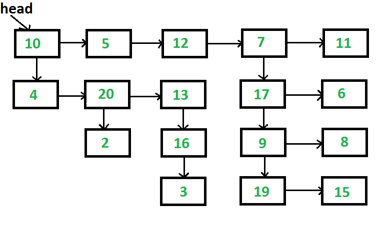

##[1. 3Sum](https://oj.leetcode.com/problems/3sum/)

Given an array S of n integers, are there elements a, b, c in S such that a + b + c = 0? Find all unique triplets in the array which gives the sum of zero.

Note:
Elements in a triplet (a,b,c) must be in non-descending order. (ie, a ≤ b ≤ c)
The solution set must not contain duplicate triplets.
    For example, given array S = {-1 0 1 2 -1 -4},

    A solution set is:
    (-1, 0, 1)
    (-1, -1, 2)

```python

class Solution:
    # @return a list of lists of length 3, [[val1,val2,val3]]
    def threeSum(self, num):
        num = sorted(num)
        N = len(num)
        ret = []
        for i in range(N-2):
            if i > 0 and num[i] == num[i-1]:
                continue
            l = i + 1
            r = N - 1
            while l < r:
                if num[i] + num[l] + num[r] < 0:
                    l += 1
                elif num[i] + num[l] + num[r] > 0:
                    r -= 1
                else:
                    ret.append([num[i], num[l], num[r]])
                    l += 1
                    r -= 1
                    while l < r and num[l] == num[l-1]:
                        l += 1
                    while l < r and num[r] == num[r+1]:
                        r -= 1
        return ret

    # Notice:
    # 1. This is almost the same to 3 Sum Closest.
    # 2. remember to remove duplicate result by doing l += 1 and r -= 1, also the continue on line 22
```
-----

##[2. 3Sum Closest](https://oj.leetcode.com/problems/3sum-closest/)

Given an array S of n integers, find three integers in S such that the sum is closest to a given number, target. Return the sum of the three integers. You may assume that each input would have exactly one solution.

    For example, given array S = {-1 2 1 -4}, and target = 1.

    The sum that is closest to the target is 2. (-1 + 2 + 1 = 2).

```python

class Solution:
    # @return an integer
    def threeSumClosest(self, num, target):
        N = len(num)
        num = sorted(num)
        ret = sum(num[:3])
        i = 0
        for i in range(N-2):
            l = i + 1
            r = N - 1
            while l < r:
                threesum = num[i] + num[l] + num[r]
                if abs(threesum-target) < abs(ret-target): # Need to check this before changing threesum
                    ret = threesum
                if threesum == target:
                    return target
                elif threesum < target:
                    l += 1
                else:
                    r -= 1
        return ret

    # Note:
    # Since it's assuming each input only have one result, there's no need to check dup
```
-----

##[3. 4Sum](https://oj.leetcode.com/problems/4sum/)

Given an array S of n integers, are there elements a, b, c, and d in S such that a + b + c + d = target? Find all unique quadruplets in the array which gives the sum of target.

Note:
Elements in a quadruplet (a,b,c,d) must be in non-descending order. (ie, a ≤ b ≤ c ≤ d)
The solution set must not contain duplicate quadruplets.
    For example, given array S = {1 0 -1 0 -2 2}, and target = 0.

    A solution set is:
    (-1,  0, 0, 1)
    (-2, -1, 1, 2)
    (-2,  0, 0, 2)

```python

class Solution:
    # @return a list of lists of length 4, [[val1,val2,val3,val4]]
    def fourSum(self, num, target):
        return self.fourSum_1(num, target)

    # This is kitt's way, using dictionary
    def fourSum_1(self, num, target):
        N = len(num)
        if N < 4:
            return []
        num.sort()
        res = set()
        d = {}
        # Convert 4Sum to 2Sum, store every i+j result
        for i in range(N):
            for j in range(i + 1, N):
                if num[i] + num[j] not in d:
                    d[ num[i] + num[j] ] = [(i,j)]
                else:
                    d[ num[i] + num[j] ].append( (i,j) )
        # Solve 2Sum
        for i in range(N):
            for j in range(i + 1, N - 2):
                T = target - num[i] - num[j]
                if T in d:
                    for k in d[T]:
                        if k[0] > j: res.add( ( num[i], num[j], num[k[0]], num[k[1]] ) )
        return [ list(i) for i in res ]

    # Won't pass because this is O(n^3)
    def fourSum_2(self, num, target):
        num.sort()
        N = len(num)
        ret = []
        for i in range(N-3):
            if i > 0 and num[i] == num[i-1]:
                continue
            for j in range(i+1, N-2):
                if j > i+1 and num[j] == num[j-1]:
                    continue
                l = j + 1
                r = N - 1
                while l < r:
                    four_sum = num[i] + num[j] + num[l] + num[r]
                    if four_sum < target:
                        l += 1
                    elif four_sum > target:
                        r -= 1
                    else:
                        ret.append([num[i], num[j], num[l], num[r]])
                        l += 1
                        r -= 1
                        while l < r and num[l] == num[l-1]:
                            l += 1
                        while l < r and num[r] == num[r+1]:
                            r -= 1
        return ret
```
-----

##[4. Add Binary](https://oj.leetcode.com/problems/add-binary/)

Given two binary strings, return their sum (also a binary string).

For example,
a = "11"
b = "1"
Return "100".

```python

class Solution:
    # @param a, a string
    # @param b, a string
    # @return a string
    def addBinary(self, a, b):
        A = len(a)
        B = len(b)
        res = []
        carry = 0
        i = 1
        while i <= max(A,B):            # using sum at first, then add bit if exist, this is good
            sum = carry
            if i <= A:
                sum += int(a[-i])
            if i <= B:
                sum += int(b[-i])
            bit = sum % 2
            carry = sum / 2
            i += 1
            res.insert(0, str(bit))
        if carry > 0:
            res.insert(0, '1')
        return ''.join(res)
    # Nothing would be better than this
```
-----

##[5. Add Two Numbers](https://oj.leetcode.com/problems/add-two-numbers/)

You are given two linked lists representing two non-negative numbers. The digits are stored in reverse order and each of their nodes contain a single digit. Add the two numbers and return it as a linked list.

Input: (2 -> 4 -> 3) + (5 -> 6 -> 4)
Output: 7 -> 0 -> 8

```python

# Definition for singly-linked list.
# class ListNode:
#     def __init__(self, x):
#         self.val = x
#         self.next = None

class Solution:
    # @return a ListNode
    def addTwoNumbers(self, l1, l2):
        dummy = ListNode(0)
        carry = 0
        cur = dummy
        while l1 is not None or l2 is not None or carry > 0:
            sum = carry
            if l1 is not None:
                sum += l1.val
                l1 = l1.next
            if l2 is not None:
                sum += l2.val
                l2 = l2.next
            cur.next = ListNode(sum % 10)
            carry = sum / 10
            cur = cur.next
        return dummy.next
```
-----

##[6. Anagrams](https://oj.leetcode.com/problems/anagrams/)

Given an array of strings, return all groups of strings that are anagrams.

Note: All inputs will be in lower-case.

```python

class Solution:
    # @param strs, a list of strings
    # @return a list of strings
    def anagrams(self, strs):
        d = {}
        for s in strs:
            key = ''.join(sorted(s))
            d.setdefault(key,[]).append(s)
        ret = []
        for key in d:
            if len(d[key]) > 1:
                ret.extend(d[key])
        return ret
    # Note:
    # 1. Need to use extend here, return those len(d[key]) > 1
    # 2. Need to remember the definition of Anagrams
    
    Input:      ["tea","and","ate","eat","dan"]
    Output:     ["and","dan"]
    Expected:   ["and","dan","tea","ate","eat"]
    
```
-----

##[7. Balanced Binary Tree](https://oj.leetcode.com/problems/balanced-binary-tree/)

Given a binary tree, determine if it is height-balanced.

For this problem, a height-balanced binary tree is defined as a binary tree in which the depth of the two subtrees of every node never differ by more than 1.

```python

# Definition for a  binary tree node
# class TreeNode:
#     def __init__(self, x):
#         self.val = x
#         self.left = None
#         self.right = None

class Solution:
    # @param root, a tree node
    # @return a boolean
    def isBalanced(self, root):
        return self.isBalanced_1(root)

    def isBalanced_1(self, root):
        if root is None:
            return True
        if self.get_height(root) == -1:
            return False
        return True

    def get_height(self, root):
        if root is None:
            return 0
        left_height = self.get_height(root.left)
        right_height = self.get_height(root.right)
        if left_height == -1 or right_height == -1:
            return -1
        if abs(left_height - right_height) > 1:
            return -1
        return max(left_height, right_height) + 1

    def isBalanced_2(self, root):
        if root is None:
            return True
        if abs(self.get_max_height(root.left) - self.get_max_height(root.right)) > 1:
            return False
        return self.isBalanced(root.left) and self.isBalanced(root.right)

    def get_max_height(self, root):
        if root is None:
            return 0
        return max(self.get_max_height(root.left), self.get_max_height(root.right)) + 1

    # First way is a little bit hard to think
    # Using -1 as return to sign if height diff > 1
    # First way has better performance
```
-----

##[8. Best Time to Buy and Sell Stock](https://oj.leetcode.com/problems/best-time-to-buy-and-sell-stock/)

Say you have an array for which the ith element is the price of a given stock on day i.

If you were only permitted to complete at most one transaction (ie, buy one and sell one share of the stock), design an algorithm to find the maximum profit.

```python

class Solution:
    # @param prices, a list of integer
    # @return an integer
    def maxProfit(self, prices):
        if len(prices) == 0:
            return 0
        max_profit = 0
        low_price = prices[0]
        for price in prices:
            max_profit = max(max_profit, price - low_price)
            low_price = min(low_price, price)
        return max_profit
```
-----

##[9. Best Time to Buy and Sell Stock II](https://oj.leetcode.com/problems/best-time-to-buy-and-sell-stock-ii/)

Say you have an array for which the ith element is the price of a given stock on day i.

Design an algorithm to find the maximum profit. You may complete as many transactions as you like (ie, buy one and sell one share of the stock multiple times). However, you may not engage in multiple transactions at the same time (ie, you must sell the stock before you buy again).

```python

class Solution:
    # @param prices, a list of integer
    # @return an integer
    def maxProfit(self, prices):
        if len(prices) <= 1:
            return 0
        max_profit = 0
        for i in range(1, len(prices)):
            if prices[i] - prices[i-1] > 0:
                max_profit += prices[i] - prices[i-1]
        return max_profit
```
-----

##[10. Best Time to Buy and Sell Stock III](https://oj.leetcode.com/problems/best-time-to-buy-and-sell-stock-iii/)

Say you have an array for which the ith element is the price of a given stock on day i.

Design an algorithm to find the maximum profit. You may complete at most two transactions.

Note:
You may not engage in multiple transactions at the same time (ie, you must sell the stock before you buy again).

```python

class Solution:
    # @param prices, a list of integer
    # @return an integer
    def maxProfit(self, prices):
        N = len(prices)
        if N <= 1:
            return 0
        dp_1 = [0 for i in range(N)]
        dp_2 = [0 for i in range(N)]
        min_price = prices[0]
        i = 1
        while i < N:
            min_price = min(min_price, prices[i])
            dp_1[i] = max(dp_1[i-1], prices[i]-min_price)
            i+= 1

        max_price = prices[-1]
        i = N-2
        while i >= 0:
            max_price = max(max_price, prices[i])
            dp_2[i] = max(dp_2[i+1], max_price-prices[i])
            i -= 1
        res = 0
        for i in range(N):
            res = max(res, dp_1[i] + dp_2[i])
        return res
    # Very similart to trapping rain water, from left to right then right to left
```
-----

##[11. Binary Tree Inorder Traversal](https://oj.leetcode.com/problems/binary-tree-inorder-traversal/)

Given a binary tree, return the inorder traversal of its nodes' values.

For example:
Given binary tree {1,#,2,3},
```
   1
    \
     2
    /
   3
```
return [1,3,2].

Note: Recursive solution is trivial, could you do it iteratively?

```python

# Definition for a  binary tree node
# class TreeNode:
#     def __init__(self, x):
#         self.val = x
#         self.left = None
#         self.right = None

class Solution:
    # @param root, a tree node
    # @return a list of integers
    def inorderTraversal(self, root):
        return self.inorderTraversal_1(root)

    def inorderTraversal_1(self, root):
        stack = []
        current = root
        res = []
        while current is not None or len(stack) > 0:
            if current is not None:
                stack.append(current)
                current = current.left
            elif len(stack) > 0:
                current = stack.pop()
                res.append(current.val)
                current = current.right
        return res

    def inorderTraversal_2(self, root):
        res = []
        self.inorderTraversal_rec(root, res)
        return res

    def inorderTraversal_rec(self, root, res):
        if root is None:
            return
        self.inorderTraversal_rec(root.left, res)
        res.append(root.val)
        self.inorderTraversal_rec(root.right, res)
```
-----

##[12. Binary Tree Level Order Traversal](https://oj.leetcode.com/problems/binary-tree-level-order-traversal/)

Given a binary tree, return the level order traversal of its nodes' values. (ie, from left to right, level by level).

For example:
Given binary tree {3,9,20,#,#,15,7},
```
    3
   / \
  9  20
    /  \
   15   7
```
return its level order traversal as:
[
  [3],
  [9,20],
  [15,7]
]

```python

# Definition for a  binary tree node
# class TreeNode:
#     def __init__(self, x):
#         self.val = x
#         self.left = None
#         self.right = None

class Solution:
    # @param root, a tree node
    # @return a list of lists of integers
    def levelOrder(self, root):
        res = []
        if root is None:
            return res
        queue = [root, ]
        while len(queue)>0:
            size = len(queue)
            level = []
            for i in range(size):
                node = queue.pop()
                level.append(node.val)
                if node.left is not None:
                    queue.insert(0, node.left)
                if node.right is not None:
                    queue.insert(0, node.right)
            res.append(level[:])
        return res

    # Note
    # 1. Try to use double loop to do this
    # 2. Other ways are: a. use dummy node(None) b. use two queues
```
-----

##[13. Binary Tree Level Order Traversal II](https://oj.leetcode.com/problems/binary-tree-level-order-traversal-ii/)

Given a binary tree, return the bottom-up level order traversal of its nodes' values. (ie, from left to right, level by level from leaf to root).

For example:
Given binary tree {3,9,20,#,#,15,7},
```
    3
   / \
  9  20
    /  \
   15   7
```
return its bottom-up level order traversal as:
[
  [15,7],
  [9,20],
  [3]
]

```python

# Definition for a  binary tree node
# class TreeNode:
#     def __init__(self, x):
#         self.val = x
#         self.left = None
#         self.right = None

class Solution:
    # @param root, a tree node
    # @return a list of lists of integers
    def levelOrderBottom(self, root):
        res = []
        if root is None:
            return res
        queue = []
        level = []
        queue.append(root)
        queue.append(None)
        while len(queue)>0:
            node = queue.pop(0)
            if node is None:
                res.append(level[:])
                level = []
                if len(queue)>0:
                    queue.append(None)
            else:
                level.append(node.val)
                if node.left is not None:
                    queue.append(node.left)
                if node.right is not None:
                    queue.append(node.right)
        return res[::-1]
```
-----

##[14. Binary Tree Maximum Path Sum](https://oj.leetcode.com/problems/binary-tree-maximum-path-sum/)

Given a binary tree, find the maximum path sum.

The path may start and end at any node in the tree.

For example:
Given the below binary tree,

```
       1
      / \
     2   3
```
Return 6.

```python

# Definition for a  binary tree node
# class TreeNode:
#     def __init__(self, x):
#         self.val = x
#         self.left = None
#         self.right = None

class Solution:
    # @param root, a tree node
    # @return an integer
    def maxPathSum(self, root):
        if root is None:
            return 0
        self.max_sum = -9223372036854775808
        self.maxPathSum_helper(root, self.max_sum)
        return self.max_sum

    def maxPathSum_helper(self, root, max_sum):
        if root is None:
            return 0

        left = self.maxPathSum_helper(root.left, max_sum)
        right = self.maxPathSum_helper(root.right, max_sum)

        root_max = max(root.val, left + root.val, right + root.val)
        self.max_sum = max(self.max_sum, root_max, left + right + root.val)

        return root_max
```
-----

##[15. Binary Tree Postorder Traversal](https://oj.leetcode.com/problems/binary-tree-postorder-traversal/)

Given a binary tree, return the postorder traversal of its nodes' values.

For example:
Given binary tree {1,#,2,3},
```
   1
    \
     2
    /
   3
```
return [3,2,1].

Note: Recursive solution is trivial, could you do it iteratively?

```python

# Definition for a  binary tree node
# class TreeNode:
#     def __init__(self, x):
#         self.val = x
#         self.left = None
#         self.right = None

class Solution:
    # @param root, a tree node
    # @return a list of integers
    def postorderTraversal(self, root):
        return self.postorderTraversal_1(root)

    # I prefer this way
    def postorderTraversal_1(self, root):
        if root is None:
            return []
        stack = [root]
        output = []
        while len(stack)>0:
            node = stack.pop()
            output.append(node.val)
            if node.left is not None:
                stack.append(node.left)
            if node.right is not None:
                stack.append(node.right)
        return output[::-1]

    # I don't like this way
    def postorderTraversal_2(self, root):
        stack = []
        current = root
        res = []
        last = None
        while current is not None or len(stack)>0:
            if current is not None:
                stack.append(current)
                current = current.left
            else:
                peak = stack[-1]
                if peak.right is not None and last != peak.right:
                    current = peak.right
                else:
                    last = stack.pop()
                    res.append(last.val)
        return res

    def postorderTraversal_3(self, root):
        res = []
        self.postorderTraversal_rec(root, res)
        return res

    def postorderTraversal_rec(self, root, res):
        if root is None:
            return
        self.postorderTraversal_rec(root.left, res)
        self.postorderTraversal_rec(root.right, res)
        res.append(root.val)
```
-----

##[16. Binary Tree Preorder Traversal](https://oj.leetcode.com/problems/binary-tree-preorder-traversal/)

Given a binary tree, return the preorder traversal of its nodes' values.

For example:
Given binary tree {1,#,2,3},
```
   1
    \
     2
    /
   3
```
return [1,2,3].

Note: Recursive solution is trivial, could you do it iteratively?

```python

# Definition for a  binary tree node
# class TreeNode:
#     def __init__(self, x):
#         self.val = x
#         self.left = None
#         self.right = None

class Solution:
    # @param root, a tree node
    # @return a list of integers
    def preorderTraversal(self, root):
        return self.preorderTraversal_1(root)

    def preorderTraversal_1(self, root):
        stack = []
        current = root
        res = []
        while current is not None or len(stack)>0:
            if current is not None:
                res.append(current.val)
                stack.append(current)
                current = current.left
            elif len(stack)>0:
                current = stack.pop()
                current = current.right
        return res

    def preorderTraversal_2(self, root):
        res = []
        self.preorderTraversal_rec(root, res)
        return res

    def preorderTraversal_rec(self, root, res):
        if root is None:
            return
        res.append(root.val)
        self.preorderTraversal_rec(root.left, res)
        self.preorderTraversal_rec(root.right, res)
```
-----

##[17. Binary Tree Zigzag Level Order Traversal](https://oj.leetcode.com/problems/binary-tree-zigzag-level-order-traversal/)

Given a binary tree, return the zigzag level order traversal of its nodes' values. (ie, from left to right, then right to left for the next level and alternate between).

For example:
Given binary tree {3,9,20,#,#,15,7},
```
    3
   / \
  9  20
    /  \
   15   7
```
return its zigzag level order traversal as:
[
  [3],
  [20,9],
  [15,7]
]

```python

# Definition for a  binary tree node
# class TreeNode:
#     def __init__(self, x):
#         self.val = x
#         self.left = None
#         self.right = None

class Solution:
    # @param root, a tree node
    # @return a list of lists of integers
    def zigzagLevelOrder(self, root):
        ret = []
        if root is None:
            return ret
        queue = [root, None]
        res = []
        zig = False                     # Because we start from very root, so no reverse at that point
        while len(queue) > 0:
            node = queue.pop(0)
            if node is None:
                if zig:
                    ret.append(res[::-1])
                else:
                    ret.append(res[:])
                res = []
                if len(queue) == 0:     # Break here, otherwise will append another None
                    break
                zig = not zig
                queue.append(None)
            else:
                res.append(node.val)    # Remember this, need to do this in node, not node.left/right
                if node.left is not None:
                    queue.append(node.left)
                if node.right is not None:
                    queue.append(node.right)
        return ret
```
-----

##[18. Candy](https://oj.leetcode.com/problems/candy/)

There are N children standing in a line. Each child is assigned a rating value.

You are giving candies to these children subjected to the following requirements:

Each child must have at least one candy.
Children with a higher rating get more candies than their neighbors.
What is the minimum candies you must give?

```python

class Solution:
    # @param ratings, a list of integer
    # @return an integer
    def candy(self, ratings):
        N = len(ratings)
        candy = [1 for i in range(N)]
        for i in range(1, N):
            if ratings[i] > ratings[i-1]:
                candy[i] = candy[i-1] + 1
        for i in range(N-1)[::-1]:
            if ratings[i] > ratings[i+1] and candy[i] <= candy[i+1]:
                candy[i] = candy[i+1] + 1
        return sum(candy)

    # Note:
    # Need to be careful for line 21 the second and
```
-----

##[19. Climbing Stairs](https://oj.leetcode.com/problems/climbing-stairs/)

You are climbing a stair case. It takes n steps to reach to the top.

Each time you can either climb 1 or 2 steps. In how many distinct ways can you climb to the top?

```python

class Solution:
    # @param n, an integer
    # @return an integer
    def climbStairs(self, n):
        return self.climbStairs_2(n)

    def climbStairs_1(self, n):
        if n <= 2:
            return n
        return self.climbStairs(n-1) + self.climbStairs(n-2)

    def climbStairs_2(self, n):
        if n <= 1:
            return n
        dp = [ 0 for i in range(n)]
        dp[0] = 1
        dp[1] = 2
        for i in range(2, n):
            dp[i] = dp[i-1] + dp[i-2]
        return dp[n-1]

    # Note:
    # 1. dp[i] means from 0 to i-1 stair, how many ways to go
    # 2. dp[0] = 1, dp[1] = 2
    # 3. dp[i] = d[i-1] + dp[i-2]
    # 4. dp[N-1]

    def climbStairs_3(self, n):
        if n <= 2:
            return n
        fn_1 = 1
        fn_2 = 2
        for i in range(3, n+1):
            fn = fn_1 + fn_2
            fn_1 = fn
            fn_2 = fn_1
        return fn

    # Note:
    # DP way is the best, and no need to check if n <= 2 or not.
```
-----

##[20. Clone Graph](https://oj.leetcode.com/problems/clone-graph/)

Clone an undirected graph. Each node in the graph contains a label and a list of its neighbors.


OJ's undirected graph serialization:
Nodes are labeled uniquely.

We use # as a separator for each node, and , as a separator for node label and each neighbor of the node.
As an example, consider the serialized graph {0,1,2#1,2#2,2}.

The graph has a total of three nodes, and therefore contains three parts as separated by #.

First node is labeled as 0. Connect node 0 to both nodes 1 and 2.
Second node is labeled as 1. Connect node 1 to node 2.
Third node is labeled as 2. Connect node 2 to node 2 (itself), thus forming a self-cycle.
Visually, the graph looks like the following:

```
       1
      / \
     /   \
    0 --- 2
         / \
         \_/

```
```python

# Definition for a undirected graph node
# class UndirectedGraphNode:
#     def __init__(self, x):
#         self.label = x
#         self.neighbors = []

class Solution:
    # @param node, a undirected graph node
    # @return a undirected graph node
    def cloneGraph(self, node):
        if node is None:
            return None
        # Use oldNode as the oldGraph, newNode as the newGraph. Use tuple (oldNode, newNode) to store relation
        newNodeHead = UndirectedGraphNode(node.label)
        queue = collections.deque()
        queue.append((node,newNodeHead))
        map_dict = {}
        while len(queue) > 0:
            (oldNode,newNode) = queue.popleft()
            if oldNode in map_dict:
                continue
            map_dict[oldNode] = 'Visited'
            newNode.neighbors = []
            for oldNeighbor in oldNode.neighbors:
                newNeighbor = UndirectedGraphNode(oldNeighbor.label)
                queue.append((oldNeighbor, newNeighbor))
                newNode.neighbors.append(newNeighbor)
        return newNodeHead

    # Another way to this is like Nine Chapter, no need to do like level order BFS
    # Finally add all neighbors
```
-----

##[21. Combination Sum](https://oj.leetcode.com/problems/combination-sum/)

Given a set of candidate numbers (C) and a target number (T), find all unique combinations in C where the candidate numbers sums to T.

The same repeated number may be chosen from C unlimited number of times.

Note:
All numbers (including target) will be positive integers.
Elements in a combination (a1, a2, … , ak) must be in non-descending order. (ie, a1 ≤ a2 ≤ … ≤ ak).
The solution set must not contain duplicate combinations.
For example, given candidate set 2,3,6,7 and target 7,
A solution set is:
[7]
[2, 2, 3]

```python

class Solution:
    # @param candidates, a list of integers
    # @param target, integer
    # @return a list of lists of integers
    def combinationSum(self, candidates, target):
        ret = []
        self.combinationSum_helper(sorted(candidates), target, [], ret) # Look into the question, need sorted
        return ret

    def combinationSum_helper(self, candidates, target, res, ret):
        if target == 0:
            ret.append(res[:])
            return
        for i, num in enumerate(candidates):
            if target - num < 0:
                continue
            res.append(num)
            self.combinationSum_helper(candidates[i:], target - num, res, ret)
            res.pop()

    # Continue when target < num
```
-----

##[22. Combination Sum II](https://oj.leetcode.com/problems/combination-sum-ii/)

Given a collection of candidate numbers (C) and a target number (T), find all unique combinations in C where the candidate numbers sums to T.

Each number in C may only be used once in the combination.

Note:
All numbers (including target) will be positive integers.
Elements in a combination (a1, a2, … , ak) must be in non-descending order. (ie, a1 ≤ a2 ≤ … ≤ ak).
The solution set must not contain duplicate combinations.
For example, given candidate set 10,1,2,7,6,1,5 and target 8,
A solution set is:
[1, 7]
[1, 2, 5]
[2, 6]
[1, 1, 6]

```python

class Solution:
    # @param candidates, a list of integers
    # @param target, integer
    # @return a list of lists of integers
    def combinationSum2(self, candidates, target):
        ret = []
        self.combinationSum_helper(sorted(candidates), target, [], ret) # Look into the question, need sorted
        return ret

    def combinationSum_helper(self, candidates, target, res, ret):
        if target == 0:
            ret.append(res[:])
            return
        for i, num in enumerate(candidates):
            if target < num or (i > 0 and candidates[i] == candidates[i-1]):
                continue
            res.append(num)
            self.combinationSum_helper(candidates[i+1:], target - num, res, ret)
            res.pop()

    # Note some diffs with I:
    # 1. line 32 check dup
    # 2. line 35 [i+1:]
```
-----

##[23. Combinations](https://oj.leetcode.com/problems/combinations/)

Given two integers n and k, return all possible combinations of k numbers out of 1 ... n.

For example,
If n = 4 and k = 2, a solution is:

[
  [2,4],
  [3,4],
  [2,3],
  [1,2],
  [1,3],
  [1,4],
]

```python

class Solution:
    # @return a list of lists of integers
    def combine(self, n, k):
        ret =[]
        self.combine_helper(1, n, k, [], ret)
        return ret

    def combine_helper(self, cur, n, k, res, ret):
        if len(res) == k:
            ret.append(res[:])
            return
        for i in range(cur, n+1):
            res.append(i)
            self.combine_helper(i+1, n, k, res, ret)
            res.pop()
    # Need to notice the i+1
```
-----

##[24. Construct Binary Tree from Inorder and Postorder Traversal](https://oj.leetcode.com/problems/construct-binary-tree-from-inorder-and-postorder-traversal/)

Given inorder and postorder traversal of a tree, construct the binary tree.

Note:
You may assume that duplicates do not exist in the tree.

```python

# Definition for a  binary tree node
# class TreeNode:
#     def __init__(self, x):
#         self.val = x
#         self.left = None
#         self.right = None

class Solution:
    # @param inorder, a list of integers
    # @param postorder, a list of integers
    # @return a tree node
    def buildTree(self, inorder, postorder):
        if len(inorder) == 0:
            return None
        root = TreeNode(postorder.pop())
        index = inorder.index(root.val)
        root.right = self.buildTree(inorder[index+1:], postorder)
        root.left = self.buildTree(inorder[:index], postorder)
        return root
    # Only difference if pop(0) or pop()
    # In this case need to do right first
```
-----

##[25. Construct Binary Tree from Preorder and Inorder Traversal](https://oj.leetcode.com/problems/construct-binary-tree-from-preorder-and-inorder-traversal/)

Given preorder and inorder traversal of a tree, construct the binary tree.

Note:
You may assume that duplicates do not exist in the tree.

```python

# Definition for a  binary tree node
# class TreeNode:
#     def __init__(self, x):
#         self.val = x
#         self.left = None
#         self.right = None

class Solution:
    # @param preorder, a list of integers
    # @param inorder, a list of integers
    # @return a tree node
    def buildTree(self, preorder, inorder):
        if len(inorder) == 0:
            return None
        root = TreeNode(preorder.pop(0))
        index = inorder.index(root.val)
        root.left = self.buildTree(preorder, inorder[:index])
        root.right = self.buildTree(preorder, inorder[index+1:])
        return root
    # for line 24/25, it's using preorder instead of slicing it. Because when left tree is ready
    # all the preorder index are already poped
```
-----

##[26. Container With Most Water](https://oj.leetcode.com/problems/container-with-most-water/)

Given n non-negative integers a1, a2, ..., an, where each represents a point at coordinate (i, ai). n vertical lines are drawn such that the two endpoints of line i is at (i, ai) and (i, 0). Find two lines, which together with x-axis forms a container, such that the container contains the most water.

Note: You may not slant the container.

```python

class Solution:
    # @return an integer
    def maxArea(self, height):
        l = 0
        r = len(height) - 1
        max_water = 0
        while l < r:
            max_water = max(max_water, (r-l) * min(height[l], height[r]))
            if height[l] <= height[r]:
                l += 1
            else:
                r -= 1
        return max_water

    # Two pointer problem
```
-----

##[27. Convert Sorted Array to Binary Search Tree](https://oj.leetcode.com/problems/convert-sorted-array-to-binary-search-tree/)

Given an array where elements are sorted in ascending order, convert it to a height balanced BST.

```python

# Definition for a  binary tree node
# class TreeNode:
#     def __init__(self, x):
#         self.val = x
#         self.left = None
#         self.right = None

class Solution:
    # @param num, a list of integers
    # @return a tree node
    def sortedArrayToBST(self, num):
        if len(num) == 0:
            return None
        return self.sortedArrayToBSTRec(num, 0, len(num)-1)

    def sortedArrayToBSTRec(self, num, start, end):
        if start > end:
            return None
        mid = (start + end) / 2
        node = TreeNode(num[mid])
        node.left = self.sortedArrayToBstRec(num, start, mid-1)
        node.right = self.sortedArrayToBstRec(num, mid+1, end)
        return node
```
-----

##[28. Convert Sorted List to Binary Search Tree](https://oj.leetcode.com/problems/convert-sorted-list-to-binary-search-tree/)

Given a singly linked list where elements are sorted in ascending order, convert it to a height balanced BST.

```python

# Definition for a  binary tree node
# class TreeNode:
#     def __init__(self, x):
#         self.val = x
#         self.left = None
#         self.right = None
#
# Definition for singly-linked list.
# class ListNode:
#     def __init__(self, x):
#         self.val = x
#         self.next = None

class Solution:
    # @param head, a list node
    # @return a tree node
    def sortedListToBST(self, head):
        cur = head
        length = 0
        while cur:
            cur = cur.next
            length += 1
        self.head = head
        return self.sortedRecur(0, length - 1)

    def sortedRecur(self, start, end):
        if start > end:
            return None

        mid = (start + end) / 2
        left = self.sortedRecur(start, mid - 1)
        root = TreeNode(self.head.val)
        root.left = left
        self.head = self.head.next
        root.right = self.sortedRecur(mid + 1, end)

        return root

    # This is creating the tree from leaves to root
    # Normal way(Get middle and create each half) takes O(n*logn)
    # This way takes O(n)
```
-----

##[29. Copy List with Random Pointer](https://oj.leetcode.com/problems/copy-list-with-random-pointer/)

A linked list is given such that each node contains an additional random pointer which could point to any node in the list or null.

Return a deep copy of the list.

```python

# Definition for singly-linked list with a random pointer.
# class RandomListNode:
#     def __init__(self, x):
#         self.label = x
#         self.next = None
#         self.random = None

class Solution:
    # @param head, a RandomListNode
    # @return a RandomListNode
    def copyRandomList(self, head):
        if head is None:
            return None
        cur = head
        while cur is not None:
            newNode = RandomListNode(cur.label)
            newNode.next = cur.next
            cur.next = newNode
            cur = newNode.next
        cur = head
        while cur is not None:
            newNode = cur.next
            if cur.random is not None:  # random pointer may not exist
                newNode.random = cur.random.next
            cur = newNode.next
        cur = head
        newNodehead = head.next
        while cur is not None:
            newNode = cur.next
            cur.next = newNode.next
            if newNode.next is not None:
                newNode.next = newNode.next.next
            cur = cur.next
        return newNodehead
```
-----

##[30. Count and Say](https://oj.leetcode.com/problems/count-and-say/)

The count-and-say sequence is the sequence of integers beginning as follows:
1, 11, 21, 1211, 111221, ...

1 is read off as "one 1" or 11.
11 is read off as "two 1s" or 21.
21 is read off as "one 2, then one 1" or 1211.
Given an integer n, generate the nth sequence.

Note: The sequence of integers will be represented as a string.

```python

class Solution:
    # @return a string
    def countAndSay(self, n):
        prev = '1'
        for i in range(1, n):
            counter = 1
            cur = [prev[0]]
            for char in prev[1:]:
                if char == cur[-1]:
                    counter += 1
                else:
                    cur.insert(-1, str(counter))
                    cur.append(char)
                    counter = 1
            cur.insert(-1, str(counter))
            prev = ''.join(cur)
        return prev
```
-----

##[31. Decode Ways](https://oj.leetcode.com/problems/decode-ways/)

A message containing letters from A-Z is being encoded to numbers using the following mapping:

'A' -> 1
'B' -> 2
...
'Z' -> 26
Given an encoded message containing digits, determine the total number of ways to decode it.

For example,
Given encoded message "12", it could be decoded as "AB" (1 2) or "L" (12).

The number of ways decoding "12" is 2.

```python

class Solution:
    # @param s, a string
    # @return an integer
    def numDecodings(self, s):
        N = len(s)
        if N == 0 or s[0] == '0':
            return 0
        dp = [0 for i in range(N+1)]
        dp[0] = 1
        dp[1] = 1
        for i in range(2, N+1):
            if s[i-1] == '0' and s[i-2] not in ['1', '2']:
                return 0
            if s[i-1] != '0':
                dp[i] += dp[i-1]
            if 10 <= int(s[i-2: i]) <= 26:
                dp[i] += dp[i-2]
        return dp[N]

    # Note:
    # 1. State: dp[i] means from char 0 to char i-1 how many decode ways
    # 2. Init: dp[0] = 1; dp[1] = 1
    # 3. Function:
    #      dp[i] = if s[i-1] == 0 and s[i-2] not in ['1', '2'] : return 0
    #              if s[i-1] != 0                              : += dp[i-1]
    #              if 10 <= int(s[i-2:i]) <= 26                : += dp[i-2]
    # 4. Result: dp[N]

    # i.   dp size is len(s)+1
    # ii.  10 <= x <= 26
    # iii. use if += instead of if dp = xx else dp = xx

    # Another idea
    def numDecodings_2(self, s):
        if s == '' or s[0] == '0': return 0
        dp = [1, 1]
        length = len(s)
        for i in xrange(2, length + 1):
            if 10 <= int(s[i-2:i]) <= 26 and '1' <= s[i-1] <= '9':
                dp.append(dp[i-1] + dp[i-2])
            elif 10 <= int(s[i-2:i]) <= 26: # s[i-1] == '0'
                dp.append(dp[i-2])
            elif '1' <= s[i-1] <= '9':
                dp.append(dp[i-1])
            else:  # s[i] == '0'
                return 0
        return dp[length]
```
-----

##[32. Distinct Subsequences](https://oj.leetcode.com/problems/distinct-subsequences/)

Given a string S and a string T, count the number of distinct subsequences of T in S.

A subsequence of a string is a new string which is formed from the original string by deleting some (can be none) of the characters without disturbing the relative positions of the remaining characters. (ie, "ACE" is a subsequence of "ABCDE" while "AEC" is not).

Here is an example:
S = "rabbbit", T = "rabbit"

Return 3.

Note:
The answer is three rabbit by removing the first, second, third 'b'

```python

class Solution:
    # @return an integer
    def numDistinct(self, S, T):
        M = len(T)
        N = len(S)
        dp = [ [0 for j in range(N+1)] for i in range(M+1)]
        for i in range(M+1):
            dp[i][0] = 0
        for j in range(N+1):
            dp[0][j] = 1
        for i in range(1, M+1):
            for j in range(1, N+1):
                if S[j-1] == T[i-1]:
                    dp[i][j] = dp[i][j-1] + dp[i-1][j-1]
                else:
                    dp[i][j] = dp[i][j-1]
        return dp[M][N]
    # !!!!分清M,i和N,j分别对应T和S哪个
    # Note:
    # dp[i][j]表示S的前i个字符配上T的前j个字符的DS
    # [i][0] = 0, dp[0][j] = 1
    # dp[i][j] = dp[i][j-1] + dp[i-1][j-1] # if T[i-1] == S[j-1]
    #          = dp[i][j-1]                # if T[i-1] != S[j-1]
    # dp[M][N]
    # Need to draw this pic when solving this problem
    # 大概意思就是， 因为算的是S的子串和T匹配的方法， 所以一旦S[:j-1]和T[:i]有x种匹配方法时
    # S[:j]必定也至少和T[:i]有x种匹配方法，但尤其当S[j-1]==T[i-1]的时候，需要再加上S[:j-1]和T[:i-1]的匹配方法数
    #     r a b b b i t
    #   1 1 1 1 1 1 1 1
    # r 0 1 1 1 1 1 1 1
    # a 0 0 1 1 1 1 1 1
    # b 0 0 0 1 2 3 3 3
    # b 0 0 0 0 1 3 3 3
    # i 0 0 0 0 0 0 3 3
    # t 0 0 0 0 0 0 0 3
    # No matter T[i-1] ?= S[j-1],  dp[i][j] = dp[i][j-1]
    # But    if T[i-1] == S[j-1], we can add another one which is dp[i-1][j-1]
```
-----

##[33. Divide Two Integers](https://oj.leetcode.com/problems/divide-two-integers/)

Divide two integers without using multiplication, division and mod operator.

```python

class Solution:
    # @return an integer
    def divide(self, dividend, divisor):
        if (dividend < 0) != (divisor < 0):
            sign = -1
        else:
            sign = 1

        dividend = abs(dividend)
        divisor  = abs(divisor)
        res = 0
        while dividend >= divisor:
            shift = 0
            while dividend >= divisor << shift:
                shift += 1
            #print 'res = %d, shift = %d, adding = %d, dividend = %d' % (res, shift, 1<<(shift-1), dividend)
            res += 1 << (shift - 1)            # This is shift-1, because the top loop quit
            dividend -= divisor << (shift - 1) # when dividend < divisor << shift, so we don't want to shift more
        return res * sign

    # How to think:
    # Any number can be computed in binary way, like 8 = 2^3 * 1 + 2^2 * 0 + 2^1 * 0 + 2^0 * 0
    # In this case, we calculate this num = a * (2^n * an + ... + 2^1 * a1 + 2^0 * a0)
    # So we calculate an first, them decrease num with a * 2^an, and sum(2^i * ai)
```
-----

##[34. Edit Distance](https://oj.leetcode.com/problems/edit-distance/)

Given two words word1 and word2, find the minimum number of steps required to convert word1 to word2. (each operation is counted as 1 step.)

You have the following 3 operations permitted on a word:

a) Insert a character
b) Delete a character
c) Replace a character

```python

class Solution:
    # @return an integer
    def minDistance(self, word1, word2):
        M = len(word1)
        N = len(word2)
        dp = [ [ 0 for j in range(N+1)] for i in range(M+1)]
        for i in range(M+1):
            for j in range(N+1):
                if i == 0:
                    dp[0][j] = j
                elif j == 0:
                    dp[i][0] = i
                elif word1[i-1] == word2[j-1]:
                    dp[i][j] = dp[i-1][j-1]
                else:
                    dp[i][j] = min( dp[i][j-1], dp[i-1][j], dp[i-1][j-1]) + 1
        return dp[M][N]
    # Note:
    # 1. dp[i][j] is Edit Distance of first i-1 chars in word1 with first j-1 chars in word2
    # 2. dp[0][j] = j, dp[i][0] = i
    # 3. dp[i][j] = dp[i-1][j-1]                                   # if word[i-1] == word[j-1]
    #             = min( dp[i][j-1], dp[i-1][j], dp[i-1][j-1]) + 1 # if word[i-1] != word[j-1]

    # Note:
    # 1. This dp is a bit diff, the length of dp is A+1, B+1
    # 2. Others are the same, remember how to initiate the dp matrix
    # 3. When comparing the i, it compares with word[i-1] and word[j-1]
    #    This is not hard to think, since we start loop from 1
    # 4. Initial value of DP: add N chars for word1

    # Transfer function:
    # Target somestr1c -> somestr2d
    # 1. Assume somestr1  -> somestr2  dp[i][j]
    # 2.        somestr1  -> somestr2d dp[i-1][j]
    # 3.        somestr1c -> somestr2  dp[i][j-1]
    # 4. i.   replace c with d: somestr1  -> somestr2 + 1  :    dp[i-1][j-1] + 1
    #    ii.  append d to c   : somestr1c -> somestr2 + 1  :    dp[i][j-1] + 1
    #    iii. delete c        : somestr1  -> somestr2d + 1 :    dp[i-1][j] + 1
```
-----

##[35. Evaluate Reverse Polish Notation](https://oj.leetcode.com/problems/evaluate-reverse-polish-notation/)

Evaluate the value of an arithmetic expression in Reverse Polish Notation.

Valid operators are +, -, *, /. Each operand may be an integer or another expression.

Some examples:
  ["2", "1", "+", "3", "*"] -> ((2 + 1) * 3) -> 9
  ["4", "13", "5", "/", "+"] -> (4 + (13 / 5)) -> 6

```python

class Solution:
    # @param tokens, a list of string
    # @return an integer
    def evalRPN(self, tokens):
        stack = []
        for token in tokens:
            if token in ['+', '-', '*', '/']:
                b = stack.pop()
                a = stack.pop()
                stack.append(self.calculate(a, b, token))
            else:
                stack.append(int(token))
        return stack.pop()

    def calculate(self, num_1, num_2, operator):
        oper_dict = { '+' : lambda x, y: x + y,
                      '-' : lambda x, y: x - y,
                      '*' : lambda x, y: x * y,
                      '/' : lambda x, y: int( x * 1.0 / y),
                      }
        return oper_dict[operator](num_1, num_2)

    # Notice:
    # Need to be very careful about line 29, need to convert float and result is in int
```
-----

##[36. First Missing Positive](https://oj.leetcode.com/problems/first-missing-positive/)

Given an unsorted integer array, find the first missing positive integer.

For example,
Given [1,2,0] return 3,
and [3,4,-1,1] return 2.

Your algorithm should run in O(n) time and uses constant space.

```python

class Solution:
    # @param A, a list of integers
    # @return an integer
    def firstMissingPositive(self, A):
        N = len(A)
        i = 0
        while i < N:
            if A[i] <= 0 or A[i] == i + 1 or A[i] > N:
                i += 1
            else:
                x = A[i]
                if A[i] == A[x-1]:
                    i += 1
                    continue
                A[i], A[x-1] = A[x-1], A[i]

        for i in range(N):
            if A[i] != i + 1:
                return i + 1

        return N + 1

    # Note details
    # 1. Good way to do this is name A[i] = x
    # 2. line 22 need to check if it's already equal, like [1,1] will cause dead loop
    # 3. line 29, return i+1 not A[i]
    # 4. line 31 return N + 1
```
-----

##[37. Flatten Binary Tree to Linked List](https://oj.leetcode.com/problems/flatten-binary-tree-to-linked-list/)

Given a binary tree, flatten it to a linked list in-place.

For example,
Given

```
         1
        / \
       2   5
      / \   \
     3   4   6
The flattened tree should look like:
   1
    \
     2
      \
       3
        \
         4
          \
           5
            \
             6
```
click to show hints.

Hints:
If you notice carefully in the flattened tree, each node's right child points to the next node of a pre-order traversal.

```python

# Definition for a  binary tree node
# class TreeNode:
#     def __init__(self, x):
#         self.val = x
#         self.left = None
#         self.right = None

class Solution:
    # @param root, a tree node
    # @return nothing, do it in place
    last_node = None
    def flatten(self, root):
        if not root:
            return
        if self.last_node:
            self.last_node.left = None
            self.last_node.right = root
        self.last_node = root
        right = root.right              # Because root.right has changed
        self.flatten(root.left)
        self.flatten(right)
    # The above way is preferred
    # Notice line 48 need to store the state of right

    def flatten(self, root):
        if root is None:
            return None
        self.flatten_helper(root)

    def flatten_helper(self, root):
        if root.left is None and root.right is None:
            return root
        rhead = None                    # This declare is nessary
        if root.right is not None:
            rhead = self.flatten_helper(root.right)
        lend = root                     # Need this here
        if root.left is not None:
            lhead = self.flatten_helper(root.left)
            root.right = lhead
            lhead.left = None
            root.left = None
            while lend.right is not None: # Get the lend from root
                lend = lend.right

        if rhead is not None:
            lend.right = rhead
        return root

    # Non-recursion way
    def flatten(self, root):
        while root:
            if root.left:
                pre = root.left
                while pre.right:
                    pre = pre.right
                pre.right = root.right
                root.right = root.left
                root.left = None
            root = root.right

    # Another diao zha way
    # This is the reverse way of above
    last = None
    def flatten(self, root):
        if root != None:
            self.flatten(root.right)
            self.flatten(root.left)
            root.right = self.last
            root.left = None
            self.last = root
```
-----

##[38. Gas Station](https://oj.leetcode.com/problems/gas-station/)

There are N gas stations along a circular route, where the amount of gas at station i is gas[i].

You have a car with an unlimited gas tank and it costs cost[i] of gas to travel from station i to its next station (i+1). You begin the journey with an empty tank at one of the gas stations.

Return the starting gas station's index if you can travel around the circuit once, otherwise return -1.

Note:
The solution is guaranteed to be unique.

```python

class Solution:
    # @param gas, a list of integers
    # @param cost, a list of integers
    # @return an integer
    def canCompleteCircuit(self, gas, cost):
        N = len(gas)
        start_node = 0
        total_gas = 0
        cur_gas = 0
        for i in range(N):
            total_gas += gas[i] - cost[i]
            cur_gas += gas[i] - cost[i]
            if cur_gas < 0:
                start_node = i + 1
                cur_gas = 0
        if total_gas < 0:
            return -1
        else:
            return start_node % N
        # Note:
        # 1. Notice line 18 for start node and line 30 for return
```
-----

##[39. Generate Parentheses](https://oj.leetcode.com/problems/generate-parentheses/)

Given n pairs of parentheses, write a function to generate all combinations of well-formed parentheses.

For example, given n = 3, a solution set is:

"((()))", "(()())", "(())()", "()(())", "()()()"

```python

class Solution:
    # @param an integer
    # @return a list of string
    def generateParenthesis(self, n):
        ret = []
        self.generateParenthesis_helper(n, n, '', ret)
        return ret

    def generateParenthesis_helper(self, left, right, res, ret):
        if left == 0 and right ==0:
            ret.append(res[:])
            return
        if left > 0:
            self.generateParenthesis_helper(left-1, right, res+'(', ret)
        if right > left:
            self.generateParenthesis_helper(left, right-1, res+')', ret)
```
-----

##[40. Gray Code](https://oj.leetcode.com/problems/gray-code/)

The gray code is a binary numeral system where two successive values differ in only one bit.

Given a non-negative integer n representing the total number of bits in the code, print the sequence of gray code. A gray code sequence must begin with 0.

For example, given n = 2, return [0,1,3,2]. Its gray code sequence is:

00 - 0
01 - 1
11 - 3
10 - 2
Note:
For a given n, a gray code sequence is not uniquely defined.

For example, [0,2,3,1] is also a valid gray code sequence according to the above definition.

For now, the judge is able to judge based on one instance of gray code sequence. Sorry about that.

```python

# Tip: you can use bin(x) to check the binary form of a num

class Solution:
    # @return a list of integers
    def gray_code(self, n):
        if n == 0:
            return [0]
        return [int(code, 2) for code in self.graycode_helper(n)]

    def graycode_helper(self, n):
        if n == 1:
            return ['0', '1']
        prev_code = self.graycode_helper(n-1)
        cur_code = []
        for code in prev_code:
            cur_code.append('0' + code)
        for code in prev_code[::-1]:
            cur_code.append('1' + code)
        return cur_code

    # Using bit
    def grayCode(self, n):
        ret = []
        i = 0
        while i < 2**n:
            ret.append(i>>1^i)
            i+=1
        return ret

# Using generator

    def grayCodeGen(self, n, reverse=False):
        if n == 1:
            if reverse:
                yield "1"
                yield "0"
            else:
                yield "0"
                yield "1"
        else:
            if reverse:
                # all the "1"s start first
                gcprev = self.grayCodeGen(n-1, False)
                for code in gcprev:
                    yield "1" + code
                gcprev = self.grayCodeGen(n-1, True)
                for code in gcprev:
                    yield "0" + code
            else:
                # all the "0" start first
                gcprev = self.grayCodeGen(n-1, False)
                for code in gcprev:
                    yield "0" + code
                gcprev = self.grayCodeGen(n-1, True)
                for code in gcprev:
                    yield "1" + code

```
-----

##[41. Implement strStr](https://oj.leetcode.com/problems/implement-strstr/)

Implement strStr().

Returns a pointer to the first occurrence of needle in haystack, or null if needle is not part of haystack.

```python

class Solution:
    # @param haystack, a string
    # @param needle, a string
    # @return a string or None
    def strStr(self, haystack, needle):
        H = len(haystack)
        N = len(needle)
        if N == 0:
            return haystack
        i = 0
        while i < H - N + 1:
            if haystack[i] == needle[0]:
                start = None            # Use None here
                j = 1
                while j < N and haystack[i+j] == needle[j]:
                    if start == None and haystack[i+j] == needle[0]: # Find first dup occurance
                        start = i + j
                    j += 1
                if j == N:
                    return haystack[i:]
                if start is not None:
                    i = start
                else:
                    i = i + j
            else:
                i += 1
        return None
    # Note:
    # line 32, don't forget the i += 1
```
-----

##[42. Insert Interval](https://oj.leetcode.com/problems/insert-interval/)

Given a set of non-overlapping intervals, insert a new interval into the intervals (merge if necessary).

You may assume that the intervals were initially sorted according to their start times.

Example 1:
Given intervals [1,3],[6,9], insert and merge [2,5] in as [1,5],[6,9].

Example 2:
Given [1,2],[3,5],[6,7],[8,10],[12,16], insert and merge [4,9] in as [1,2],[3,10],[12,16].

This is because the new interval [4,9] overlaps with [3,5],[6,7],[8,10].

```python

# Definition for an interval.
# class Interval:
#     def __init__(self, s=0, e=0):
#         self.start = s
#         self.end = e

class Solution:
    # @param intervals, a list of Intervals
    # @param newInterval, a Interval
    # @return a list of Interval
    def insert(self, intervals, newInterval):
        res = []
        inserted = False
        for inter in intervals:
            if newInterval.end < inter.start:
                if not inserted:
                    res.append(newInterval)
                    inserted = True
                res.append(inter)
            elif inter.end < newInterval.start:
                res.append(inter)
            else:
                newInterval.start = min(newInterval.start, inter.start)
                newInterval.end = max(newInterval.end, inter.end)

        if not inserted:
            res.append(newInterval)
        return res
    # Note
    # 分三种情况讨论
    # 1. 插入区间在当前区间左边 - 如果没插入就插入, 添加当前区间
    # 2. 插入区间在当前区间右边 - 插入当前区间
    # 3. 剩余的mix情况        - 合并两个区间
```
-----

##[43. Insertion Sort List](https://oj.leetcode.com/problems/insertion-sort-list/)

Sort a linked list using insertion sort.

```python

# Definition for singly-linked list.
# class ListNode:
#     def __init__(self, x):
#         self.val = x
#         self.next = None

class Solution:
    # @param head, a ListNode
    # @return a ListNode
    def insertionSortList(self, head):
        dummy = ListNode(-9223372036854775807-1)
        dummy.next = head
        cur = dummy
        while cur.next is not None:
            if cur.val < cur.next.val:
                cur = cur.next
            else:
                insert = cur.next
                cur.next = insert.next
                start = dummy
                while start.val < insert.val:
                    prev = start
                    start = start.next
                prev.next = insert
                insert.next = start
        return dummy.next

    # Write everything in one func MAY increase the speed of processing
    # Made a mistake here, pasted the code to Sort List and coulnd't pass...
    # 1. The insertion sort shown in wiki, will check from back to front. It's the same to check from front-back
```
-----

##[44. Integer to Roman](https://oj.leetcode.com/problems/integer-to-roman/)

Given an integer, convert it to a roman numeral.

Input is guaranteed to be within the range from 1 to 3999.

```python

class Solution:
    # @return a string
    def intToRoman(self, num):
        digits = [(1000, 'M'), (900, 'CM'), (500, 'D'), (400, 'CD' ),
                  (100, 'C'), (90, 'XC'), (50, 'L'), (40, 'XL'),
                  (10, 'X'), (9, 'IX'), (5, 'V'), (4, 'IV'), (1, 'I')]
        result = ""
        for digit in digits:
            while num >= digit[0]:
                result += digit[1]
                num -= digit[0]
            if num == 0:
                break
        return result
```
-----

##[45. Interleaving String](https://oj.leetcode.com/problems/interleaving-string/)

Given s1, s2, s3, find whether s3 is formed by the interleaving of s1 and s2.

For example,
Given:
s1 = "aabcc",
s2 = "dbbca",

When s3 = "aadbbcbcac", return true.
When s3 = "aadbbbaccc", return false.

```python

class Solution:
    # @return a boolean
    def isInterleave(self, s1, s2, s3):
        return self.isInterleave_1(s1, s2, s3)

    def isInterleave_1(self, s1, s2, s3):
        M = len(s1)
        N = len(s2)
        K = len(s3)
        if M + N != K:
            return False
        dp = [ [ False for j in range(N+1)] for i in range(M+1) ]
        for i in range(M+1):
            for j in range(N+1):
                if i == 0 and j == 0:
                    dp[i][j] = True
                elif i > 0 and dp[i-1][j] and s1[i-1] == s3[i-1+j]:
                    dp[i][j] = True
                elif j > 0 and dp[i][j-1] and s2[j-1] == s3[i+j-1]:
                    dp[i][j] = True
                else:
                    dp[i][j] = False
        return dp[M][N]

    # Note:
    # 1. dp[i][j] means whether s1[:i] and s2[:j] is interleave with s3[:i+j]
    # 2. dp[0...M][0...N] = False
    # 3. dp[i][j] = True   # if dp[i-1][j] == True and s1[i-1] == s3[i-1+j] or
    #                           dp[i][j-1] == True and s2[j-1] == s3[i+j-1]
    #             = False  # else
    # 4. dp[M][N]

    # Will TLE
    def isInterleave_2(self, s1, s2, s3):
        return self.isInterleave_re(s1, 0, s2, 0, s3, 0)

    def isInterleave_re(self, s1, i1, s2, i2, s3, i3):
        if i1 >= len(s1) and i2 >= len(s2) and i3 >= len(s3):
            return True
        if i3 >= len(s3):
            return False
        if i1 >= len(s1):
            return s2[i2:] == s3[i3:]
        if i2 >= len(s2):
            return s1[i1:] == s3[i3:]

        return (s1[i1] == s3[i3] and self.isInterleave_re(s1, i1+1, s2, i2, s3, i3+1)) or (s2[i2] == s3[i3] and self.isInterleave_re(s1, i1, s2, i2+1, s3, i3+1))
```
-----

##[46. Jump Game](https://oj.leetcode.com/problems/jump-game/)

Given an array of non-negative integers, you are initially positioned at the first index of the array.

Each element in the array represents your maximum jump length at that position.

Determine if you are able to reach the last index.

For example:
A = [2,3,1,1,4], return true.

A = [3,2,1,0,4], return false.

```python

class Solution:
    # @param A, a list of integers
    # @return a boolean
    def canJump(self, A):
        return self.canJump_1(A)

    # Real DP way, but TLE. This is a O(n^2)'s solution
    def canJump_3(self, A):
        if A[0] == 0:
            return False
        N = len(A)
        dp = [False for i in range(N)]
        dp[0] = True
        for i in range(1, N):
            for j in range(i)[::-1]:
                if dp[j] and j + A[j] >= i:
                    dp[i] = True
                    break
        return dp[N-1]
    # Note:
    # 1. dp[i] means whether we can jump to i
    # 2. dp[0] = True
    # 3. dp[i] = True if from i-1 ... 0 if we can jump to i
    # 4. dp[N-1]

    # Constant DP
    def canJump_1(self, A):
        pre_max = A[0]
        for i in range(1, len(A)):
            max_jump = max(pre_max-1, A[i-1]-1)
            if max_jump < 0:            # Note this is < 0 but not <= 0
                return False
            pre_max = max_jump
        return True

    # Another DP
    def canJump_2(self, A):
        dp = [0 for i in range(len(A))]
        dp[0] = A[0]
        for i in range(1, len(A)):
            dp[i] = max(dp[i-1]-1, A[i-1]-1)
            if dp[i] < 0:
                return False
        return True
    # Note:
    # 1. dp[i] means at i, we can jump to where
    # 2. dp[0] = A[0]
    # 3. dp[i] = max(A[i-1]-1, dp[i-1]-1), if dp[i] < 0: then return False
    # return True if we can finish the loop
```
-----

##[47. Jump Game II](https://oj.leetcode.com/problems/jump-game-ii/)

Given an array of non-negative integers, you are initially positioned at the first index of the array.

Each element in the array represents your maximum jump length at that position.

Your goal is to reach the last index in the minimum number of jumps.

For example:
Given array A = [2,3,1,1,4]

The minimum number of jumps to reach the last index is 2. (Jump 1 step from index 0 to 1, then 3 steps to the last index.)

```python

class Solution:
    # @param A, a list of integers
    # @return an integer
    def jump(self, A):
        N = len(A)
        dp = [N for i in range(N)]
        dp[0] = 0
        for i in range(N):
            for j in range(i)[::-1]:
                if A[j] + j >= i:
                    dp[i] = min(dp[i], dp[j]+1)
        return dp[N-1]
    # Note:
    # 1. dp means jump to i, the min jump steps
    # 2. dp[0] = 0
    # 3. dp[i] = min(dp[i],dp[j]+1) if A[j] + j >= i

    def jump(self, A):
        n = len(A)
        if n == 1:
            return 0
        res = 0
        start = 0
        while start < n-1:
            res += 1
            if start + A[start] >= n-1:
                return res
            max_step = start
            for i in range(start+1, start+A[start]+1):
                if i + A[i] >= max_step + A[max_step]: # Here doesn't have to be >=
                    max_step = i
            start = max_step
```
-----

##[48. LRU Cache](https://oj.leetcode.com/problems/lru-cache/)

Design and implement a data structure for Least Recently Used (LRU) cache. It should support the following operations: get and set.

get(key) - Get the value (will always be positive) of the key if the key exists in the cache, otherwise return -1.
set(key, value) - Set or insert the value if the key is not already present. When the cache reached its capacity, it should invalidate the least recently used item before inserting a new item.

```python

class LRUCache:

    # @param capacity, an integer
    def __init__(self, capacity):
        self.capacity = capacity
        self.cache = collections.OrderedDict()

    # @return an integer
    def get(self, key):
        if key in self.cache:
            value = self.cache[key]
            del self.cache[key]
            self.cache[key] = value
            return value
        return -1

    # @param key, an integer
    # @param value, an integer
    # @return nothing
    def set(self, key, value):
        if key not in self.cache and len(self.cache) >= self.capacity:
            self.cache.popitem(last=False)
        elif key in self.cache:
            del self.cache[key]
        self.cache[key] = value

    # Keep a note here, always delete the item. Cause update the key won't update the order

    # @param capacity, an integer
    def __init__(self, capacity):
        self.capacity = capacity
        self.cache = {}
        self.queue = []

    # @return an integer
    def get(self, key):
        if key in self.cache:
            self.queue.remove(key)
            self.queue.append(key)
            return self.cache[key]
        return -1

    # @param key, an integer
    # @param value, an integer
    # @return nothing
    def set(self, key, value):
        if key in self.cache:
            self.queue.remove(key)
        elif len(self.cache) >= self.capacity:
            remove = self.queue.pop(0)
            self.cache.pop(remove)

        self.queue.append(key)
        self.cache[key] = value

    # Checked online, so changed to use python's ordered dictionary
    # So obsoleted queue
    # Also, there was some understanding mistake
    # When get a key, it won't delete the key, but just reorder it to highier rank
    # Just like a cache. Don't think it as a dict
```
-----

##[49. Largest Rectangle in Histogram](https://oj.leetcode.com/problems/largest-rectangle-in-histogram/)

Given n non-negative integers representing the histogram's bar height where the width of each bar is 1, find the area of largest rectangle in the histogram.


Above is a histogram where width of each bar is 1, given height = [2,1,5,6,2,3].


The largest rectangle is shown in the shaded area, which has area = 10 unit.

For example,
Given height = [2,1,5,6,2,3],
return 10.

```python

class Solution:
    # @param height, a list of integer
    # @return an integer
    def largestRectangleArea(self, height):
        height.append(0)                # append 0 to the end, used to find the last
        N = len(height)
        stack = []
        max_area = 0
        i = 0
        while i < N:
            if len(stack) == 0 or height[i] >= height[stack[-1]]:
                stack.append(i)
                i += 1
            else:
                index = stack.pop()     # h = height[index]
                if len(stack) == 0:
                    width = i           # left bound = 0, right bound i-1, w = (i-1) - (0) + 1 = i
                else:
                    width = i - stack[-1] - 1 # left bound = stack[-1] + 1, right bound = i-1, w = (i-1) - (stack[-1] + 1) + 1 = i - stack[-1] - 1
                max_area = max(max_area, width * height[index])
        return max_area
```
-----

##[50. Length of Last Word](https://oj.leetcode.com/problems/length-of-last-word/)

Given a string s consists of upper/lower-case alphabets and empty space characters ' ', return the length of last word in the string.

If the last word does not exist, return 0.

Note: A word is defined as a character sequence consists of non-space characters only.

For example,
Given s = "Hello World",
return 5.

```python

class Solution:
    # @param s, a string
    # @return an integer
    def lengthOfLastWord(self, s):
        return self.lengthOfLastWord_3(s)

    def lengthOfLastWord_1(self, s):
        if len(s.strip()) == 0:                   # Need to check if len(s) is 0
            return 0
        return len(s.strip().split()[-1])         # Python way

    def lengthOfLastWord_2(self, s):              # My way
        n = len(s) - 1
        while n >= 0 and s[n] == ' ':
            n -= 1
        i = 0
        while n >= 0 and s[n] != ' ':
            n -= 1
            i += 1
        return i

    def lengthOfLastWord_3(self, s):              # Annie way
        n = len(s) - 1
        res = 0
        while n >= 0:
            if s[n] != ' ':
                res += 1
            elif res > 0:
                break
            n -= 1
        return res
```
-----

##[51. Letter Combinations of a Phone Number](https://oj.leetcode.com/problems/letter-combinations-of-a-phone-number/)

Given a digit string, return all possible letter combinations that the number could represent.

A mapping of digit to letters (just like on the telephone buttons) is given below.


Input:Digit string "23"
Output: ["ad", "ae", "af", "bd", "be", "bf", "cd", "ce", "cf"].
Note:
Although the above answer is in lexicographical order, your answer could be in any order you want.

```python

class Solution:
    # @return a list of strings, [s1, s2]
    def letterCombinations(self, digits):
        self.digit_map = { '2': 'abc',
                           '3': 'def',
                           '4': 'ghi',
                           '5': 'jkl',
                           '6': 'mno',
                           '7': 'pqrs',
                           '8': 'tuv',
                           '9': 'wxyz'
                           }
        return self.letterCombinations_2(digits)

    def letterCombinations_1(self, digits):
        ret = ['']
        for digit in digits:
            res = []
            for comb in ret:
                for digit_char in self.digit_map[digit]:
                    res.append(comb+digit_char)
            ret = res
        return ret

    # Recursion way to do this
    def letterCombinations_2(self, digits):
        ret = []
        self.letterCombinations_rec(0, digits, '', ret)
        return ret

    def letterCombinations_rec(self, i, digits, res, ret):
        if i == len(digits):
            ret.append(res[:])
            return
        for char in self.digit_map[digits[i]]:
            self.letterCombinations_rec(i+1, digits, res + char, ret)
```
-----

##[52. Linked List Cycle](https://oj.leetcode.com/problems/linked-list-cycle/)

Given a linked list, determine if it has a cycle in it.

Follow up:
Can you solve it without using extra space?

```python

# Definition for singly-linked list.
# class ListNode:
#     def __init__(self, x):
#         self.val = x
#         self.next = None

class Solution:
    # @param head, a ListNode
    # @return a boolean
    def hasCycle(self, head):
        slow = head
        fast = head
        while fast is not None and fast.next is not None:
            slow = slow.next
            fast = fast.next.next
            if fast == slow:
                return True
        return False
```
-----

##[53. Linked List Cycle II](https://oj.leetcode.com/problems/linked-list-cycle-ii/)

Given a linked list, return the node where the cycle begins. If there is no cycle, return null.

Follow up:
Can you solve it without using extra space?

```python

# Definition for singly-linked list.
# class ListNode:
#     def __init__(self, x):
#         self.val = x
#         self.next = None

class Solution:
    # @param head, a ListNode
    # @return a list node
    def detectCycle(self, head):
        if head is None or head.next is None:
            return None
        slow = head.next
        fast = head.next.next
        while slow!=fast:
            if fast is None or fast.next is None:
                return None
            slow = slow.next
            fast = fast.next.next
        fast = head
        while slow!=fast:
            slow = slow.next
            fast = fast.next
        return slow

    # Remember to set slow = head.next and fast = head.next.next before entering the loop
```
-----

##[54. Longest Common Prefix](https://oj.leetcode.com/problems/longest-common-prefix/)

Write a function to find the longest common prefix string amongst an array of strings.

```python

class Solution:
    # @return a string
    def longestCommonPrefix(self, strs):
        if len(strs) == 0:
            return ''
        N = len(strs)
        compare = strs[0]
        for i in range(len(compare)):
            for str in strs[1:]:
                if len(str) == i or str[i] != compare[i]:
                    return compare[:i]
        return compare
```
-----

##[55. Longest Consecutive Sequence](https://oj.leetcode.com/problems/longest-consecutive-sequence/)

Given an unsorted array of integers, find the length of the longest consecutive elements sequence.

For example,
Given [100, 4, 200, 1, 3, 2],
The longest consecutive elements sequence is [1, 2, 3, 4]. Return its length: 4.

Your algorithm should run in O(n) complexity.

```python

class Solution:
    # @param num, a list of integer
    # @return an integer
    def longestConsecutive(self, num):
        num_dict = {}
        for i in num:
            if i not in num_dict:
                num_dict[i] = True
        ret = 1
        for i in num:
            if i not in num_dict:
                continue
            length = 1
            j = i
            while j + 1 in num_dict:
                length += 1
                num_dict.pop(j+1, None)
                j += 1
            j = i
            while j - 1 in num_dict:
                length += 1
                num_dict.pop(j-1, None)
                j -= 1
            ret = max(ret, length)
            num_dict.pop(i, None)
        return ret
    # Other methods are not O(n) solution
```
-----

##[56. Longest Palindromic Substring](https://oj.leetcode.com/problems/longest-palindromic-substring/)

Given a string S, find the longest palindromic substring in S. You may assume that the maximum length of S is 1000, and there exists one unique longest palindromic substring.

```python

class Solution:
    # @return a string
    def longestPalindrome(self, s):
        N = len(s)
        dp = [ [ False for j in range(N)] for i in range(N) ]
        for i in range(N):
            dp[i][i] = True

        for i in range(N-1):
            dp[i][i+1] = s[i] == s[i+1]

        length = 2
        max_length = 1

        while length < N:
            start = 0
            while start + length < N:
                if dp[start+1][start+length-1] and s[start] == s[start+length]:
                    dp[start][start+length] = True
                    max_length = max(max_length, length)
                start += 1
            length += 1
        return max_length

    # Notice
    # 1. dp[i][j] means if s[i:j] is a palindrome
    # 2. dp[i][i] = True
    #    dp[i][i+1] = True if s[i] == s[i+1]
    # 3. dp[start][start+length] = True if s[start] == s[star+length] and dp[start+1][start+length-1]
    # 4. Update length
    # This dp way is O(n^2) will get TLE
    
    Other Ways
    def longestPalindrome(self, s):
        arr = ['$', '#']
        for i in range(len(s)):
            arr.append(s[i])
            arr.append('#')
        p = [0] * len(arr)
        mx, pos, ansp = 0, 0, 0
        for i in range(1, len(arr)):
            p[i] = min(mx - i, p[2 * pos - i]) if mx > i else 1
            while p[i] + i < len(arr) and arr[i + p[i]] == arr[i - p[i]]:
                p[i] += 1
            if p[i] + i > mx:
                mx, pos = p[i] + i, i
            if p[i] > p[ansp]:
                ansp = i
        st = (ansp - p[ansp] + 1) / 2
        return s[st:st + p[ansp] - 1]
    
```
-----

##[57. Longest Substring Without Repeating Characters](https://oj.leetcode.com/problems/longest-substring-without-repeating-characters/)

Given a string, find the length of the longest substring without repeating characters. For example, the longest substring without repeating letters for "abcabcbb" is "abc", which the length is 3. For "bbbbb" the longest substring is "b", with the length of 1.

```python

class Solution:
    # @return an integer
    def lengthOfLongestSubstring(self, s):
        start = 0
        max_len = 0
        d = {}
        for i, char in enumerate(s):
            if char in d:
                start = max(start,d[char] + 1)
            d[char] = i
            max_len = max(max_len, i-start+1)
        return max_len

    # I did this totally by myself. Previous solution was wrong.

    
    This is not incorrect, but waste too much time
    def lengthOfLongestSubstring(self, s):
        N = len(s)
        if N <= 1:
            return N
        d = {}
        max_len = 0
        cur = 0
        i = 0
        while i < N:
            if s[i] not in d:
                d[s[i]] = i
                cur += 1
                max_len = max(max_len, cur)
                i += 1
            else:
                i = d[s[i]] + 1
                d = {}
                cur = 0
        return max_len
    
```
-----

##[58. Longest Valid Parentheses](https://oj.leetcode.com/problems/longest-valid-parentheses/)

Given a string containing just the characters '(' and ')', find the length of the longest valid (well-formed) parentheses substring.

For "(()", the longest valid parentheses substring is "()", which has length = 2.

Another example is ")()())", where the longest valid parentheses substring is "()()", which has length = 4.

```python

class Solution:
    # @param s, a string
    # @return an integer
    def longestValidParentheses(self, s):
        N = len(s)
        if N <= 1:
            return 0
        ret = 0
        stack = []
        last = 0
        for i, char in enumerate(s):
            if char == '(':
                stack.append(i)
            else:
                if len(stack) == 0:
                    last = i + 1
                else:
                    index = stack.pop()
                    if len(stack) == 0:
                        ret = max(ret, i - last + 1)
                    else:
                        ret = max(ret, i - stack[-1])
        return ret
```
-----

##[59. Max Points on a Line](https://oj.leetcode.com/problems/max-points-on-a-line/)

Given n points on a 2D plane, find the maximum number of points that lie on the same straight line.

```python

# Definition for a point
# class Point:
#     def __init__(self, a=0, b=0):
#         self.x = a
#         self.y = b

class Solution:
    # @param points, a list of Points
    # @return an integer
    def maxPoints(self, points):
        N = len(points)
        if N <= 2:
            return N
        max_points = 2
        for i in range(N-1):
            p1 = points[i]
            same = 1
            verti = 0
            slot = {}
            max_slot = 0
            for j in range(i+1, N):
                p2 = points[j]
                if p1.x == p2.x and p1.y == p2.y:
                    same += 1
                elif p1.x == p2.x:
                    verti += 1
                else:
                    k = (p1.y - p2.y)*1.0 / (p1.x - p2.x) # This 1.0 is so important
                    if k not in slot:
                        slot[k] = 0
                    slot[k] += 1
                    max_slot = max(max_slot, slot[k])
            max_points = max(max_points, same + verti, same + max_slot)
        return max_points
    # Note:
    # 1. Double loop, O(n^2)
    # 2. Need to consider same nodes, vertical nodes. final is max(cur_max, same + verti, same + slots)
    # 3. So many things need to be initialized
```
-----

##[60. Maximal Rectangle](https://oj.leetcode.com/problems/maximal-rectangle/)

Given a 2D binary matrix filled with 0's and 1's, find the largest rectangle containing all ones and return its area.

```python

class Solution:
    # @param matrix, a list of lists of 1 length string
    # @return an integer
    def maximalRectangle(self, matrix):
        if len(matrix) == 0 or len(matrix[0]) == 0:
            return 0
        row = len(matrix)
        col = len(matrix[0])
        h = [ 0 for i in range(col+1) ]
        max_area = 0
        for i in range(row):
            for j in range(col):
                if matrix[i][j] == '0':
                    h[j] = 0
                else:
                    h[j] += 1
            max_area = max(max_area, self.largestRectangleArea(h))
        return max_area

    def largestRectangleArea(self, h):
        stack = []
        max_area = 0
        i = 0
        while i < len(h):
            if len(stack) == 0 or h[i] >= h[stack[-1]]:
                stack.append(i)
                i += 1
            else:
                height = h[stack.pop()]
                if len(stack) == 0:
                    width = i
                else:
                    width = i - stack[-1] - 1
                max_area = max(max_area, width * height)
        return max_area
```
-----

##[61. Maximum Depth of Binary Tree](https://oj.leetcode.com/problems/maximum-depth-of-binary-tree/)

Given a binary tree, find its maximum depth.

The maximum depth is the number of nodes along the longest path
from the root node down to the farthest leaf node.

```python

# Definition for a  binary tree node
# class TreeNode:
#     def __init__(self, x):
#         self.val = x
#         self.left = None
#         self.right = None

class Solution:
    # @param root, a tree node
    # @return an integer
    def maxDepth(self, root):
        if root is None:
            return 0
        return max( self.maxDepth(root.left), self.maxDepth(root.right) ) + 1
```
-----

##[62. Maximum Product Subarray](https://oj.leetcode.com/problems/maximum-product-subarray/)

Find the contiguous subarray within an array (containing at least one number) which has the largest product.

For example, given the array [2,3,-2,4],
the contiguous subarray [2,3] has the largest product = 6.

```python

class Solution:
    # @param A, a list of integers
    # @return an integer
    def maxProduct(self, A):
        min_product = A[0]
        max_product = A[0]
        largest_product = A[0]

        for num in A[1:]:
            if num > 0:
                max_product = max(num, num * max_product)
                min_product = min(num, num * min_product)
            else:
                tmp = min_product
                min_product = min(num, num * max_product)
                max_product = max(num, num * tmp)
            largest_product = max(largest_product, max_product)

        return largest_product

    # Notice:
    # 1. Need to remember the idea to flip the result, and keep a note the min and max
    # 2. Be careful on line 21,
    # 3. Check the condition, it's a list of integer, so I was thinking too much
```
-----

##[63. Maximum Subarray](https://oj.leetcode.com/problems/maximum-subarray/)

Find the contiguous subarray within an array (containing at least one number) which has the largest sum.

For example, given the array [−2,1,−3,4,−1,2,1,−5,4],
the contiguous subarray [4,−1,2,1] has the largest sum = 6.

click to show more practice.

More practice:
If you have figured out the O(n) solution, try coding another solution using the divide and conquer approach, which is more subtle.

```python

class Solution:
    # @param A, a list of integers
    # @return an integer
    def maxSubArray(self, A):
        return self.maxSubArray_2(A)

    def maxSubArray_1(self, A):
        max_sum = A[0]
        cur_sum = 0
        for num in A:
            cur_sum += num
            max_sum = max(max_sum, cur_sum)
            if cur_sum < 0:
                cur_sum = 0
        return max_sum

    def maxSubArray_2(self, A):
        res = A[0]
        dp = A[0]
        for num in A[1:]:
            dp = max(num, dp+num)
            res = max(res, dp)
        return res
    # Note
    # 1. dp[i] means maximum subarray ends with A[i]
    # 2. dp[0] = A[0]
    # 3. dp[i] = max(A[i], A[i] + dp[i-1])  意思就是如果end with A[i-1]的dp是负的话我们就不取，otherwise就取
    # 4. dp[N-1]
    # Because we don't need to store dp[i], so simplify to dp
```
-----

##[64. Median of Two Sorted Arrays](https://oj.leetcode.com/problems/median-of-two-sorted-arrays/)

There are two sorted arrays A and B of size m and n respectively. Find the median of the two sorted arrays. The overall run time complexity should be O(log (m+n)).

```python

class Solution:
    # @return a float
    def findMedianSortedArrays(self, A, B):
        length = len(A) + len(B)
        if length % 2 == 0:
            return ( self.findKth(A, 0, B, 0, length / 2) + self.findKth(A, 0, B, 0, length / 2 + 1) ) / 2.0
        else:
            return self.findKth(A, 0, B, 0, length / 2 + 1)

    def findKth(self, A, A_start, B, B_start, k):
        if A_start >= len(A):
            return B[B_start + k - 1]
        if B_start >= len(B):
            return A[A_start + k - 1]

        if k == 1:
            return min(A[A_start], B[B_start])

        if A_start + k/2 -1 < len(A):
            A_key = A[A_start + k/2 -1]
        else:
            A_key = 9223372036854775807

        if B_start + k/2 -1 < len(B):
            B_key = B[B_start + k/2 -1]
        else:
            B_key = 9223372036854775807

        if A_key < B_key:
            return self.findKth(A, A_start + k / 2, B, B_start, k - k/2)
        else:
            return self.findKth(A, A_start, B, B_start + k / 2, k - k/2)

        # So manny details:
        # 1. last line is k - k/2
        # 2. Line 10, divided by 2.0 to make it float
        # 3. don't forget to -1 or +1 on some index
```
-----

##[65. Merge Intervals](https://oj.leetcode.com/problems/merge-intervals/)

Given a collection of intervals, merge all overlapping intervals.

For example,
Given [1,3],[2,6],[8,10],[15,18],
return [1,6],[8,10],[15,18].

```python

# Definition for an interval.
# class Interval:
#     def __init__(self, s=0, e=0):
#         self.start = s
#         self.end = e

class Solution:
    # @param intervals, a list of Interval
    # @return a list of Interval
    def merge(self, intervals):
        N = len(intervals)
        if N <= 1:
            return intervals
        intervals.sort(key=lambda x: x.start)
        ret = []
        prev = intervals[0]
        for inter in intervals[1:]:
            if inter.start <= prev.end: # Can merge
                prev.end = max(prev.end, inter.end)
            else:
                ret.append(prev)
                prev = inter
        ret.append(prev)
        return ret
```
-----

##[66. Merge Sorted Array](https://oj.leetcode.com/problems/merge-sorted-array/)

Given two sorted integer arrays A and B, merge B into A as one sorted array.

Note:
You may assume that A has enough space (size that is greater or equal to m + n) to hold additional elements from B. The number of elements initialized in A and B are m and n respectively.

```python

class Solution:
    # @param A  a list of integers
    # @param m  an integer, length of A
    # @param B  a list of integers
    # @param n  an integer, length of B
    # @return nothing
    def merge(self, A, m, B, n):
        i = m - 1
        j = n - 1
        x = m + n - 1
        while i>=0 and j>=0:
            if A[i] > B[j]:
                A[x] = A[i]
                i -= 1
            else:
                A[x] = B[j]
                j -= 1
            x -= 1
        while j>=0:
            A[x] = B[j]
            x -= 1
            j -= 1
    # Focus on detail!!!
```
-----

##[67. Merge Two Sorted Lists](https://oj.leetcode.com/problems/merge-two-sorted-lists/)

Merge two sorted linked lists and return it as a new list. The new list should be made by splicing together the nodes of the first two lists.

```python

# Definition for singly-linked list.
# class ListNode:
#     def __init__(self, x):
#         self.val = x
#         self.next = None

# Use dummy
class Solution:
    # @param two ListNodes
    # @return a ListNode
    def mergeTwoLists(self, l1, l2):
        dummy = ListNode(0)
        cur = dummy
        while l1 and l2:
            if l1.val < l2.val:
                cur.next = l1
                l1 = l1.next
            else:
                cur.next = l2
                l2 = l2.next
            cur = cur.next
        if l1:
            cur.next = l1
        if l2:
            cur.next = l2
        return dummy.next
```
-----

##[68. Merge k Sorted Lists](https://oj.leetcode.com/problems/merge-k-sorted-lists/)

Merge k sorted linked lists and return it as one sorted list. Analyze and describe its complexity.

```python

# Definition for singly-linked list.
# class ListNode:
#     def __init__(self, x):
#         self.val = x
#         self.next = None

class Solution:
    # @param a list of ListNode
    # @return a ListNode
    def mergeKLists(self, lists):
        pq = []
        for node in lists:
            if node is not None:
                heapq.heappush(pq, (node.val, node))
        dummy = ListNode(0)
        cur = dummy
        while len(pq) > 0:
            val, node = heapq.heappop(pq)
            cur.next = node
            cur = cur.next
            if node.next is not None:
                heapq.heappush(pq, (node.next.val, node.next))
        return dummy.next

    # Remember this to use Priority Queue
```
-----

##[69. Minimum Depth of Binary Tree](https://oj.leetcode.com/problems/minimum-depth-of-binary-tree/)

Given a binary tree, find its minimum depth.

The minimum depth is the number of nodes along the shortest path from the root node down to the nearest leaf node.

```python

# Definition for a  binary tree node
# class TreeNode:
#     def __init__(self, x):
#         self.val = x
#         self.left = None
#         self.right = None

class Solution:
    # @param root, a tree node
    # @return an integer
    def minDepth(self, root):
        if not root:
            return 0
        return self.minDepth_rec(root)

    def minDepth_rec(self, root):
        if not root:
            return 9223372036854775807
        if root.left is None and root.right is None:
            return 1
        return min(self.minDepth_rec(root.left), self.minDepth_rec(root.right)) + 1
```
-----

##[70. Minimum Path Sum](https://oj.leetcode.com/problems/minimum-path-sum/)

Given a m x n grid filled with non-negative numbers, find a path from top left to bottom right which minimizes the sum of all numbers along its path.

Note: You can only move either down or right at any point in time.

```python

class Solution:
    # @param grid, a list of lists of integers
    # @return an integer
    def minPathSum(self, grid):
        M = len(grid)
        N = len(grid[0])
        dp = [ [0 for j in range(N)] for i in range(M)]
        for i in range(M):
            for j in range(N):
                if i == 0 and j == 0:
                    dp[i][j] = grid[i][j]
                elif i == 0:
                    dp[i][j] = dp[i][j-1] + grid[i][j]
                elif j == 0:
                    dp[i][j] = dp[i-1][j] + grid[i][j]
                else:
                    dp[i][j] = min(dp[i-1][j], dp[i][j-1]) + grid[i][j]
        return dp[M-1][N-1]

    # Note:
    # 1. dp[i][j] means from (0, 0) to (i, j) the min path sum
    # 2. init: dp[i][0] = dp[i-1][0]+grid[i][j], dp[0][j] += dp[0][j-1]+grid[i][j]
    # 3. func: dp[i][j] = min(dp[i-1][j], dp[i][j-1]) + grid[i][j]
    # 4. ret: dp[m-1][n-1]

All Previous work. No need to worry
    def minPathSum_1(self, grid):
        M = len(grid)
        N = len(grid[0])
        dp = [[ 0 for j in range(N)] for i in range(M)]
        dp[0][0] = grid[0][0]
        for i in range(1, M):
            dp[i][0] = dp[i-1][0] + grid[i][0]
        for j in range(1, N):
            dp[0][j] = dp[0][j-1] + grid[0][j]
        for i in range(1, M):
            for j in range(1, N):
                dp[i][j] = min(dp[i-1][j], dp[i][j-1]) + grid[i][j]
        return dp[M-1][N-1]

    # Another time:
    # dp[m][n] dp[i][j]
    # M is the rows
    # N is the cols
    # [[for j in range(N)] for i in range(M)]
    # M = len(grid)
    # N = len(grid[0])


    Given the dynamic programming formula f[i][j]=min(f[i-1][j],f[i][j-1])+grid[i][j]:

    Assume that you are populating the table row by row, the current value (f[i][j]) will be used immediately in the calculation of f[i][j+1], so there is no need to store all the previous column values.

    Therefore, you can do it in linear space complexity.

    def minPathSum_2(self, grid):
        M = len(grid)
        N = len(grid[0])
        dp = [ 0 for j in range(N)]
        dp[0] = grid[0][0]
        for j in range(1, N):
            dp[j] = dp[j-1] + grid[0][j]
        for i in range(1, M):
            dp[0] += grid[i][0]
            for j in range(1, N):
                dp[j] = min(dp[j], dp[j-1]) + grid[i][j]

        return dp[N-1]

    # This is a bit tricky. Read the above how to simplify this
    # The key is we are doing this for j ... so we can just j-1

```
-----

##[71. Minimum Window Substring](https://oj.leetcode.com/problems/minimum-window-substring/)

Given a string S and a string T, find the minimum window in S which will contain all the characters in T in complexity O(n).

For example,
S = "ADOBECODEBANC"
T = "ABC"
Minimum window is "BANC".

Note:
If there is no such window in S that covers all characters in T, return the emtpy string "".

If there are multiple such windows, you are guaranteed that there will always be only one unique minimum window in S.

```python

class Solution:
    # @return a string
    def minWindow(self, S, T):
        N = len(S)
        M = len(T)
        wanted = {}
        found = {}
        for char in T:
            wanted[char] = wanted.get(char, 0) + 1
            found[char] = 0
        l = 0
        res = ''
        counter = 0
        for r in range(N):
            if S[r] not in wanted:
                continue

            found[S[r]] += 1
            if found[S[r]] <= wanted[S[r]]:
                counter += 1

            if counter == M:
                while l < r:
                    if S[l] not in wanted:
                        l += 1
                        continue
                    if found[S[l]] > wanted[S[l]]:
                        found[S[l]] -= 1
                        l += 1
                        continue
                    break
                if not res or len(res) > r - l + 1:
                    res = S[l:r+1]
        return res

    # Note
    # 1. Prepare for wo dict
    # 2. Skip chars that we don't care, increase right bound
    # 3. If current window contains all the chars we want(counter == M), stop and resize left bound
    # 4. Skip chars that we don't care. If extra chars in found > wanted, skip them
    # 5. break here
    # 6. Calculate the current size
```
-----

##[72. Multiply Strings](https://oj.leetcode.com/problems/multiply-strings/)

Given two numbers represented as strings, return multiplication of the numbers as a string.

Note: The numbers can be arbitrarily large and are non-negative.

```python

class Solution:
    # @param num1, a string
    # @param num2, a string
    # @return a string
    def multiply(self, num1, num2):
        res = 0
        for i, bit_i in enumerate(num1[::-1]):
            num_i = int(bit_i) * (10**i)
            for j, bit_j in enumerate(num2[::-1]):
                num_j = int(bit_j) * (10**j)
                res += num_i * num_j
        return str(res)
```
-----

##[73. N-Queens](https://oj.leetcode.com/problems/n-queens/)

The n-queens puzzle is the problem of placing n queens on an n×n chessboard such that no two queens attack each other.

Given an integer n, return all distinct solutions to the n-queens puzzle.

Each solution contains a distinct board configuration of the n-queens' placement, where 'Q' and '.' both indicate a queen and an empty space respectively.

For example,
There exist two distinct solutions to the 4-queens puzzle:
[
 [".Q..",  // Solution 1
  "...Q",
  "Q...",
  "..Q."],

 ["..Q.",  // Solution 2
  "Q...",
  "...Q",
  ".Q.."]
]

```python

class Solution:
    # @return a list of lists of string
    def solveNQueens(self, n):
        ret = []
        res = ['.' * n for i in range(n)]
        self.solveNQueens_helper(n, res, ret, 0)
        return ret

    def solveNQueens_helper(self, n, res, ret, queens):
        if queens == n:
            ret.append(res[:])
            return
        for i in range(n):
            new_row = '.'*n
            res[queens] = new_row[:i] + 'Q' + new_row[i+1:]
            if self.is_valid(res, queens, i):
                self.solveNQueens_helper(n, res, ret, queens+1)
            res[queens] = new_row

    def is_valid(self, board, row, col):
        for i in range(row):
            for j in range(len(board[0])):
                if board[i][j] == 'Q' and (j == col or abs(row-i) == abs(col-j)):
                    return False
        return True

    # Note:
    # 1. Remember this it's row-i == col-j
    # 2. The other way to do is use res.append() then pop()
    # 3. In this case, is_valid, we can do str.find('Q') or [char for char in line].index('Q') to get index
```
-----

##[74. N-Queens II](https://oj.leetcode.com/problems/n-queens-ii/)

Follow up for N-Queens problem.

Now, instead outputting board configurations, return the total number of distinct solutions.

```python

class Solution:
    # @return an integer
    def totalNQueens(self, n):
        self.ret = 0
        self.totalNQueens_helper(n, [])
        return self.ret

    def totalNQueens_helper(self, n, res):
        if len(res) == n:
            self.ret += 1                    # ret.append(res[:])
            return
        for i in range(n):
            res.append(i)
            if self.is_valid(res):
                self.totalNQueens_helper(n, res)
            res.pop()

    def is_valid(self, board):
        l = len(board) - 1
        for i in range(len(board)-1):
            if board[i] == board[l] or abs(board[i]-board[l]) == abs(i-l):
                    return False
        return True

    # First remember this is diff to a normal cheesboard,
    # placing a n*n chess board
    # input 1, expect 1 but not 8
    # Keep in mind the way to use self.ret as global
```
-----

##[75. Next Permutation](https://oj.leetcode.com/problems/next-permutation/)

Implement next permutation, which rearranges numbers into the lexicographically next greater permutation of numbers.

If such arrangement is not possible, it must rearrange it as the lowest possible order (ie, sorted in ascending order).

The replacement must be in-place, do not allocate extra memory.

Here are some examples. Inputs are in the left-hand column and its corresponding outputs are in the right-hand column.
1,2,3 -> 1,3,2
3,2,1 -> 1,2,3
1,1,5 -> 1,5,1

```python

class Solution:
    # @param num, a list of integer
    # @return a list of integer
    def nextPermutation(self, num):
        N = len(num)
        for i in range(N)[::-1]:
            if num[i-1] < num[i]:
                for j in range(i-1, N)[::-1]:
                    if num[i-1] < num[j]:
                        return self.find_next(i-1, j, num)
        num.reverse()
        return num

    def find_next(self, i, j, num):
        num[i], num[j] = num[j], num[i]
        return num[:i+1] + sorted(num[i+1:])

    # Way to think:
    # [7, 8, 6, 9, 8, 7, 2] ->
    #        |        |
    # 1. Find 6 first
    # 2. Find 7
    # 3. Swap 6 and 7, sort all the nums after 6
    
    # Steps
    # 1. Iterate from the back to the front, find the first element that A[i-1] < A[i]
    # 2. Iterate from the back to the front, find the first element that A[j] > A[i-1]
    # 3. swap A[i-1] and A[j], return A[:i+1] + sorted(A[i+1:])
```
-----

##[76. Palindrome Number](https://oj.leetcode.com/problems/palindrome-number/)

Determine whether an integer is a palindrome. Do this without extra space.

click to show spoilers.

Some hints:
Could negative integers be palindromes? (ie, -1) No!

If you are thinking of converting the integer to string, note the restriction of using extra space.

You could also try reversing an integer. However, if you have solved the problem "Reverse Integer", you know that the reversed integer might overflow. How would you handle such case?

There is a more generic way of solving this problem.

```python

class Solution:
    # @return a boolean
    def isPalindrome(self, x):
        if x < 0:
            return False
        div = 10
        while x > div:
            div *= 10
        div /= 10
        while x > 0:
            if x / div != x % 10:
                return False
            x = (x % div) / 10
            div /= 100
        return True
```
-----

##[77. Palindrome Partitioning](https://oj.leetcode.com/problems/palindrome-partitioning/)

Given a string s, partition s such that every substring of the partition is a palindrome.

Return all possible palindrome partitioning of s.

For example, given s = "aab",
Return
```
  [
    ["aa","b"],
    ["a","a","b"]
  ]
```

```python

class Solution:
    # @param s, a string
    # @return a list of lists of string
    def partition(self, s):
        ret = []
        self.partition_helper(s, [], ret)
        return ret

    def partition_helper(self, s, res, ret):
        N = len(s)
        if N == 0 :
            ret.append(res[:])
            return
        for i in range(1, N+1):         # This N+1 is important
            if self.is_palindrome(s[:i]):
                res.append(s[:i])
                self.partition_helper(s[i:], res, ret)
                res.pop()

    def is_palindrome(self, s):
        l = 0
        r = len(s) - 1
        while l < r:
            if s[l] != s[r]:
                return False
            l += 1
            r -= 1
        return True
    # This function can use return s == s[::-1] to replace.
```
-----

##[78. Palindrome Partitioning II](https://oj.leetcode.com/problems/palindrome-partitioning-ii/)

Given a string s, partition s such that every substring of the partition is a palindrome.

Return the minimum cuts needed for a palindrome partitioning of s.

For example, given s = "aab",
Return 1 since the palindrome partitioning ["aa","b"] could be produced using 1 cut.

```python
import sys
class Solution:
    # @param s, a string
    # @return an integer
    def minCut(self, s):
        is_palin = self.get_is_palindrome(s)
        N = len(s)
        dp = [ N-1 for i in range(N+1)]
        dp[0] = 0
        for i in range(1, N+1):
            dp[i] = 9223372036854775807
            for j in range(i)[::-1]:
                if is_palin[j][i-1]:
                    dp[i] = min(dp[i], dp[j]+1)
        return dp[N] - 1

    def get_is_palindrome(self, s):
        N = len(s)
        is_palin = [ [ False for j in range(N)] for i in range(N) ]
        for i in range(N):
            is_palin[i][i] = True

        for i in range(N-1):
            is_palin[i][i+1] = s[i] == s[i+1]

        length = 2
        while length < N:
            start = 0
            while start + length < N:
                is_palin[start][start+length] = is_palin[start+1][start+length-1] and s[start] == s[start+length]
                start += 1
            length += 1
        return is_palin

    
    This func is no longer used
    def is_palin(s):
        return s == s[::-1]
    
    # 1. dp means from 0 ... i the min cut times of palin
    # 2. dp[0] = 0
    # 3. dp[i] = min(dp[i], dp[j]+1) for j = i-1 ... 0 if isPalin(s[j:i])
    # 4. dp[N] - 1

    # get_is_palindrome is used to reduce the cost for line 21
    # it's returning dp[N] - 1, very tricky
    # Beacause in definition, we define as min cut times of palin
    # But actually, we just want the min cut
    # abbacdc
    # dp[3] = 0 but actually dp[3] = 1. So dp[N] = 1 + 1 = 2 but should be 1
    # We need to reduce a delete here
```
-----

##[79. Partition List](https://oj.leetcode.com/problems/partition-list/)

Given a linked list and a value x, partition it such that all nodes less than x come before nodes greater than or equal to x.

You should preserve the original relative order of the nodes in each of the two partitions.

For example,
Given 1->4->3->2->5->2 and x = 3,
return 1->2->2->4->3->5.

```python

# Definition for singly-linked list.
# class ListNode:
#     def __init__(self, x):
#         self.val = x
#         self.next = None

class Solution:
    # @param head, a ListNode
    # @param x, an integer
    # @return a ListNode
    def partition(self, head, x):
        before_dummy = ListNode(0)
        after_dummy = ListNode(0)
        before_cur = before_dummy
        after_cur = after_dummy
        while head is not None:
            if head.val < x:
                before_cur.next = head
                before_cur = before_cur.next
                head = head.next
                before_cur.next = None
            else:
                after_cur.next = head
                after_cur = after_cur.next
                head = head.next
                after_cur.next = None
        if before_dummy.next is not None:
            before_cur.next = after_dummy.next
            return before_dummy.next
        else:
            return after_dummy.next
        # Set None can be done for only last
```
-----

##[80. Pascals Triangle](https://oj.leetcode.com/problems/pascals-triangle/)

Given numRows, generate the first numRows of Pascal's triangle.

For example, given numRows = 5,
Return

[
     [1],
    [1,1],
   [1,2,1],
  [1,3,3,1],
 [1,4,6,4,1]
]

```python

class Solution:
    # @return a list of lists of integers
    def generate(numRows):
        return self.generate_1(numRows)

    def generate_1(self, numRows):
        res = []
        for j in range(numRows):
            current = [1]
            for i in range(1, j):
                current.append(res[-1][i]+res[-1][i-1])
            if j>=1:
                current.append(1)
            res.append(current[:])
        return res

    def generate_2(self, numRows):
        if numRows ==0:
            return []
        if numRows == 1:
            return [[1]]
        if numRows == 2:
            return [[1],[1,1]]
        res = [[1], [1,1]]
        prev = [1,1]
        for j in range(numRows-1):
            current = [1]
            for i in range(1,len(prev)):
                current.append(prev[i]+prev[i-1])
            current.append(1)
            res.append(current[:])
            prev = current
        return res
```
-----

##[81. Pascals Triangle II](https://oj.leetcode.com/problems/pascals-triangle-ii/)

Given an index k, return the kth row of the Pascal's triangle.

For example, given k = 3,
Return [1,3,3,1].

Note:
Could you optimize your algorithm to use only O(k) extra space?

```python

class Solution:
    # @return a list of integers
    def getRow(self, rowIndex):
        return self.getRow_2(rowIndex)

    def getRow_1(self, rowIndex):
        ret = [1]
        if rowIndex == 0:
            return ret
        while rowIndex > 0:
            if len(ret) > 1:
                for i in range(1, len(ret)):
                    ret[i-1] = ret[i] + ret[i-1]
            ret.insert(0, 1)
            rowIndex -= 1
        return ret

    def getRow_2(self, rowIndex):
        ret = [1 for i in range(rowIndex+1)]
        for i in range(rowIndex+1):
            for j in range(i-1, 0, -1):
                ret[j] += ret[j-1]
        return ret
```
-----

##[82. Path Sum](https://oj.leetcode.com/problems/path-sum/)

Given a binary tree and a sum, determine if the tree has a root-to-leaf path such that adding up all the values along the path equals the given sum.

For example:
Given the below binary tree and sum = 22,
```
              5
             / \
            4   8
           /   / \
          11  13  4
         /  \      \
        7    2      1
```
return true, as there exist a root-to-leaf path 5->4->11->2 which sum is 22.

```python

# Definition for a  binary tree node
# class TreeNode:
#     def __init__(self, x):
#         self.val = x
#         self.left = None
#         self.right = None

class Solution:
    # @param root, a tree node
    # @param sum, an integer
    # @return a boolean
    def hasPathSum(self, root, sum):
        if root is None:
            return False
        if root.left is None and root.right is None: # Found a leaf
            if sum == root.val:
                return True
        return self.hasPathSum(root.left, sum-root.val) or self.hasPathSum(root.right, sum-root.val)

    # Need to note, a leaf is a node has no left chind and no right child
```
-----

##[83. Path Sum II](https://oj.leetcode.com/problems/path-sum-ii/)

Given a binary tree and a sum, find all root-to-leaf paths where each path's sum equals the given sum.

For example:
Given the below binary tree and sum = 22,
```
              5
             / \
            4   8
           /   / \
          11  13  4
         /  \    / \
        7    2  5   1
```
return
[
   [5,4,11,2],
   [5,8,4,5]
]

```python

# Definition for a  binary tree node
# class TreeNode:
#     def __init__(self, x):
#         self.val = x
#         self.left = None
#         self.right = None

class Solution:
    # @param root, a tree node
    # @param sum, an integer
    # @return a list of lists of integers
    def pathSum(self, root, sum):
        ret = []
        self.pathSum_helper(root, sum, [], ret)
        return ret

    def pathSum_helper(self, root, sum, res, ret):
        if root is None:
            return
        if root.left is None and root.right is None:
            if sum == root.val:
                res.append(root.val)
                ret.append(res[:])
                res.pop()
            return
        res.append(root.val)
        self.pathSum_helper(root.left, sum - root.val, res, ret)
        self.pathSum_helper(root.right, sum - root.val, res, ret)
        res.pop()


This way will have long run time
    def pathSum(self, root, sum):
        if root is None:
            return []
        ret = []
        self.pathSum_helper(root, sum, [root.val], ret)
        return ret

    def pathSum_helper(self, root, sum, res, ret):
        if root.left is None and root.right is None: # Found a leaf
            if sum == root.val:
                ret.append(res[:])
                return
        if root.left is not None:
            res.append(root.left)
            self.pathSum_helper(root.left, sum, res, ret)
            res.pop()
        if root.right is not None:
            res.append(root.right)
            self.pathSum_helper(root.right, sum, res, ret)
            res.pop()

```
-----

##[84. Permutation Sequence](https://oj.leetcode.com/problems/permutation-sequence/)

The set [1,2,3,…,n] contains a total of n! unique permutations.

By listing and labeling all of the permutations in order,
We get the following sequence (ie, for n = 3):

"123"
"132"
"213"
"231"
"312"
"321"
Given n and k, return the kth permutation sequence.

Note: Given n will be between 1 and 9 inclusive.

```python

class Solution:
    # @return a string
    def getPermutation(self, n, k):
        num_list = []
        total = 1
        res = ''
        for i in range(1, n+1):         # Detail!!! this is n+1
            total *= i
            num_list.append(str(i))
        k -= 1                          # This is very important
        while n > 0:
            total /= n
            i = k / total
            k %= total
            res += num_list[i]
            num_list.pop(i)
            n -= 1
        return res

    # total is very important here
```
-----

##[85. Permutations](https://oj.leetcode.com/problems/permutations/)

Given a collection of numbers, return all possible permutations.

For example,
[1,2,3] have the following permutations:
[1,2,3], [1,3,2], [2,1,3], [2,3,1], [3,1,2], and [3,2,1].

```python

class Solution:
    # @param num, a list of integer
    # @return a list of lists of integers
    def permute(self, num):
        return self.permute_2(num)

    def permute_1(self, num):
        ret = []
        self.permute_helper(num, [], ret)
        return ret

    def permute_helper(self, num, res, ret):
        if len(num) == 0:
            ret.append(res[:])
            return

        for i, n in enumerate(num):
            res.append(n)
            self.permute_helper(num[:i] + num[i+1:], res, ret)
            res.pop()

    # Do this "inplace"
    def permute_2(self, num):
        if len(num) == 0:
            return [[]]                 # This is the tricky part
        ret = []
        for i, n in enumerate(num):
            rest_perms = self.permute_2( num[:i]+num[i+1:] )
            for perm in rest_perms:
                ret.append( [n] + perm)
        return ret
```
-----

##[86. Permutations II](https://oj.leetcode.com/problems/permutations-ii/)

Given a collection of numbers that might contain duplicates, return all possible unique permutations.

For example,
[1,1,2] have the following unique permutations:
[1,1,2], [1,2,1], and [2,1,1].

```python

class Solution:
    # @param num, a list of integer
    # @return a list of lists of integers
    def permuteUnique(self, num):
        return self.permuteUnique_2(num)

    def permuteUnique_1(self, num):
        ret = []
        self.permuteUnique_helper(sorted(num), [], ret)
        return ret

    def permuteUnique_helper(self, num, res, ret):
        if len(num) == 0:
            ret.append(res[:])
            return
        for i, n in enumerate(num):
            if i > 0 and num[i] == num[i-1]:
                continue
            res.append(n)
            self.permuteUnique_helper(num[:i] + num[i+1:], res, ret)
            res.pop()
    # Note:
    # Should do it in this way
    # 1. line 17 sorted(num)
    # 2. line 25 check if already used as permutation


    def permuteUnique_2(self, num):
        if len(num) == 0:
            return [[]]
        unique_perm = {}
        ret = []
        for i, n in enumerate(num):
            if n not in unique_perm:
                unique_perm[n] = True
                rest_perms = self.permuteUnique_2(num[:i]+num[i+1:])
                for perm in rest_perms:
                    ret.append([n,]+perm)
        return ret
```
-----

##[87. Plus One](https://oj.leetcode.com/problems/plus-one/)

Given a non-negative number represented as an array of digits, plus one to the number.

The digits are stored such that the most significant digit is at the head of the list.

```python

class Solution:
    # @param digits, a list of integer digits
    # @return a list of integer digits
    def plusOne(self, digits):
        i = len(digits) - 1
        carry = 1
        while i >= 0 and carry == 1:    # So many detail! No need to continue calculation if carry == 0
            s = digits[i] + carry       # Calculate s first
            digits[i] = s % 10
            carry = s / 10
            i -= 1
        if carry == 1:                  # Last check
            digits.insert(0, 1)
        return digits
```
-----

##[88. Populating Next Right Pointers in Each Node](https://oj.leetcode.com/problems/populating-next-right-pointers-in-each-node/)

Given a binary tree

    struct TreeLinkNode {
      TreeLinkNode *left;
      TreeLinkNode *right;
      TreeLinkNode *next;
    }
Populate each next pointer to point to its next right node. If there is no next right node, the next pointer should be set to NULL.

Initially, all next pointers are set to NULL.

Note:

You may only use constant extra space.
You may assume that it is a perfect binary tree (ie, all leaves are at the same level, and every parent has two children).
For example,
Given the following perfect binary tree,
```
         1
       /  \
      2    3
     / \  / \
    4  5  6  7
After calling your function, the tree should look like:
         1 -> NULL
       /  \
      2 -> 3 -> NULL
     / \  / \
    4->5->6->7 -> NULL
```

```python

# Definition for a  binary tree node
# class TreeNode:
#     def __init__(self, x):
#         self.val = x
#         self.left = None
#         self.right = None
#         self.next = None

class Solution:
    # @param root, a tree node
    # @return nothing
    def connect(self, root):
        if root is None or root.left is None:
            return
        root.left.next = root.right
        if root.right is not None and root.next is not None:
            root.right.next = root.next.left
        self.connect(root.left)
        self.connect(root.right)

    # Or maybe use a level order traversal
    # Removed one line
```
-----

##[89. Populating Next Right Pointers in Each Node II](https://oj.leetcode.com/problems/populating-next-right-pointers-in-each-node-ii/)

Follow up for problem "Populating Next Right Pointers in Each Node".

What if the given tree could be any binary tree? Would your previous solution still work?

Note:

You may only use constant extra space.
For example,
Given the following binary tree,
```
         1
       /  \
      2    3
     / \    \
    4   5    7
After calling your function, the tree should look like:
         1 -> NULL
       /  \
      2 -> 3 -> NULL
     / \    \
    4-> 5 -> 7 -> NULL
```

```python

# Definition for a  binary tree node
# class TreeNode:
#     def __init__(self, x):
#         self.val = x
#         self.left = None
#         self.right = None
#         self.next = None

class Solution:
    # @param root, a tree node
    # @return nothing
    def connect(self, root):
        if not root or (not root.left and not root.right):
            return
        if root.left and root.right:
            root.left.next = root.right

        next_node = self.find_next(root.next)
        if root.right:
            root.right.next = next_node
        else:
            root.left.next = next_node

        self.connect(root.right)        # Do right first then left
        self.connect(root.left)

    def find_next(self, root):
        if not root:
            return None
        if not root.left and not root.right:
            return self.find_next(root.next)
        if root.left:
            return root.left
        else:
            return root.right
    # Notice:
    # 1. Note that line 47 need to do right first then left
    # 2. The reason that I doesn't need to process I first is it doesn't need to process
    #    nodes of root.next.next...
```
-----

##[90. Powx-n](https://oj.leetcode.com/problems/powx-n/)

Implement pow(x, n).

```python

class Solution:
    # @param x, a float
    # @param n, a integer
    # @return a float
    def pow(self, x, n):
        if x == 0 or x == 1:
            return x
        elif x < 0 and n % 2 == 0:
            return self.pow(-x, n)
        elif x < 0 and n % 2 ==1:
            return self.pow(-x, n) * (-1)
        elif n < 0:
            return 1.0 / self.pow(x, -n)
        elif n == 0:
            return 1.0
        # Notice here:
        # 1. Must checks: n < 0 and n == 0
        # 2. No need to check x, but if x == 0 or 1 will reduce calculation
        # 3. Below the code, need to store half, if doing self.pow all the time, it's O(n) but not O(logn)
        half = self.pow(x, n/2)
        if n % 2 == 0:
            return half * half
        else:
            return half * half * x
    # Note to use the half var to make the code clean
    # O(logn) complexity
```
-----

##[91. Recover Binary Search Tree](https://oj.leetcode.com/problems/recover-binary-search-tree/)

Two elements of a binary search tree (BST) are swapped by mistake.

Recover the tree without changing its structure.

Note:
A solution using O(n) space is pretty straight forward. Could you devise a constant space solution?

```python

# Definition for a  binary tree node
# class TreeNode:
#     def __init__(self, x):
#         self.val = x
#         self.left = None
#         self.right = None

class Solution:
    # @param root, a tree node
    # @return a tree node
    def recoverTree(self, root):
        self.last = None
        self.wrongs = [None, None]
        self.recover_helper(root)
        self.wrongs[0].val, self.wrongs[1].val = self.wrongs[1].val, self.wrongs[0].val
        return root

    def recover_helper(self, root):
        if not root:
            return
        self.recover_helper(root.left)
        if self.last and self.last.val > root.val:
            if not self.wrongs[0]:
                self.wrongs[0] = self.last
            self.wrongs[1] = root
        self.last = root

        self.recover_helper(root.right)

    # Note:
    # 1. Very normal inorder traversal
    # 2. Notice line 32,33. Always update wrongs[1], but wrongs[0] will only update one time
    #    Reason is image [1,2,3,4,5,6], swap to [1,2,6,4,5,3]
    #    We will find out 6 > 4 and 5 > 3
    #    So first time we should update wrongs[0] = last,
    #       second time we should update wrongs[1] = root
    #    But line 34 first time we also update wrong[1] because if we have [1,2,4,3,5,6]
    #    4 is next to 3 so we need to update them at the same time
```
-----

##[92. Regular Expression Matching](https://oj.leetcode.com/problems/regular-expression-matching/)

Implement regular expression matching with support for '.' and '*'.

'.' Matches any single character.  
'*' Matches zero or more of the preceding element.

The matching should cover the entire input string (not partial).

The function prototype should be:  
bool isMatch(const char *s, const char *p)

Some examples:  
isMatch("aa","a") → false  
isMatch("aa","aa") → true  
isMatch("aaa","aa") → false  
isMatch("aa", "a*") → true  
isMatch("aa", ".*") → true  
isMatch("ab", ".*") → true  
isMatch("aab", "c*a*b") → true

```python

class Solution:
    # @return a boolean
    def isMatch(self, s, p):
        M = len(s)
        N = len(p)
        dp = [ [False for j in range(N+1)] for i in range(M+1) ]
        dp[0][0] = True
        pi = 2                          # Means pair increase, e.g. p = a*b*c*d*, s ='', should be true
        while pi < N + 1 and p[pi-1] == '*':
            dp[0][pi] = True
            pi += 2

        for i in range(1, M+1):
            for j in range(1, N+1):
                if p[j-1] == '.' or s[i-1] == p[j-1]:
                    dp[i][j] = dp[i-1][j-1]
                elif p[j-1] == '*':
                    dp[i][j] = dp[i][j-1] or \ # * is used as zero
                               dp[i][j-2] or \ # * is removing the previous char
                               (dp[i-1][j] and (s[i-1] == p[j-2] or p[j-2] == '.')) # * is back matching

        return dp[M][N]

    # Notice
    # 1. Line 30 initializing
    # 2. Line 39 ~ 41
```
-----

##[93. Remove Duplicates from Sorted Array](https://oj.leetcode.com/problems/remove-duplicates-from-sorted-array/)

Given a sorted array, remove the duplicates in place such that each element appear only once and return the new length.

Do not allocate extra space for another array, you must do this in place with constant memory.

For example,
Given input array A = [1,1,2],

Your function should return length = 2, and A is now [1,2].

```python

class Solution:
    # @param a list of integers
    # @return an integer
    def removeDuplicates(self, A):
        return self.removeDuplicates_2(A)

    def removeDuplicates_1(self, A):
        i = 0
        for j in range(len(A)):
            if i == 0 or A[j] != A[j-1]:
                A[i] = A[j]
                i += 1
        return i

    def removeDuplicates_2(self, A):
        if len(A) <= 1:
            return len(A)
        i = 0
        for j in range(1, len(A)):
            if A[i] != A[j]:
                A[i+1] = A[j]
                i += 1
        return i+1
    # Second way is my way
```
-----

##[94. Remove Duplicates from Sorted Array II](https://oj.leetcode.com/problems/remove-duplicates-from-sorted-array-ii/)

Follow up for "Remove Duplicates":
What if duplicates are allowed at most twice?

For example,
Given sorted array A = [1,1,1,2,2,3],

Your function should return length = 5, and A is now [1,1,2,2,3].

```python

class Solution:
    # @param A a list of integers
    # @return an integer
    def removeDuplicates(self, A):
        if len(A) <= 2:
            return len(A)
        start = 1
        cur = 2
        while cur < len(A):
            if A[cur] != A[start] or A[cur] != A[start-1]:
                A[start+1] = A[cur]
                start += 1
            cur+= 1
        return start+1
```
-----

##[95. Remove Duplicates from Sorted List](https://oj.leetcode.com/problems/remove-duplicates-from-sorted-list/)

Given a sorted linked list, delete all duplicates such that each element appear only once.

For example,
Given 1->1->2, return 1->2.
Given 1->1->2->3->3, return 1->2->3.

```python

# Definition for singly-linked list.
# class ListNode:
#     def __init__(self, x):
#         self.val = x
#         self.next = None

class Solution:
    # @param head, a ListNode
    # @return a ListNode
    def deleteDuplicates(self, head):
        if head is None or head.next is None:
            return head
        current = head
        while current.next is not None:
            if current.val == current.next.val:
                current.next = current.next.next
            else:
                current = current.next
        return head
```
-----

##[96. Remove Duplicates from Sorted List II](https://oj.leetcode.com/problems/remove-duplicates-from-sorted-list-ii/)

Given a sorted linked list, delete all nodes that have duplicate numbers, leaving only distinct numbers from the original list.

For example,
Given 1->2->3->3->4->4->5, return 1->2->5.
Given 1->1->1->2->3, return 2->3.

```python

# Definition for singly-linked list.
# class ListNode:
#     def __init__(self, x):
#         self.val = x
#         self.next = None

class Solution:
    # @param head, a ListNode
    # @return a ListNode
    def deleteDuplicates(self, head):
        if not head or not head.next:
            return head
        dummy = ListNode(0)
        dummy.next = head
        prev = dummy
        cur = head.next
        while cur:
            if prev.next.val != cur.val:
                prev = prev.next
                cur = cur.next
            else:
                while cur and cur.val == prev.next.val:
                    cur = cur.next
                prev.next = cur
                if cur:
                    cur = cur.next
        return dummy.next
    # Better way to do this
```
-----

##[97. Remove Element](https://oj.leetcode.com/problems/remove-element/)

Given an array and a value, remove all instances of that value in place and return the new length.

The order of elements can be changed. It doesn't matter what you leave beyond the new length.

```python

class Solution:
    # @param    A       a list of integers
    # @param    elem    an integer, value need to be removed
    # @return an integer
    def removeElement(self, A, elem):
        i = 0
        for j, num in enumerate(A):
            if num != elem:
                A[i] = A[j]
                i += 1
        return i

    # Two pointer problem
```
-----

##[98. Remove Nth Node From End of List](https://oj.leetcode.com/problems/remove-nth-node-from-end-of-list/)

Given a linked list, remove the nth node from the end of list and return its head.

For example,

   Given linked list: 1->2->3->4->5, and n = 2.

   After removing the second node from the end, the linked list becomes 1->2->3->5.
Note:
Given n will always be valid.
Try to do this in one pass.

```python

# Definition for singly-linked list.
# class ListNode:
#     def __init__(self, x):
#         self.val = x
#         self.next = None

class Solution:
    # @return a ListNode
    def removeNthFromEnd(self, head, n):
        fast = head
        dummy = ListNode(0)
        dummy.next = head
        while n > 0:
            fast = fast.next
            n -= 1
        slow = dummy
        while fast is not None:
            fast = fast.next
            slow = slow.next
        slow.next = slow.next.next
        return dummy.next
```
-----

##[99. Reorder List](https://oj.leetcode.com/problems/reorder-list/)

Given a singly linked list L: L0→L1→…→Ln-1→Ln,
reorder it to: L0→Ln→L1→Ln-1→L2→Ln-2→…

You must do this in-place without altering the nodes' values.

For example,
Given {1,2,3,4}, reorder it to {1,4,2,3}.

```python

# Definition for singly-linked list.
# class ListNode:
#     def __init__(self, x):
#         self.val = x
#         self.next = None

class Solution:
    # @param head, a ListNode
    # @return nothing
    def reorderList(self, head):
        if not head or not head.next:
            return head
        mid = self.find_mid(head)
        next_node = mid.next
        mid.next = None
        second_half = self.reverse(next_node)

        self.merge(head, second_half)
        return head

    def find_mid(self, head):
        slow = head
        fast = head.next
        while fast and fast.next:
            fast = fast.next.next
            slow = slow.next
        return slow

    def reverse(self, head):
        dummy = ListNode(0)
        dummy.next = head
        while head.next:
            move = head.next
            head.next = move.next
            move.next = dummy.next
            dummy.next = move
        return dummy.next

    def merge(self, l1, l2):
        dummy = ListNode(0)
        cur = dummy
        i = 0
        while l1 and l2:
            if i % 2 == 0:
                cur.next = l1
                l1 = l1.next
            else:
                cur.next = l2
                l2 = l2.next
            cur = cur.next
            i += 1
        if l1:
            cur.next = l1
        if l2:
            cur.next = l2
```
-----

##[100. Restore IP Addresses](https://oj.leetcode.com/problems/restore-ip-addresses/)

Given a string containing only digits, restore it by returning all possible valid IP address combinations.

For example:
Given "25525511135",

return ["255.255.11.135", "255.255.111.35"]. (Order does not matter)

```python

class Solution:
    # @param s, a string
    # @return a list of strings
    def restoreIpAddresses(self, s):
        ret = []
        self.restoreIpAddresses_helper(s, [], ret)
        return ret

    def restoreIpAddresses_helper(self, s, res, ret):
        if len(res) == 4 and len(s) == 0:
            ret.append('.'.join(res))
        if len(res) >= 4 or len(s) == 0:
            return

        for i in range(1, min(3,len(s))+1):
            if ( 0 <= int(s[:i]) < 256 and s[:i][0]!= '0' ) or ( int(s[:i]) == 0 and len(s[:i]) == 1):
                res.append(s[:i])
                self.restoreIpAddresses_helper(s[i:], res, ret)
                res.pop()

        # Note the check:
        # 1. 0<= ip < 255
        # 2. ip shouldn't like 001, 000
```
-----

##[101. Reverse Integer](https://oj.leetcode.com/problems/reverse-integer/)

Reverse digits of an integer.

Example1: x = 123, return 321
Example2: x = -123, return -321

click to show spoilers.

Have you thought about this?
Here are some good questions to ask before coding. Bonus points for you if you have already thought through this!

If the integer's last digit is 0, what should the output be? ie, cases such as 10, 100.

Did you notice that the reversed integer might overflow? Assume the input is a 32-bit integer, then the reverse of 1000000003 overflows. How should you handle such cases?

Throw an exception? Good, but what if throwing an exception is not an option? You would then have to re-design the function (ie, add an extra parameter).

```python

class Solution:
    # @return an integer
    def reverse(self, x):
        if x < 0:
            return (-1) * self.reverse( (-1) * x)
        res = 0
        while x > 0:
            res = res*10 + x%10
            x /= 10
        return res
```
-----

##[102. Reverse Linked List II](https://oj.leetcode.com/problems/reverse-linked-list-ii/)

Reverse a linked list from position m to n. Do it in-place and in one-pass.

For example:
Given 1->2->3->4->5->NULL, m = 2 and n = 4,

return 1->4->3->2->5->NULL.

Note:
Given m, n satisfy the following condition:
1 ≤ m ≤ n ≤ length of list.

```python

# Definition for singly-linked list.
# class ListNode:
#     def __init__(self, x):
#         self.val = x
#         self.next = None

class Solution:
    # @param head, a ListNode
    # @param m, an integer
    # @param n, an integer
    # @return a ListNode
    def reverseBetween(self, head, m, n):
        dummy = ListNode(0)
        dummy.next = head
        start = dummy
        i = 1
        while i < m:
            start = start.next
            i += 1
        cur = start.next
        while i < n:
            move = cur.next
            cur.next = move.next
            move.next = start.next
            start.next = move
            i += 1
        return dummy.next
    # Notice the m and n
```
-----

##[103. Reverse Nodes in k-Group](https://oj.leetcode.com/problems/reverse-nodes-in-k-group/)

Given a linked list, reverse the nodes of a linked list k at a time and return its modified list.

If the number of nodes is not a multiple of k then left-out nodes in the end should remain as it is.

You may not alter the values in the nodes, only nodes itself may be changed.

Only constant memory is allowed.

For example,
Given this linked list: 1->2->3->4->5

For k = 2, you should return: 2->1->4->3->5

For k = 3, you should return: 3->2->1->4->5

```python

# Definition for singly-linked list.
# class ListNode:
#     def __init__(self, x):
#         self.val = x
#         self.next = None

class Solution:
    # @param head, a ListNode
    # @param k, an integer
    # @return a ListNode
    def reverseKGroup(self, head, k):
        if k <= 1:
            return head
        dummy = ListNode(0)
        dummy.next = head

        total_nodes = 0
        cur = head
        while cur is not None:
            cur = cur.next
            total_nodes += 1
        n = total_nodes / k

        prev = dummy
        while n > 0:
            i = 1
            cur = prev.next
            while i < k:
                move = cur.next
                cur.next = move.next
                move.next = prev.next
                prev.next = move
                i += 1
            prev = cur
            n -= 1
        return dummy.next
```
-----

##[104. Reverse Words in a String](https://oj.leetcode.com/problems/reverse-words-in-a-string/)

Given an input string, reverse the string word by word.

For example,
Given s = 'the sky is blue',
return 'blue is sky the'.

Clarification:
What constitutes a word?
A sequence of non-space characters constitutes a word.
Could the input string contain leading or trailing spaces?
Yes. However, your reversed string should not contain leading or trailing spaces.
How about multiple spaces between two words?
Reduce them to a single space in the reversed string.


```python
class Solution:
    # @param s, a string
    # @return a string
    def reverseWords(self, s):
        return self.reverseWords_2(s)

    def reverseWords_1(self, str):
        return ' '.join(str.split()[::-1])

    def reverseWords_2(self, str):
        res = ''
        word = ''
        for char in str:
            if char != ' ':
                word += char
            elif len(word) > 0:
                if res != '':
                    res = ' ' + res
                res = word + res
                word = ''

        if len(word) > 0:
            if res != '':
                res = ' ' + res
            res = word + res
        return res
```
-----

##[105. Roman to Integer](https://oj.leetcode.com/problems/roman-to-integer/)

Given a roman numeral, convert it to an integer.

Input is guaranteed to be within the range from 1 to 3999.

```python

class Solution:
    # @return an integer
    def romanToInt(self, s):
        roman_map = { 'I': 1,
                      'V': 5,
                      'X': 10,
                      'L': 50,
                      'C': 100,
                      'D': 500,
                      'M': 1000,
                  }
        ret = 0
        prev = s[0]
        for char in s:
            if roman_map[char] <= roman_map[prev]:
                ret += roman_map[char]
            else:
                ret += roman_map[char] - 2 * roman_map[prev]
            prev = char
        return ret
```
-----

##[106. Rotate Image](https://oj.leetcode.com/problems/rotate-image/)

You are given an n x n 2D matrix representing an image.

Rotate the image by 90 degrees (clockwise).

Follow up:
Could you do this in-place?

```python

class Solution:
    # @param matrix, a list of lists of integers
    # @return a list of lists of integers
    def rotate(self, matrix):
        start = 0
        end = len(matrix) - 1
        while start < end:
            for i in range(end-start):
                tmp = matrix[start][start+i]
                matrix[start][start+i] = matrix[end-i][start]
                matrix[end-i][start] = matrix[end][end-i]
                matrix[end][end-i] = matrix[start+i][end]
                matrix[start+i][end] = tmp
                #print matrix
            start += 1
            end -= 1
        return matrix

    # Note:
    # 1. Remember line 17, which is end-start

    
    matrix = [[2,29,20,26,16,28],[12,27,9,25,13,21],[32,33,32,2,28,14],[13,14,32,27,22,26],[33,1,20,7,21,7],[4,24,1,6,32,34]]
    def rotate(matrix):
        return [list(reversed(x)) for x in zip(*matrix)]
    print rotate(matrix)
    
```
-----

##[107. Rotate List](https://oj.leetcode.com/problems/rotate-list/)

Given a list, rotate the list to the right by k places, where k is non-negative.

For example:
Given 1->2->3->4->5->NULL and k = 2,
return 4->5->1->2->3->NULL.

```python

# Definition for singly-linked list.
# class ListNode:
#     def __init__(self, x):
#         self.val = x
#         self.next = None

class Solution:
    # @param head, a ListNode
    # @param k, an integer
    # @return a ListNode
    def rotateRight(self, head, k):
        if not head:
            return None
        length = 1
        tail = head                     # Naming
        while tail.next:                # No need to use extra prev
            tail = tail.next
            length += 1
        k %= length
        if k == 0:
            return head                 # Detail
        tail.next = head
        cur = head
        i = 0
        while i < length - k - 1:       # Note this detail
            cur = cur.next
            i += 1
        new_head = cur.next
        cur.next = None
        return new_head
```
-----

##[108. Same Tree](https://oj.leetcode.com/problems/same-tree/)

Given two binary trees, write a function to check if they are equal or not.

Two binary trees are considered equal if they are structurally identical and the nodes have the same value.


```python

# Definition for a  binary tree node
# class TreeNode:
#     def __init__(self, x):
#         self.val = x
#         self.left = None
#         self.right = None

class Solution:
    # @param p, a tree node
    # @param q, a tree node
    # @return a boolean
    def isSameTree(self, p, q):
        if not p and not q:
            return True
        if not p or not q:
            return False
        if p.val != q.val:
            return False
        return self.isSameTree(p.left, q.left) and self.isSameTree(p.right, q.right)
```
-----

##[109. Scramble String](https://oj.leetcode.com/problems/scramble-string/)

Given a string s1, we may represent it as a binary tree by partitioning it to two non-empty substrings recursively.

Below is one possible representation of s1 = "great":

```
    great
   /    \
  gr    eat
 / \    /  \
g   r  e   at
           / \
          a   t
To scramble the string, we may choose any non-leaf node and swap its two children.

For example, if we choose the node "gr" and swap its two children, it produces a scrambled string "rgeat".

    rgeat
   /    \
  rg    eat
 / \    /  \
r   g  e   at
           / \
          a   t
We say that "rgeat" is a scrambled string of "great".

Similarly, if we continue to swap the children of nodes "eat" and "at", it produces a scrambled string "rgtae".

    rgtae
   /    \
  rg    tae
 / \    /  \
r   g  ta  e
       / \
      t   a
```
We say that "rgtae" is a scrambled string of "great".

Given two strings s1 and s2 of the same length, determine if s2 is a scrambled string of s1.

```python

class Solution:
    # @return a boolean
    def isScramble(self, s1, s2):
        if len(s1) != len(s2):
            return False
        if not self.hasSameLetter(s1, s2):
            return False
        if len(s1) <= 2:
            return True
        for i in range(1, len(s1)):
            if ( self.isScramble(s1[:i], s2[:i]) and self.isScramble(s1[i:], s2[i:]) ) or ( self.isScramble(s1[:i], s2[-i:]) and self.isScramble(s1[i:], s2[:-i]) ): # This is soooo important, -i!!!
                return True
        return False

    def hasSameLetter(self, s1, s2):
        if sorted(s1) != sorted(s2):
            return False
        return True
    # Another way to do this in dp, need to learn
```
-----

##[110. Search Insert Position](https://oj.leetcode.com/problems/search-insert-position/)

Given a sorted array and a target value, return the index if the target is found. If not, return the index where it would be if it were inserted in order.

You may assume no duplicates in the array.

Here are few examples.
[1,3,5,6], 5 → 2
[1,3,5,6], 2 → 1
[1,3,5,6], 7 → 4
[1,3,5,6], 0 → 0

```python

class Solution:
    # @param A, a list of integers
    # @param target, an integer to be inserted
    # @return integer
    def searchInsert(self, A, target):
        start = 0
        end = len(A) - 1
        while start <= end:
            mid = (start + end) / 2
            if A[mid] == target:
                return mid
            elif A[mid] < target:       # need to search second half
                start = mid + 1
            else:
                end = mid - 1
        return start

    # Too easy way, not the way wanted
    def searchInsert_2(self, A, target):
        for i, num in enumerate(A):
            if target <= num:
                return i
        return len(A)
```
-----

##[111. Search a 2D Matrix](https://oj.leetcode.com/problems/search-a-2d-matrix/)

Write an efficient algorithm that searches for a value in an m x n matrix. This matrix has the following properties:

Integers in each row are sorted from left to right.
The first integer of each row is greater than the last integer of the previous row.
For example,

Consider the following matrix:

[
  [1,   3,  5,  7],
  [10, 11, 16, 20],
  [23, 30, 34, 50]
]
Given target = 3, return true.

```python

class Solution:
    # @param matrix, a list of lists of integers
    # @param target, an integer
    # @return a boolean
    def searchMatrix(self, matrix, target):
        M = len(matrix)
        N = len(matrix[0])
        start = 0
        end = M*N - 1
        while start <= end:
            mid = (start+end) / 2
            i = mid / N
            j = mid % N
            if matrix[i][j] == target:
                return True
            elif matrix[i][j] < target:
                start = mid + 1
            else:
                end = mid - 1
        return False

```
#####Search a 2D Matrix II
What if we allow duplicate in the matrix and need to find out all the posisitons
```

def search_matrix_II(matrix, target):
    lb = search_for_bound(matrix, target, True)
    if lb == -1:
        return False
    rb = search_for_bound(matrix, target, False)
    res = []
    for i in range(lb, rb+1):
        res.append((i/N, i%N))
    return res

def search_for_bound(matrix, target, is_lower_bound):
    M = len(matrix)
    N = len(matrix[0])
    start = 0
    end = M*N - 1
    while start + 1 < end:
        mid = (start+end) / 2
        if matrix[mid/N][mid%N] == target:
            if is_lower_bound:
                end = mid
            else:
                start = mid
        elif matrix[mid/N][mid%N] < target:
            start = mid
        else:
            end = mid

    if is_lower_bound:
        if matrix[start/N][start%N] == target:
            return start
        elif matrix[end/N][end%N] == target:
            return end
    else:
        if matrix[end/N][end%N] == target:
            return end
        elif matrix[start/N][start%N] == target:
            return start

    return -1

```
Note:
1. from [mitbbs](http://www.mitbbs.com/article_t/JobHunting/32775405.html) that answer check mid-1 == mid
2. I don't think this is a good way. So need to discuss here.
```
```
-----

##[112. Search for a Range](https://oj.leetcode.com/problems/search-for-a-range/)

Given a sorted array of integers, find the starting and ending position of a given target value.

Your algorithm's runtime complexity must be in the order of O(log n).

If the target is not found in the array, return [-1, -1].

For example,
Given [5, 7, 7, 8, 8, 10] and target value 8,
return [3, 4].

```python

class Solution:
    # @param A, a list of integers
    # @param target, an integer to be searched
    # @return a list of length 2, [index1, index2]
    def searchRange(self, A, target):
        start = 0
        end = len(A) - 1
        bound = [-1, -1]

        # Check for left bound
        while start + 1 < end:
            mid = (start + end) / 2
            if A[mid] == target:
                end = mid
            elif A[mid] < target:
                start = mid
            else:
                end = mid

        if A[start] == target:
            bound[0] = start
        elif A[end] == target:
            bound[0] = end
        else:
            return bound

        # Check right bound
        start = 0
        end = len(A) - 1
        while start + 1 < end:
            mid = (start + end) / 2
            if A[mid] == target:
                start = mid
            elif A[mid] < target:
                start = mid
            else:
                end = mid

        if A[end] == target:
            bound[1] = end
        elif A[start] == target:
            bound[1] = start

        return bound
```
-----

##[113. Search in Rotated Sorted Array](https://oj.leetcode.com/problems/search-in-rotated-sorted-array/)

Suppose a sorted array is rotated at some pivot unknown to you beforehand.

(i.e., 0 1 2 4 5 6 7 might become 4 5 6 7 0 1 2).

You are given a target value to search. If found in the array return its index, otherwise return -1.

You may assume no duplicate exists in the array.

```python

class Solution:
    # @param A, a list of integers
    # @param target, an integer to be searched
    # @return an integer
    def search(self, A, target):
        return self.search_1(A, target)

    def search_1(self, A, target):
        start = 0
        end = len(A) - 1
        while start + 1 < end:
            mid = (start + end) / 2
            if target == A[mid]:
                return mid
            if A[start] < A[mid]:                           # First half sorted
                if A[start] <= target < A[mid]:             # In first half
                    end = mid
                else:                                       # In second half
                    start = mid
            else:                                           # Second half sorted
                if A[mid] < target <= A[end]:               # In second half
                    start = mid
                else:
                    end = mid
        if A[start] == target:
            return start
        if A[end] == target:
            return end
        return -1

    # Switching to NC way, use start+1 < end instead

    def search_rec(self, A, target):
        return self.search_helper(A, target, 0, len(A) - 1)

    def search_helper(self, A, target, start, end):
        if start > end:
            return -1
        mid = (start  + end) / 2
        if A[mid] == target:
            return mid
        elif A[mid] > A[end]:         # First half sorted
            if A[start] <= target and target < A[mid]:
                return self.search_helper(A, target, start, mid - 1)
            else:
                return self.search_helper(A, target, mid + 1, end)
        else:                           # Second half sorted
            if A[mid] < target and target <= A[end]:
                return self.search_helper(A, target, mid + 1, end)
            else:
                return self.search_helper(A, target, start, mid - 1)
```
-----

##[114. Search in Rotated Sorted Array II](https://oj.leetcode.com/problems/search-in-rotated-sorted-array-ii/)

Follow up for "Search in Rotated Sorted Array":
What if duplicates are allowed?

Would this affect the run-time complexity? How and why?

Write a function to determine if a given target is in the array.

```python

class Solution:
    # @param A a list of integers
    # @param target an integer
    # @return a boolean
    def search(self, A, target):
        start = 0
        end = len(A) - 1
        while start <= end:
            mid = (start + end) / 2
            if A[mid] == target:
                return True
            elif A[start] < A[mid]:     # First half sorted
                if A[start] <= target and target < A[mid]:
                    end = mid - 1
                else:
                    start = mid + 1
            elif A[start]> A[mid]:      # Second half sorted
                if A[mid] < target and target <= A[end]:
                    start = mid + 1
                else:
                    end = mid - 1
            else:
                start += 1
        return False
```
-----

##[115. Set Matrix Zeroes](https://oj.leetcode.com/problems/set-matrix-zeroes/)

Given a m x n matrix, if an element is 0, set its entire row and column to 0. Do it in place.

click to show follow up.

Follow up:
Did you use extra space?
A straight forward solution using O(mn) space is probably a bad idea.
A simple improvement uses O(m + n) space, but still not the best solution.
Could you devise a constant space solution?

```python

class Solution:
    # @param matrix, a list of lists of integers
    # RETURN NOTHING, MODIFY matrix IN PLACE.
    def setZeroes(self, matrix):
        n = len(matrix[0])
        m = len(matrix)
        zero_row = False
        zero_col = False

        for i in range(m):
            for j in range(n):
                if matrix[i][j] == 0:
                    if i == 0:
                        zero_row = True
                    if j == 0:
                        zero_col = True
                    matrix[i][0] = matrix[0][j] = 0

        for i in range(1, m):
            for j in range(1, n):
                if matrix[i][0] == 0 or matrix[0][j] == 0:
                    matrix[i][j] = 0
        if zero_col:
            for i in range(m):
                matrix[i][0] = 0

        if zero_row:
            for j in range(n):
                matrix[0][j] = 0

        return matrix
```
-----

##[116. Simplify Path](https://oj.leetcode.com/problems/simplify-path/)

Given an absolute path for a file (Unix-style), simplify it.

For example,
path = "/home/", => "/home"
path = "/a/./b/../../c/", => "/c"
click to show corner cases.

Corner Cases:
Did you consider the case where path = "/../"?
In this case, you should return "/".
Another corner case is the path might contain multiple slashes '/' together, such as "/home//foo/".
In this case, you should ignore redundant slashes and return "/home/foo".

```python

class Solution:
    # @param path, a string
    # @return a string
    def simplifyPath(self, path):
        path_list = path.strip('/').split('/')
        ret = []
        jump = 0
        for p in path_list[::-1]:
            if p == '.' or p == '':
                continue
            elif p == '..':
                jump += 1
            else:                       # p is a valid path
                if jump > 0:
                    jump -= 1
                else:
                    ret.insert(0, p)
        return '/'+'/'.join(ret)
    # Note:
    # 1. Remove dup '/', if using split(), // will become '', remove it
    # 2. Keep in mind those two [::-1]
    # 3. Don't forget to attach the first '/'
```
-----

##[117. Single Number](https://oj.leetcode.com/problems/single-number/)

Given an array of integers, every element appears twice except for one. Find that single one.

Note:
Your algorithm should have a linear runtime complexity. Could you implement it without using extra memory?

```python

class Solution:
    # @param A, a list of integer
    # @return an integer
    def singleNumber(self, A):
        for num in A[1:]:
            A[0] ^= num
        return A[0]
```
-----

##[118. Single Number II](https://oj.leetcode.com/problems/single-number-ii/)

Given an array of integers, every element appears three times except for one. Find that single one.

Note:
Your algorithm should have a linear runtime complexity. Could you implement it without using extra memory?

```python

class Solution:
    # @param A, a list of integer
    # @return an integer
    def singleNumber(self, A):
        res = 0
        bits = [0 for i in range(32)]
        for i in range(32):
            for num in A:
                bits[i] += (num >> i & 1)
                bits[i] %= 3
        if bits[31] % 3 == 0:            # Positive
            for i in range(31):
                if bits[i] == 1:
                    res += 1 << i
        else:                            # Negative
            for i in range(31):
                if bits[i] == 0:
                    res += 1 << i
            res = -(res + 1)
        return res
    
    A = [-2,-2,1,1,-3,1,-3,-3,-4,-2]
    A = [1,2,3,1,2,3,1,2,3,-4]
    print singleNumber('shit', A)
    
    # Note:
    # Python is a little different with doing this
    # In java, int is 32 bits, so we can just play with it
    # But in python, need to check if number is positive or negative
    # So need to do line 18 to 26 check
    # Otherwise should looks like somthing

    def singleNumber(self, A):
        res = 0
        bit = [0 for i in range(32)]
        for i in range(32):
            for num in A:
                bit[i] += num >> i & 1
                bit[i] %= 3
            res += bit[i] << i
        return res, bit
    # A = [1,2,3,1,2,3,1,2,3,-4]
    # print int(singleNumber('shit', A)[1])
    # int(''.join(['0' if i==1 else '1' for i in a])[::-1], 2) + 1 真他妈爽
    # This one works fine in python if all num > 0
```
-----

##[119. Sort Colors](https://oj.leetcode.com/problems/sort-colors/)

Given an array with n objects colored red, white or blue, sort them so that objects of the same color are adjacent, with the colors in the order red, white and blue.

Here, we will use the integers 0, 1, and 2 to represent the color red, white, and blue respectively.

Note:
You are not suppose to use the library's sort function for this problem.

click to show follow up.

Follow up:
A rather straight forward solution is a two-pass algorithm using counting sort.
First, iterate the array counting number of 0's, 1's, and 2's, then overwrite array with total number of 0's, then 1's and followed by 2's.

Could you come up with an one-pass algorithm using only constant space?

```python

class Solution:
    # @param A a list of integers
    # @return nothing, sort in place
    def sortColors(self, A):
        start = 0
        end = len(A) - 1
        cur = 0
        while cur <= end:
            if A[cur] == 0:
                A[start], A[cur] = A[cur], A[start]
                cur += 1
                start += 1
            elif A[cur] == 1:
                cur += 1
            else:
                A[cur], A[end] = A[end], A[cur]
                end -= 1
```
-----

##[120. Sort List](https://oj.leetcode.com/problems/sort-list/)

Sort a linked list in O(n log n) time using constant space complexity.

```python

# Definition for singly-linked list.
# class ListNode:
#     def __init__(self, x):
#         self.val = x
#         self.next = None

class Solution:
    # @param head, a ListNode
    # @return a ListNode
    def sortList(self, head):
        if not head or not head.next:
            return head
        mid = self.find_mid(head)
        next_node = mid.next
        mid.next = None
        first_half = self.sortList(head)
        second_half = self.sortList(next_node)
        return self.merge_list(first_half, second_half)

    def merge_list(self, l1, l2):
        dummy = ListNode(0)
        cur = dummy
        while l1 and l2:
            if l1.val < l2.val:
                cur.next = l1
                l1 = l1.next
            else:
                cur.next = l2
                l2 = l2.next
            cur = cur.next
        if l1:
            cur.next = l1
        if l2:
            cur.next = l2
        return dummy.next

    def find_mid(self, head):
        if not head or not head.next:
            return head
        slow = head
        fast = head.next
        while fast and fast.next:
            slow = slow.next
            fast = fast.next.next
        return slow

    # Way to think about this:
    # 1. Split the list into first half and second half
    # 2. Recursion sort the two half
    # 3. Merge those two
```
-----

##[121. Spiral Matrix](https://oj.leetcode.com/problems/spiral-matrix/)

Given a matrix of m x n elements (m rows, n columns), return all elements of the matrix in spiral order.

For example,
Given the following matrix:

[
 [ 1, 2, 3 ],
 [ 4, 5, 6 ],
 [ 7, 8, 9 ]
]
You should return [1,2,3,6,9,8,7,4,5]

```python

class Solution:
    # @param matrix, a list of lists of integers
    # @return a list of integers
    def spiralOrder(self, matrix):
        M = len(matrix)
        if len(matrix) == 0:
            return []
        N = len(matrix[0])
        start_col = start_row = 0
        end_row   = M - 1
        end_col   = N - 1
        ret = []

        while True:
            for i in range(start_col, end_col + 1):
                ret.append(matrix[start_row][i])
            start_row += 1
            if start_row > end_row:
                break
            for i in range(start_row, end_row + 1):
                ret.append(matrix[i][end_col])
            end_col -= 1
            if start_col > end_col:
                break
            for i in range(start_col, end_col + 1)[::-1]:
                ret.append(matrix[end_row][i])
            end_row -= 1
            if start_row > end_row:
                break
            for i in range(start_row, end_row + 1)[::-1]:
                ret.append(matrix[i][start_col])
            start_col += 1
            if start_col > end_col:
                break
        return ret

    # Note:
    # This way is a lot better to memory
```
-----

##[122. Spiral Matrix II](https://oj.leetcode.com/problems/spiral-matrix-ii/)

Given an integer n, generate a square matrix filled with elements from 1 to n2 in spiral order.

For example,
Given n = 3,

You should return the following matrix:
[
 [ 1, 2, 3 ],
 [ 8, 9, 4 ],
 [ 7, 6, 5 ]
]

```python

class Solution:
    # @return a list of lists of integer
    def generateMatrix(self, n):
        ret = [ [ 0 for i in range(n)] for j in range(n) ]
        num = 1
        start_row = start_col = 0
        end_row = end_col = n - 1
        while True:
            for i in range(start_col, end_col + 1):
                ret[start_row][i] = num
                num += 1
            start_row += 1
            if start_row > end_row:
                break

            for i in range(start_row, end_row + 1):
                ret[i][end_col] = num
                num += 1
            end_col -= 1
            if start_col > end_col:
                break

            for i in range(end_col, start_col - 1, -1):
                ret[end_row][i] = num
                num += 1
            end_row -= 1
            if  start_row > end_row:
                break

            for i in range(end_row, start_row -1, -1):
                ret[i][start_col] = num
                num += 1
            start_col += 1
            if start_col > end_col:
                break
        # This is the old way
        #if n%2 == 1:
        #    ret[start_col][start_row] = num
        return ret
```
-----

##[123. Sqrtx](https://oj.leetcode.com/problems/sqrtx/)

Implement int sqrt(int x).

Compute and return the square root of x.

```python

class Solution:
    # @param x, an integer
    # @return an integer
    def sqrt(self, x):
        return self.sqrt_1(x)

    # NC way to do this
    def sqrt_1(self, x):
        if x <= 1:
            return x
        left = 0
        right = x
        while left + 1 < right:
            mid = (left + right) / 2
            sqr = mid * mid
            if sqr == x:
                return mid
            elif sqr < x:
                left = mid
            else:
                right = mid
        return left
    # We are looking for the smaller one

    def sqrt_2(self, x):
        left = 0                         # Here must 0, otherwise 1 won't pass
        right = x                        # Use x/2 + 1
        while left <= right:             # <=
            mid = (left + right) / 2
            sqr = mid * mid
            if sqr == x:
                return mid
            elif sqr < x:
                left = mid + 1
            else:
                right = mid - 1
        return (left + right) / 2           # This is so important
    # On the end, we can return right, or recalculate the mid, very important
```
-----

##[124. String to Integer atoi](https://oj.leetcode.com/problems/string-to-integer-atoi/)

Implement atoi to convert a string to an integer.

Hint: Carefully consider all possible input cases. If you want a challenge, please do not see below and ask yourself what are the possible input cases.

Notes: It is intended for this problem to be specified vaguely (ie, no given input specs). You are responsible to gather all the input requirements up front.

spoilers alert... click to show requirements for atoi.

Requirements for atoi:
The function first discards as many whitespace characters as necessary until the first non-whitespace character is found. Then, starting from this character, takes an optional initial plus or minus sign followed by as many numerical digits as possible, and interprets them as a numerical value.

The string can contain additional characters after those that form the integral number, which are ignored and have no effect on the behavior of this function.

If the first sequence of non-whitespace characters in str is not a valid integral number, or if no such sequence exists because either str is empty or it contains only whitespace characters, no conversion is performed.

If no valid conversion could be performed, a zero value is returned. If the correct value is out of the range of representable values, INT_MAX (2147483647) or INT_MIN (-2147483648) is returned.

```python

class Solution:
    # @return an integer
    def atoi(self, str):
        str = str.strip()
        N = len(str)
        if N == 0:
            return 0
        sign = 1
        res = 0
        imin, imax = -1<<31, (1<<31)-1
        for i, bit in enumerate(str):
            if i == 0 and bit in ['-', '+']:
                if bit == '-':
                    sign = -1
            elif bit.isdigit():
                res = res*10 + int(bit)
                if res * sign <= imin:
                    return imin
                elif res * sign >= imax:
                    return imax
            else:
                break
        return sign * res

    # Don't forget to check sign at the beginning
```
-----

##[125. Subsets](https://oj.leetcode.com/problems/subsets/)

Given a set of distinct integers, S, return all possible subsets.

Note:
Elements in a subset must be in non-descending order.
The solution set must not contain duplicate subsets.
For example,
If S = [1,2,3], a solution is:

[
  [3],
  [1],
  [2],
  [1,2,3],
  [1,3],
  [2,3],
  [1,2],
  []
]

```python

class Solution:
    # @param S, a list of integer
    # @return a list of lists of integer
    def subsets(self, S):
        return self.subsets_2(S)

    # Recursion method
    def subsets_2(self, S):
        ret = []
        self.subsets_helper(sorted(S), [], ret)
        return ret

    def subsets_helper(self, S, res, ret):
        ret.append(res[:])

        for i, el in enumerate(S):
            res.append(el)
            self.subsets_helper(S[i+1:], res, ret)
            res.pop()
    # Keep in mind the sorted

    # Iteration method
    def subsets_1(self, S):
        ret = [[]]
        for i in sorted(S):
            res = []
            for el in ret:
                res.append(el[:])
                el.append(i)
                res.append(el[:])
            ret = res[:]
        return ret
```
-----

##[126. Subsets II](https://oj.leetcode.com/problems/subsets-ii/)

Given a collection of integers that might contain duplicates, S, return all possible subsets.

Note:
Elements in a subset must be in non-descending order.
The solution set must not contain duplicate subsets.
For example,
If S = [1,2,2], a solution is:

[
  [2],
  [1],
  [1,2,2],
  [2,2],
  [1,2],
  []
]

```python

class Solution:
    # @param num, a list of integer
    # @return a list of lists of integer
    def subsetsWithDup(self, S):
        return self.subsetsWithDup_2(S)

    # Iteration way
    def subsetsWithDup_1(self, S):
        ret = [[]]
        for i in sorted(S):
            res = []
            for el in ret:
                if len(el) == 0 or el[-1] != i: # Check len(el) == 0
                    res.append(el[:])           # if == 0 no el[-1]
                el.append(i)                    # if el[-1] != 1, then append(el[:])
                res.append(el[:])
            ret = res
        return ret

    # Recursion way
    def subsetsWithDup_2(self, S):
        ret = []
        self.subsetsWithDup_rec(sorted(S), [], ret)
        return ret

    def subsetsWithDup_rec(self, S, res, ret):
        ret.append(res[:])

        for i, el in enumerate(S):
            if i > 0 and S[i] == S[i-1]:
                continue
            res.append(el)
            subsetsWithDup_rec(S[i+1:], res, ret)
            res.pop()
```
-----

##[127. Substring with Concatenation of All Words](https://oj.leetcode.com/problems/substring-with-concatenation-of-all-words/)

You are given a string, S, and a list of words, L, that are all of the same length.
Find all starting indices of substring(s) in S that is a concatenation of each word in L exactly once and without any intervening characters.

For example, given:
S: "barfoothefoobarman"
L: ["foo", "bar"]

You should return the indices: [0,9].
(order does not matter).

```python

class Solution:
    # @param S, a string
    # @param L, a list of string
    # @return a list of integer
    def findSubstring(self, S, L):
        len_word = len(L[0])
        len_L = len(L)
        len_S = len(S)
        ret = []
        for i in range(len_S - len_word * len_L + 1):
            list_S = [ S[j:j+len_word] for j in range(i, i + len_L*len_word, len_word)]
            found = True
            for word in L:
                if word in list_S:
                    list_S.remove(word)
                else:
                    found = False
                    break
            if found:
                ret.append(i)
        return ret

    # Note
    # 1. The idea is to slice S to S[i: i+len_L*len_word: len_word] and compare S's substring list with L
    #    Can improve it with i. replacing the list to dict increase search. ii. KMP
    # 2. This is good enough. Can use KMP but it's too complicated.
    #    See http://c4fun.cn/blog/2014/03/20/leetcode-solution-02/#Substring_with_Concatenation_of_All_Words
    #    for KMP solution
    # 3. Notice line 23, wrapping everything in the range is fast than calculate them in list comprehension
```
-----

##[128. Sudoku Solver](https://oj.leetcode.com/problems/sudoku-solver/)

Write a program to solve a Sudoku puzzle by filling the empty cells.

Empty cells are indicated by the character '.'.

You may assume that there will be only one unique solution.

```python

class Solution:
    # @param board, a 9x9 2D array
    # Solve the Sudoku by modifying the input board in-place.
    # Do not return any value.
    def solveSudoku(self, board):
        self.solve(board, 0, 0)

    def solve(self, board, i, j):
        i, j = self.getEmpty(board, i, j)
        if i == 9:                      # Set end point
            return True                 # These return valuse are very important
        fill = self.getPossibleInput(board, i, j)
        for f in fill:
            board[i] = board[i][:j] + [f] + board[i][j+1:] # Python string is imutable, but this is weird
            if self.solve(board, i, j):                    # in leetcode, don't know what is their input
                return True
        board[i] = board[i][:j] + ['.'] + board[i][j+1:]
        return False

    def getEmpty(self, board, i, j):
        while i < 9 and j < 9 and board[i][j] != '.':
            i += (j+1) / 9                  # This is so qiao miao
            j = (j+1) % 9
        return (i, j)

    def getPossibleInput(self, board, x, y):
        fill = [str(i+1) for i in range(9)] # Note the type here
        for i in range(9):
            if board[x][i] in fill:
                fill.remove(board[x][i])
            if board[i][y] in fill:
                fill.remove(board[i][y])
        start_x = x / 3 * 3
        start_y = y / 3 * 3
        for i in range(3):
            for j in range(3):
                if board[start_x+i][start_y+j] in fill:
                    fill.remove(board[start_x+i][start_y+j])
        return fill
```
-----

##[129. Sum Root to Leaf Numbers](https://oj.leetcode.com/problems/sum-root-to-leaf-numbers/)

Given a binary tree containing digits from 0-9 only, each root-to-leaf path could represent a number.

An example is the root-to-leaf path 1->2->3 which represents the number 123.

Find the total sum of all root-to-leaf numbers.

For example,

```
    1
   / \
  2   3
```
The root-to-leaf path 1->2 represents the number 12.
The root-to-leaf path 1->3 represents the number 13.

Return the sum = 12 + 13 = 25.

```python

# Definition for a  binary tree node
# class TreeNode:
#     def __init__(self, x):
#         self.val = x
#         self.left = None
#         self.right = None

class Solution:
    # @param root, a tree node
    # @return an integer
    def sumNumbers(self, root):
        return self.sumNumbers_2(root)

    def sumNumbers_1(self, root):
        if root is None:
            return 0
        ret = [0]
        self.sumNumbers_helper(root, 0, ret)
        return ret[0]

    def sumNumbers_helper(self, root, res, ret):
        res = res * 10 + root.val
        if root.left is None and root.right is None: # Found a leaf node
            ret[0] += res
            return
        if root.left is not None:
            self.sumNumbers_helper(root.left, res, ret)
        if root.right is not None:
            self.sumNumbers_helper(root.right, res, ret)

    # Miracle to do this in one submit
    # Now think about a way to do this without using list[0]

    # Second way but this will reduce the check of root.left is None or root.right is None
    def sumNumbers_2(self, root):
        ret = [0]
        self.sumNumbers_2_helper(root, 0, ret)
        return ret[0]

    def sumNumbers_2_helper(self, root, res, ret):
        if root is None:
            return
        res = root.val + res * 10
        if root.left is None and root.right is None:
            ret[0] += res
            return
        self.sumNumbers_2_helper(root.left, res, ret)
        self.sumNumbers_2_helper(root.right, res, ret)
```
-----

##[130. Surrounded Regions](https://oj.leetcode.com/problems/surrounded-regions/)

Given a 2D board containing 'X' and 'O', capture all regions surrounded by 'X'.

A region is captured by flipping all 'O's into 'X's in that surrounded region.

For example,
```
X X X X
X O O X
X X O X
X O X X
```
After running your function, the board should be:
```
X X X X
X X X X
X X X X
X O X X
```

```python

class Solution:
    # @param board, a 2D array
    # Capture all regions by modifying the input board in-place.
    # Do not return any value.
    def solve(self, board):
        if len(board) == 0 or len(board[0]) == 0: # This is sooooo keng
            return board
        M = len(board)
        N = len(board[0])
        for i in range(M):
            for j in range(N):
                if i == 0 or i == M-1 or j == 0 or j == N-1:
                    self.bfs(board, i, j)
        for i in range(M):
            for j in range(N):
                if board[i][j] == 'V':
                    board[i][j] = 'O'
                elif board[i][j] == 'O':
                    board[i][j] = 'X'

    def bfs(self, board, row, col):
        if (board[row][col] != 'O'):
            return
        q = []
        q.append((row, col))
        while len(q) > 0:
            i, j = q.pop(0)
            if i < 0 or i >= len(board) or j < 0 or j >= len(board[0]):
                continue
            if board[i][j] != 'O':
                continue
            board[i][j] = 'V'
            q.append((i-1, j))
            q.append((i+1, j))
            q.append((i, j-1))
            q.append((i, j+1))

    # DFS will cause stack overflow
    def dfs(self, board, row, col):
        if row < 0 or row >= len(board) or col < 0 or col >= len(board[0]):
            return
        if board[row][col] != 'O':
            return
        board[row][col] = 'V'
        self.dfs(board, row+1, col)
        self.dfs(board, row-1, col)
        self.dfs(board, row, col+1)
        self.dfs(board, row, col-1)

    # Note:
    # 1. For matrix/board problems, need to check if matrix/board == [], otherwise len(matrix[0]) will fail
    # 2. DFS may cause stack overflow
```
-----

##[131. Swap Nodes in Pairs](https://oj.leetcode.com/problems/swap-nodes-in-pairs/)

Given a linked list, swap every two adjacent nodes and return its head.

For example,
Given 1->2->3->4, you should return the list as 2->1->4->3.

Your algorithm should use only constant space. You may not modify the values in the list, only nodes itself can be changed.

```python

# Definition for singly-linked list.
# class ListNode:
#     def __init__(self, x):
#         self.val = x
#         self.next = None

class Solution:
    # @param a ListNode
    # @return a ListNode
    def swapPairs(self, head):
        return self.swapPairs_3

    def swapPairs_1(self, head):
        dummy = ListNode(0)
        dummy.next = head
        prev = dummy
        while head and head.next:
          prev.next = head.next
          head.next = head.next.next
          prev.next.next = head
          prev = head
          head = head.next
        return dummy.next

    def swapPairs_2(self, head):
        if head.next is None or head.next.next is None:
            return
        move = head.next.next
        head.next.next = move.next
        move.next = head.next.next
        head.next = move
        self.swapPairs_2(move.next)

    def swapPairs_3(self, head):
        if head is None or head.next is None:
            return head
        first = head
        second = head.next
        first.next = second.next
        second.next = first
        first.next = self.swapPairs_3(first.next)
        return second
```
-----

##[132. Symmetric Tree](https://oj.leetcode.com/problems/symmetric-tree/)

Given a binary tree, check whether it is a mirror of itself (ie, symmetric around its center).

For example, this binary tree is symmetric:

```
    1
   / \
  2   2
 / \ / \
3  4 4  3
But the following is not:
    1
   / \
  2   2
   \   \
   3    3
```
Note:
Bonus points if you could solve it both recursively and iteratively.

```python

# Definition for a  binary tree node
# class TreeNode:
#     def __init__(self, x):
#         self.val = x
#         self.left = None
#         self.right = None

class Solution:
    # @param root, a tree node
    # @return a boolean
    def isSymmetric(self, root):
        return self.isSymmetric_2(root)

    def isSymmetric_1(self, root):
        if root is None:
            return True
        return self.symmetric_helper(root.left, root.right)

    def symmetric_helper(self, n1, n2):
        if not n1 and not n2:
            return True
        if not n1 or not n2 or n1.val != n2.val:
            return False
        return self.symmetric_helper(n1.left, n2.right) and self.symmetric_helper(n1.right, n2.left)

    # No need to use two queues here, just one but pop twice would be fine
    # Keep in mind which node should be pop first
    def isSymmetric_2(self, root):
        if root is None:
            return True
        queue = collections.deque()
        queue.append(root.left)
        queue.append(root.right)
        while len(queue)>0:
            t1 = queue.popleft()
            t2 = queue.popleft()
            if t1 is None and t2 is None:
                continue
            if t1 is None or t2 is None or t1.val != t2.val:
                return False
            queue.append(t1.left)
            queue.append(t2.right)
            queue.append(t1.right)
            queue.append(t2.left)
        return True
```
-----

##[133. Text Justification](https://oj.leetcode.com/problems/text-justification/)

Given an array of words and a length L, format the text such that each line has exactly L characters and is fully (left and right) justified.

You should pack your words in a greedy approach; that is, pack as many words as you can in each line. Pad extra spaces ' ' when necessary so that each line has exactly L characters.

Extra spaces between words should be distributed as evenly as possible. If the number of spaces on a line do not divide evenly between words, the empty slots on the left will be assigned more spaces than the slots on the right.

For the last line of text, it should be left justified and no extra space is inserted between words.

For example,
words: ["This", "is", "an", "example", "of", "text", "justification."]
L: 16.

Return the formatted lines as:
[
   "This    is    an",
   "example  of text",
   "justification.  "
]
Note: Each word is guaranteed not to exceed L in length.

```python

class Solution:
    # @param words, a list of strings
    # @param L, an integer
    # @return a list of strings
    def fullJustify(self, words, L):
        cur_len = 0
        res = []
        ret = []
        for word in words:
            if cur_len + len(word) + len(res) <= L:
                res.append(word)
                cur_len += len(word)
            else:
                if len(res) == 1:
                    ret.append(self.fill_spaces(res[0], L))
                else:
                    extra_spaces = L - cur_len - (len(res) - 1)
                    each_extra = extra_spaces / (len(res) - 1) + 1
                    rest_spaces = extra_spaces % (len(res) - 1)
                    for i in range(rest_spaces):
                        res[i] += ' '
                    line = (' ' * each_extra).join(res)
                    ret.append(line)
                res = []
                res.append(word)
                cur_len = len(word)
        ret.append(self.fill_spaces(' '.join(res), L))
        return ret

    def fill_spaces(self, string, L):
        length = len(string)
        string += ' ' * (L - length)
        return string

    # Notice:
    # 1. 算extra_spaces的时候是len(res) - 1
    # 2. 在each extra的后面+1算上必有的space
    # 3. 可以用for循环做, 但是别忘了最后要reset res, cur_len
    # 4. 最后是一定会append多余的一行的, line 49没必要再check了, 直接append
    # 5. 把fill_space函数单独提出来比较合适
    # 6. Line 42 43 这里的思想要记住, 比较重要
```
-----

##[134. Trapping Rain Water](https://oj.leetcode.com/problems/trapping-rain-water/)

Given n non-negative integers representing an elevation map where the width of each bar is 1, compute how much water it is able to trap after raining.

For example,
Given [0,1,0,2,1,0,1,3,2,1,2,1], return 6.


The above elevation map is represented by array [0,1,0,2,1,0,1,3,2,1,2,1]. In this case, 6 units of rain water (blue section) are being trapped. Thanks Marcos for contributing this image!

```python

class Solution:
    # @param A, a list of integers
    # @return an integer
    def trap(self, A):
        N = len(A)
        if N == 0:
            return 0
        left_to_right = [0 for i in range(N)]
        right_to_left = [0 for i in range(N)]
        left_to_right[0] = A[0]
        right_to_left[-1] = A[-1]

        for i in range(1, N):
            left_to_right[i] = max(left_to_right[i-1], A[i])
            right_to_left[-i-1] = max(right_to_left[-i], A[-i-1])

        water = 0
        for i in range(N):
            water += min(left_to_right[i], right_to_left[i]) - A[i] # Note here
        return water
```
-----

##[135. Triangle](https://oj.leetcode.com/problems/triangle/)

Given a triangle, find the minimum path sum from top to bottom. Each step you may move to adjacent numbers on the row below.

For example, given the following triangle
[
     [2],
    [3,4],
   [6,5,7],
  [4,1,8,3]
]
The minimum path sum from top to bottom is 11 (i.e., 2 + 3 + 5 + 1 = 11).

Note:
Bonus point if you are able to do this using only O(n) extra space, where n is the total number of rows in the triangle.

```python

class Solution:
    # @param triangle, a list of lists of integers
    # @return an integer
    def minimumTotal(self, triangle):
        M = len(triangle)
        N = len(triangle[-1])
        dp = [ [ 0 for j in range(N)] for i in range(M)]
        for i in range(M)[::-1]:
            for j in range(len(triangle[i])):
                if i == M-1:
                    dp[i][j] = triangle[i][j]
                else:
                    dp[i][j] = min(dp[i+1][j], dp[i+1][j+1]) + triangle[i][j]
        return dp[0][0]
    # Notes:
    # This is not the best solution. But easier to understand
    # 1. status: ```dp[x][y]```表示从bottom走到top每个坐标的最短路径
    # 2. function: dp[i][j] = min(dp[i+1][j], dp[i+1][j+1]) + triangle[i][j]
    # 3. initialize: dp[-1][j] = triangle[-1][j]
    # 4. answer: dp[0][0]

    #This is older way, but still pretty good
    def minimumTotal_2(self, triangle):
        n = len(triangle) - 1
        dp = triangle[n]
        n -= 1
        while n >= 0:
            for i in range(n+1):
                dp[i] = triangle[n][i] + min(dp[i], dp[i+1])
            n -= 1
        return dp[0]

    # This look too simple
    # Understand of this:
    # 1. From bottom to top
    # 2. transfer func: dp[i] = triangle[n][i] + min(dp[i], dp[i+1])
    #    top level dp[i] = current triangle value + min(bottom level reachable dps)
```
-----

##[136. Two Sum](https://oj.leetcode.com/problems/two-sum/)

Given an array of integers, find two numbers such that they add up to a specific target number.

The function twoSum should return indices of the two numbers such that they add up to the target, where index1 must be less than index2. Please note that your returned answers (both index1 and index2) are not zero-based.

You may assume that each input would have exactly one solution.

Input: numbers={2, 7, 11, 15}, target=9
Output: index1=1, index2=2

```python

class Solution:
    # @return a tuple, (index1, index2)
    def twoSum(self, num, target):
        return self.twoSum_3(num, target)

    # O(n^2)
    def twoSum_1(self, num, target):
        N = len(num)
        for i in range(N-1):
            for j in range(i+1, N):
                if target == num[i] + num[j]:
                    return (num[i], num[j])

    # O(n)
    def twoSum_2(self, num, target):
        num_map = {}
        for i, n in enumerate(num):
            if target - n not in num_map:
                num_map[n] = i
            else:
                return (num_map[target-n] + 1, i + 1) # Don't know why leetcode call the index [0] as 1

    # O(nlgn) This is the best way, used in X Sum
    def twoSum_3(self, num, target):
        d = {}                          # This is used because we need to sort the array
        for i, n in enumerate(num):
            d.setdefault(n, []).append(i+1)
        num = sorted(num)
        l = 0
        r = len(num) - 1
        while l < r:
            if num[l] + num[r]  == target:
                if num[l] == num[r]:
                    return (d[num[l]][0], d[num[r]][1])
                else:
                    return sorted((d[num[l]][0], d[num[r]][0]))
            elif num[l] + num[r] < target:
                l += 1
            else:
                r -= 1

    # Note:
    # 1. Keep in mind we need to use a dict to store the original position.
```
-----

##[137. Unique Binary Search Trees](https://oj.leetcode.com/problems/unique-binary-search-trees/)

Given n, how many structurally unique BST's (binary search trees) that store values 1...n?

For example,
Given n = 3, there are a total of 5 unique BST's.

```python

class Solution:
    # @return an integer
    def numTrees(self, n):
        dp = [0 for i in range(n+1)]
        dp[0] = 1
        for i in range(1, n+1):
            for j in range(0, i):
                dp[i] += dp[j] * dp[i-j-1]
        return dp[n]
```
-----

##[138. Unique Binary Search Trees II](https://oj.leetcode.com/problems/unique-binary-search-trees-ii/)

Given n, generate all structurally unique BST's (binary search trees) that store values 1...n.

For example,
Given n = 3, your program should return all 5 unique BST's shown below.

```
   1         3     3      2      1
    \       /     /      / \      \
     3     2     1      1   3      2
    /     /       \                 \
   2     1         2                 3
```

```python

# Definition for a  binary tree node
# class TreeNode:
#     def __init__(self, x):
#         self.val = x
#         self.left = None
#         self.right = None

class Solution:
    # @return a list of tree node
    def generateTrees(self, n):
        nums = [ i for i in range(1, n+1)]
        return self.generateTrees_helper(nums)

    def generateTrees_helper(self, nums):
        if not nums:
            return [None]
        res = []
        for i, num in enumerate(nums):
            left = self.generateTrees_helper(nums[:i])
            right = self.generateTrees_helper(nums[i+1:])
            for l in left:
                for r in right:
                    root = TreeNode(num)
                    root.left = l
                    root.right = r
                    res.append(root)
        return res

    # Annie's DP way couldn't understand
```
-----

##[139. Unique Paths](https://oj.leetcode.com/problems/unique-paths/)

A robot is located at the top-left corner of a m x n grid (marked 'Start' in the diagram below).

The robot can only move either down or right at any point in time. The robot is trying to reach the bottom-right corner of the grid (marked 'Finish' in the diagram below).

How many possible unique paths are there?

Above is a 3 x 7 grid. How many possible unique paths are there?

Note: m and n will be at most 100.

```python

class Solution:
    # @return an integer
    def uniquePaths(self, m, n):
        dp = [ [0 for j in range(n)] for i in range(m) ]
        for i in range(m):
            for j in range(n):
                if i == 0 or j == 0:
                    dp[i][j] = 1
                else:
                    dp[i][j] = dp[i-1][j] + dp[i][j-1]
        return dp[m-1][n-1]

    # Note:
    # 1. dp[i][j] means from (0,0) to (i, j) how many ways to finish
    # 2. init dp[i][0] = 1, dp[0][j] = 1
    # 3. dp[i][j] = dp[i-1][j] + dp[i][j-1]
    # 4. result dp[m-1][n-1]
```
-----

##[140. Unique Paths II](https://oj.leetcode.com/problems/unique-paths-ii/)

Follow up for "Unique Paths":

Now consider if some obstacles are added to the grids. How many unique paths would there be?

An obstacle and empty space is marked as 1 and 0 respectively in the grid.

For example,
There is one obstacle in the middle of a 3x3 grid as illustrated below.

[
  [0,0,0],
  [0,1,0],
  [0,0,0]
]
The total number of unique paths is 2.

Note: m and n will be at most 100.

```python

class Solution:
    # @param obstacleGrid, a list of lists of integers
    # @return an integer
    def uniquePathsWithObstacles(self, obstacleGrid):
        if obstacleGrid[0][0] == 1:
            return 0
        M = len(obstacleGrid)
        N = len(obstacleGrid[0])

        dp = [ [0 for j in range(N)] for i in range(M) ]
        for i in range(M):
            for j in range(N):
                if obstacleGrid[i][j] == 1:
                    dp[i][j] = 0
                elif i == 0 and j == 0:
                    dp[i][j] = 1
                elif i == 0:
                    dp[i][j] = dp[i][j-1]
                elif j == 0:
                    dp[i][j] = dp[i-1][j]
                else:
                    dp[i][j] = dp[i-1][j] + dp[i][j-1]
        return dp[M-1][N-1]

    # Note:
    # Same to unique path I but more steps to initialize
```
-----

##[141. Valid Number](https://oj.leetcode.com/problems/valid-number/)

Validate if a given string is numeric.

Some examples:
* "0" => true
* " 0.1 " => true
* "abc" => false
* "1 a" => false
* "2e10" => true

Note: It is intended for the problem statement to be ambiguous. You should gather all requirements up front before implementing one.

```python

class Solution:
    # @param s, a string
    # @return a boolean
    def isNumber(self, s):
        s = s.strip()
        if len(s.split('e')) > 2 or len(s.split('E')) > 2:
            return False

        if 'e' in s:
            return self.isNumberwoE(s.split('e')[0]) and self.isNumberwoE(s.split('e')[1], False)
        elif 'E' in s:
            return self.isNumberwoE(s.split('E')[0]) and self.isNumberwoE(s.split('E')[1], False)
        else:
            return self.isNumberwoE(s)

    def isNumberwoE(self, s, allow_digit = True):
        has_num = False
        for i, char in enumerate(s):
            if i == 0 and char in ['+', '-']:
                continue
            if char == '.' and allow_digit:
                allow_digit = False
                continue
            if char.isdigit():
                has_num = True
                continue
            return False
        return has_num

    # Note:
    # 1. Strip white space
    # 2. Check if multiple E/e, split by E/e
    # 3. Check each part of num if they are valid with/wo digit
    # 4. Things that can pass:
    #    i.   i == 0 and char in ['+', '-']
    #    ii.  char.isdigit(), pass and set hasNum = True
    #    iii. char == '.': need to check if allow_digit
    #    Set all the rest cases to False
```
-----

##[142. Valid Palindrome](https://oj.leetcode.com/problems/valid-palindrome/)

Given a string, determine if it is a palindrome, considering only alphanumeric characters and ignoring cases.

For example,
"A man, a plan, a canal: Panama" is a palindrome.
"race a car" is not a palindrome.

Note:
Have you consider that the string might be empty? This is a good question to ask during an interview.

For the purpose of this problem, we define empty string as valid palindrome.

```python

class Solution:
    # @param s, a string
    # @return a boolean
    def isPalindrome(self, s):
        start = 0
        end = len(s) - 1
        while start < end:
            while start < end and not s[start].isalnum():
                start += 1
            while start < end and not s[end].isalnum():
                end -= 1
            if s[start].lower() != s[end].lower():
                return False
            start += 1
            end -= 1
        return True
    # 1. isalnum()
    # 2. lower()
    # 3. no need to check len at the begining
```
-----

##[143. Valid Parentheses](https://oj.leetcode.com/problems/valid-parentheses/)

Given a string containing just the characters '(', ')', '{', '}', '[' and ']', determine if the input string is valid.

The brackets must close in the correct order, "()" and "()[]{}" are all valid but "(]" and "([)]" are not.

```python

class Solution:
    # @return a boolean
    def isValid(self, s):
        bracket_dict = { '[' : ']',
                         '{' : '}',
                         '(' : ')',
                         }
        stack = []
        for bracket in s:
            if bracket in bracket_dict.keys():
                stack.append(bracket)
            elif len(stack) == 0 or bracket !=bracket_dict[stack.pop()]:
                return False
        return len(stack) == 0

    # Note return len(stack) == 0 not True!
```
-----

##[144. Valid Sudoku](https://oj.leetcode.com/problems/valid-sudoku/)

Determine if a Sudoku is valid, according to: Sudoku Puzzles - The Rules.

The Sudoku board could be partially filled, where empty cells are filled with the character '.'.


A partially filled sudoku which is valid.

Note:
A valid Sudoku board (partially filled) is not necessarily solvable. Only the filled cells need to be validated.

```python

class Solution:
    # @param board, a 9x9 2D array
    # @return a boolean
    def isValidSudoku(self, board):
        for i in range(9):
            row = []
            col = []
            for j in range(9):
                if board[i][j] != '.' and board[i][j] not in row:
                    row.append(board[i][j])
                elif board[i][j] in row:
                    return False
                if board[j][i] != '.' and board[j][i] not in col:
                    col.append(board[j][i])
                elif board[j][i] in col:
                    return False

        for i in range(0,9,3):
            for j in range(0,9,3):
                square = []
                for x in range(3):
                    for y in range(3):
                        if board[i+x][j+y] != '.' and board[i+x][j+y] not in square:
                            square.append(board[i+x][j+y])
                        elif board[i+x][j+y] in square:
                            return False
        return True
```
-----

##[145. Validate Binary Search Tree](https://oj.leetcode.com/problems/validate-binary-search-tree/)

Given a binary tree, determine if it is a valid binary search tree (BST).

Assume a BST is defined as follows:

The left subtree of a node contains only nodes with keys less than the node's key.
The right subtree of a node contains only nodes with keys greater than the node's key.
Both the left and right subtrees must also be binary search trees.

```python

# Definition for a  binary tree node
# class TreeNode:
#     def __init__(self, x):
#         self.val = x
#         self.left = None
#         self.right = None

class Solution:
    # @param root, a tree node
    # @return a boolean
    def isValidBST(self, root):
        return self.isValidBST_1(root)

    def isValidBST_1(self, root):         # sys.maxint and -sys.maxint-1
        return self.isValidBST_helper_1(root, -9223372036854775808,  9223372036854775807)

    def isValidBST_helper_1(self, root, min, max):
        if root is None:
            return True
        if root.val <= min or root.val >= max:
            return False
        return self.isValidBST_helper_1(root.left, min, root.val) and self.isValidBST_helper_1(root.right, root.val, max)


This won't pass
    def isValidBST_2(self, root):
        return self.isValidBST_helper_2(root, -9223372036854775808)

    def isValidBST_helper_2(self, root, val):
        if root is None:
            return True
        if root.left is not None and not self.isValidBST_helper_2(root.left, val):
            return False
        if root.val <= val:
            return False
        val = root.val
        if root.right is not None and not self.isValidBST_helper_2(root.right, val):
            return False
        return True

```
-----

##[146. Wildcard Matching](https://oj.leetcode.com/problems/wildcard-matching/)

Implement wildcard pattern matching with support for '?' and '*'.

'?' Matches any single character.  
'*' Matches any sequence of characters (including the empty sequence).

The matching should cover the entire input string (not partial).

The function prototype should be:  
bool isMatch(const char *s, const char *p)

Some examples:  
isMatch("aa","a") -> false  
isMatch("aa","aa") -> true  
isMatch("aaa","aa") -> false  
isMatch("aa", "*") -> true  
isMatch("aa", "a*") -> true  
isMatch("ab", "?*") -> true  
isMatch("aab", "c*a*b") -> false

```python

class Solution:
    # @param s, an input string
    # @param p, a pattern string
    # @return a boolean
    def isMatch(self, s, p):
        i = 0
        j = 0
        backupS = -1
        backupP = -1
        while i < len(s):
            if j < len(p) and (p[j] == '?' or s[i] == p[j]): # Move to next if s[i] == p[j] or p[j] == '?'
                i += 1
                j += 1
            elif j < len(p) and p[j] == '*': # Backup if p[j] == '*'. Keep s but move p
                j += 1
                backupS = i
                backupP = j
            else:                       # No match
                if backupP == -1:       # if no backup, return false
                    return False
                backupS += 1            # Have a backup, move backupS, restore all the backup
                i = backupS
                j = backupP

        while j < len(p) and p[j] == '*':
            j += 1
        return j == len(p) # and i == len(s)
    # Note
    # 1. Line 47 can be removed because when it's out of loop, i must == len(s)
    # 2. Line 39 doens't matter if it is backupS or backupP
```
-----

##[147. Word Break](https://oj.leetcode.com/problems/word-break/)

Given a string s and a dictionary of words dict, determine if s can be segmented into a space-separated sequence of one or more dictionary words.

For example, given
s = "leetcode",
dict = ["leet", "code"].

Return true because "leetcode" can be segmented as "leet code".

```python

class Solution:
    # @param s, a string
    # @param dict, a set of string
    # @return a boolean
    def wordBreak(self, s, dict):
        return self.wordBreak_1(s, dict)

    def wordBreak_1(self, s, dict):
        N = len(s)
        dp = [False for i in range(N+1)]
        dp[0] = True
        for i in range(1, N+1):
            for j in range(i):
                if dp[j] and s[j:i] in dict:
                    dp[i] = True
                    break
        return dp[N]
    # Note:
    # 1. dp[i] means from first i-1 chars can be break
    # 2. dp[0] = True
    # 3. dp[i] = for j in (i-1, ... 0) if dp[j] and s[j:i] in dict
    # 4. dp[N] !!! Very important here it's N not N-1
```
-----

##[148. Word Break II](https://oj.leetcode.com/problems/word-break-ii/)

Given a string s and a dictionary of words dict, add spaces in s to construct a sentence where each word is a valid dictionary word.

Return all such possible sentences.

For example, given
s = "catsanddog",
dict = ["cat", "cats", "and", "sand", "dog"].

A solution is ["cats and dog", "cat sand dog"].

```python

class Solution:
    # @param s, a string
    # @param dict, a set of string
    # @return a list of strings
    def wordBreak(self, s, dict):
        ret = []
        dp = [True for i in range(len(s))]
        self.wordBreak_helper(0, s, dict, [], ret, dp)
        return ret

    def wordBreak_helper(self, start, s, dict, res, ret, dp):
        if start == len(s):
            ret.append(' '.join(res))
            return
        for i in range(start+1, len(s)+1):
            if s[start:i] in dict and dp[i-1]:
                res.append(s[start:i])
                beforeChange = len(ret)
                self.wordBreak_helper(i, s, dict, res, ret, dp)
                if beforeChange == len(ret):
                    dp[i-1] = False
                res.pop()

```

这两种方法本质上没有区别
* 前者是如果运行dfs之后结果没有变化，说明没有搜到，后面也不用搜了
* 后者是预处理dp然后用在recursion之中

```python

    def wordBreak(self, s, dict):
        ret = []
        dp = self.word_break_dp(s, dict)
        self.dfs_word_break(len(s)+1, s, dict, [], ret, dp)
        return ret

    def word_break_dp(self, s, dict):
        N = len(s)
        dp = [False for i in range(N+1)]
        dp[0] = True
        for i in range(N):
            for j in range(i):
                if dp[j] and s[j:i]:
                    dp[i] = True
                    break
        return dp

    def dfs_word_break(self, end, s, dict, res, ret, dp):
        if end == 0:
            ret.append(' '.join(res))
            return
        for i in range(end):
            if dp[i] and s[i:end] in dict:
                res.insert(0, s[i:end]) # Note this is insert(0)
                self.dfs_word_break(i, s, dict, res, ret, dp)
                res.pop(0)              # So this is pop(0)

        # dict = ["cat", "cats", "and", "sand", "dog"]
        # s = "catsanddog"
        # print wordBreak(s, dict)
```
-----

##[149. Word Ladder](https://oj.leetcode.com/problems/word-ladder/)

Given two words (start and end), and a dictionary, find the length of shortest transformation sequence from start to end, such that:

Only one letter can be changed at a time
Each intermediate word must exist in the dictionary
For example,

Given:
start = "hit"
end = "cog"
dict = ["hot","dot","dog","lot","log"]
As one shortest transformation is "hit" -> "hot" -> "dot" -> "dog" -> "cog",
return its length 5.

Note:
Return 0 if there is no such transformation sequence.
All words have the same length.
All words contain only lowercase alphabetic characters.

```python
class Solution:
    # @param start, a string
    # @param end, a string
    # @param dict, a set of string
    # @return an integer
    def ladderLength(self, start, end, dict):
        queue = collections.deque([start])
        N = len(start)
        length = 1
        while len(queue) > 0:
            size = len(queue)
            for i in range(size):
                word = queue.popleft()
                if word == end:
                    return length
                for i in range(N):
                    for char in 'abcdefghijklmnopqrstuvwxyz':
                        new_word = word[:i] + char + word[i+1:]
                        if new_word in dict:
                            queue.append(new_word)
                            dict.remove(new_word)
            length += 1
        return 0
```
-----

##[150. Word Ladder II](https://oj.leetcode.com/problems/word-ladder-ii/)

Given two words (start and end), and a dictionary, find all shortest transformation sequence(s) from start to end, such that:

Only one letter can be changed at a time
Each intermediate word must exist in the dictionary
For example,

Given:
start = "hit"
end = "cog"
dict = ["hot","dot","dog","lot","log"]
Return
  [
    ["hit","hot","dot","dog","cog"],
    ["hit","hot","lot","log","cog"]
  ]
Note:
All words have the same length.
All words contain only lowercase alphabetic characters.

```python

class Solution:
    # @param start, a string
    # @param end, a string
    # @param dict, a set of string
    # @return a list of lists of string
    def findLadders(self, start, end, dict):
        trace_back = { word: [] for word in dict}
        prev_level = set([start])
        found = False
        while len(prev_level) > 0 and not found:
            cur_level = set([])
            size = len(prev_level)
            for word in prev_level:
                dict.remove(word)
            for word in prev_level:
                if word == end:
                    found = True
                for i in range(len(word)):
                    for char in 'abcdefghijklmnopqrstuvwxyz':
                        new_word = word[:i] + char + word[i+1:]
                        if new_word in dict:
                            trace_back[new_word].append(word)
                            cur_level.add(new_word)
            prev_level = cur_level
        paths = []
        if found:
            self.find_traceback(end, trace_back, [], paths)
        return paths

    def find_traceback(self, word, trace, cur_path, paths):
        if len(trace[word]) == 0:
            paths.append([word] + cur_path)
            return
        for prev_word in trace[word]:
            self.find_traceback(prev_word, trace, [word] + cur_path, paths)

    # Note:
    # 1. while loop is doing a BFS
    # 2. find_traceback is doing a DFS from the end traceback to start
```
-----

##[151. Word Search](https://oj.leetcode.com/problems/word-search/)

Given a 2D board and a word, find if the word exists in the grid.

The word can be constructed from letters of sequentially adjacent cell, where "adjacent" cells are those horizontally or vertically neighboring. The same letter cell may not be used more than once.

For example,
Given
```
board = [ ["ABCE"],
          ["SFCS"],
          ["ADEE"]
          ]
```
word = "ABCCED", -> returns true,  
word = "SEE", -> returns true,  
word = "ABCB", -> returns false.

```python

class Solution:
    # @param board, a list of lists of 1 length string
    # @param word, a string
    # @return a boolean
    def exist(self, board, word):
        M = len(board)
        N = len(board[0])
        for i in range(M):
            for j in range(N):
                if board[i][j] == word[0] and self.isWord(board, i, j, 0, word):
                    return True
        return False

    def isWord(self, board, i, j, index, word):
        if index == len(word):
            return True

        M = len(board)
        N = len(board[0])

        if i < 0 or i >= M or j < 0 or j >= N or board[i][j] != word[index]:
            return False

        board[i][j] = '#'
        if self.isWord(board, i+1, j, index+1, word) or \
                self.isWord(board, i-1, j, index+1, word) or \
                self.isWord(board, i, j+1, index+1, word) or \
                self.isWord(board, i, j-1, index+1, word):
           return True

        board[i][j] = word[index]

        return False

    # Note:
    # 1. Keep in mind the declare of matrix, M, N, board, board[0]
    # 2. Line 28 check board[i][j] == word[0]
    # 3. Use in place make board[i][j] = '#' and recover later
    # 4. Line 43 line break use \
    # 5. Very important, must remark the 'visisted' part
```
-----

##[152. ZigZag Conversion](https://oj.leetcode.com/problems/zigzag-conversion/)

The string "PAYPALISHIRING" is written in a zigzag pattern on a given number of rows like this: (you may want to display this pattern in a fixed font for better legibility)
```
P   A   H   N
A P L S I I G
Y   I   R
```
And then read line by line: "PAHNAPLSIIGYIR"
Write the code that will take a string and make this conversion given a number of rows:

string convert(string text, int nRows);
convert("PAYPALISHIRING", 3) should return "PAHNAPLSIIGYIR".

```python

class Solution:
    # @return a string
    def convert(self, s, nRows):
        if nRows == 1:    # Be careful about nRows ==1
            return s
        size = 2 * nRows - 2
        n = len(s) / size + 1
        res = []
        for i in range(size):
            if i == 0 or i == size / 2:
                for j in range(n):
                    if j * size + i < len(s):
                        res.append(s[j*size+i])
                if i == size/2:
                    return ''.join(res)
            else:
                for j in range(n):
                    if j * size + i < len(s):
                        res.append(s[j*size+i])
                    if (j+1) * size - i < len(s):
                        res.append(s[(j+1) * size - i])
```
-----

##153. Absolute Minimum

#####From [mitbbs](http://www.mitbbs.com/article_t/JobHunting/32782345.html) for Amazon Interview
Given three arrays A,B,C containing unsorted numbers. Find three numbers a,
b, c from each of array A, B, C such that |a-b|, |b-c| and |c-a| are minimum
Please provide as efficient code as you can.

Note:
if a > b > c:
|a-b| + |b-c| + |c-a| = 2(a-c)
so this will always equals 2(max_num - min_num)


```python

def get_min_distance(A1, A2, A3):
    A1.sort()
    A2.sort()
    A3.sort()

    index_1 = 0
    index_2 = 0
    index_3 = 0

    min_distance = sys.maxint

    while True:
        min_num = min(A1[index_1], A2[index_2], A3[index_3])
        max_num = max(A1[index_1], A2[index_2], A3[index_3])
        distance = 2(max_num - min_num)
        min_distance = min(min_distance, distance)
        if min_distance == 0:
            break

        if min_num == A1[index_1] and index_1 < len(A1):
            index_1 += 1
        elif min_num == A2[index_2] and index_2 < len(A2):
            index_2 += 1
        elif min_num == A3[index_3] and index_3 < len(A3):
            index_3 += 1
        else:
            break
    return
```
-----

##154. Alternating Positive N Negative

or Rearrange Array Alternating Positive Negative Items
Given an array of positive and negative numbers, arrange them in an alternate fashion such that every positive number is followed by negative and vice-versa maintaining the order of appearance.

Number of positive and negative numbers need not be equal. If there are more positive numbers they appear at the end of the array. If there are more negative numbers, they too appear in the end of the array.

Example:

Input:  arr[] = {1, 2, 3, -4, -1, 4}
Output: arr[] = {-4, 1, -1, 2, 3, 4}

Input:  arr[] = {-5, -2, 5, 2, 4, 7, 1, 8, 0, -8}
output: arr[] = {-5, 5, -2, 2, -8, 4, 7, 1, 8, 0}

Found online, also NC has marked this to high frequency

[Solution](http://www.geeksforgeeks.org/rearrange-array-alternating-positive-negative-items-o1-extra-space/)

```python

def rearrange_array(A):
    start  = 0
    while start < len(A) - 1:
        if start % 2 == 0 and A[start] > 0:
            i = start + 1
            while i < len(A) and A[i] >= 0:
                i += 1
            if i == len(A):
                break
            value = A[i]
            del A[i]
            A.insert(start, value)
        elif start % 2 == 1 and A[start] < 0:
            i = start + 1
            while i < len(A) and A[i] <= 0:
                i += 1
            if i == len(A):
                break
            value = A[i]
            del A[i]
            A.insert(start, value)
        start += 1
    return A

A = [1, 2, 3, -4, -1, 4]
print rearrange_array(A)
B = [-5, -2, 5, 2, 4, 7, 1, 8, 0, -8]
print rearrange_array(B)
print '-' * 10

def rearrange_array_rotate(A):
    N = len(A)
    for i in range(N-1):
        if (i % 2 == 0 and A[i] > 0) or (i % 2 == 1 and A[i] < 0):
            next = find_next(i, A)
            if next == len(A):
                break
            rotate(i, next, A)
    return A

def find_next(i, A):
    if i % 2 == 0:
        find_negative = -1
    else:
        find_negative = 1
    start = i + 1
    while start < len(A) and A[start] * find_negative <= 0:
        start += 1
    return start

def rotate(i, next, A):
    tmp = A[next]
    while next > i:
        A[next] = A[next-1]
        next -= 1
    A[i] = tmp

A = [1, 2, 3, -4, -1, 4]
print rearrange_array_rotate(A)
B = [-5, -2, 5, 2, 4, 7, 1, 8, 0, -8]
print rearrange_array_rotate(B)
```
-----

##155. BFS DFS

#####Summarize all kind of ways to do Tree Traversal
* BFS
  * Level Order Traversal(Use double loop)
* DFS
  * Preorder(Recursive, Iterative)
  * Inorder(Recursive, Iterative)
  * Postorder(Recursive, Iterative)

```python

from Tree_Helper.tree_helper import *

def BFS_level_order_traversal(root):
    if not root:
        return
    queue = [root]
    ret = []
    while len(queue) > 0:
        size = len(queue)
        level = []
        for i in range(size):
            node = queue.pop()
            level.append(node.val)
            if node.left:
                queue.insert(0, node.left)
            if node.right:
                queue.insert(0, node.right)
        ret.append(level[:])
    return ret


def DFS_level_order_traversal(root):
    ret = {}
    DFS_helper(ret, 1, root)
    for level in sorted(ret.keys()):
        print ret[level]

def DFS_helper(ret, level, root):
    if not root:
        return

    ret.setdefault(level, []).append(root.val)
    DFS_helper(ret, level + 1, root.left)
    DFS_helper(ret, level + 1, root.right)


# Recursive Ways
def DFS_preorder(root):
    if not root:
        return
    print root.val
    DFS_preorder(root.left)
    DFS_preorder(root.right)

def DFS_inorder(root):
    if not root:
        return
    DFS_inorder(root.left)
    print root.val
    DFS_inorder(root.right)

def DFS_postorder(root):
    if not root:
        return
    DFS_postorder(root.left)
    DFS_postorder(root.right)
    print root.val


# Iterative Ways

# push right first then left
def DFS_perorder(root):
    if not root:
        return
    stack = [root,]
    while len(stack) > 0:
        node = stack.pop()
        print node.val
        if node.right:
            stack.append(node.right)
        if node.left:
            stack.append(node.left)

# if no left, move to right
def DFS_inorder(root):
    if not root:
        return
    stack = []
    cur = root
    while True:
        while cur:
            stack.append(cur)
            cur = cur.left
        if not stack:
            break
        cur = stack.pop()
        print cur.val
        cur = cur.right

# reverse the reversed preorder
def DFS_postorder(root):
    if not root:
        return
    stack = [root,]
    ret = []
    while len(stack) > 0:
        node = stack.pop()
        ret.append(node.val)
        if node.left:
            stack.append(node.left)
        if node.right:
            stack.append(node.right)
    print ret[::-1]


# Divde and Conquer
def DFS_preorder(root):
    if not root:
        return []

    left  = DFS_preorder(root.left)
    right = DFS_preorder(root.right)

    result.append(root.val)
    result.extend(left)
    result.extend(right)
    return result

def DFS_postorder(root):
    if not root:
        return []

    left = DFS_postorder(root.left)
    right = DFS_postorder(root.right)

    result.extend(left)
    result.extend(right)
    result.append(root.val)             # ?WTF just switch the place?
    return result


A = [ i for i in range(10) ]
new_tree = create_bst_from_array(A)

print new_tree.val

print BFS_level_order_traversal(new_tree)
print '-' * 10
DFS_level_order_traversal(new_tree)
print '-' * 10
DFS_inorder(new_tree)
DFS_preorder(new_tree)
DFS_postorder(new_tree)


```
#### Flatten BST to (Doubly) linked list
1. Leetcode上面的原题是to single, 但是traversal是pre-order
2. 这里的doubly用的方法是in-order traversal, pre-order也是一样的思路
3. [网上](http://cslibrary.stanford.edu/109/TreeListRecursion.html)的题目还有点差别是要变成Circular Doubly Linked List
4. 稍微注意一下return的问题, 这两种recursion的方法都没有return值, 所以如果需要找head的话还得再处理下
5. 千万记得这里需要用到global declaration

#####Flatten思路
1. 最方便的方法还是用recursion
2. 先弄清需要的是preorder, inorder还是postorder的顺序
3. 选择对应order的traversal模板, 重要的一点是要把
   ```python
   left = root.left
   right = root.right
   ```
   提前存好，因为进行flatten之后可能会破坏树的结构，这步做好之后，XXXorder traversal的方法都是一样的了
4. 记得```global head, last```然后对```last```进行操作
   * Singly Linked List - 记得重置```last.left = None, last.right = root```
   * Doubly Linked List - 如果```last.right = root, root.left = last```
     这里有一点点差别就是如果是preorder的话，```head.left = None```需要单独处理下
5. ```last = root```更新```last```
6. ```head```就是初始设为None, 第一个需要处理的node就赋为```head```就行了

```python
#last = None
#head = None
def inorder_doubly_flatten(root):
    global last
    global head
    if not root:
        return
    inorder_doubly_flatten(root.left)
    if last:
        last.right = root
        root.left = last
    last = root
    if not head:                        # Used to get true HEAD
        head = root
    inorder_doubly_flatten(root.right)


#last = None
#head = None
def preorder_doubly_flatten(root):
    if not root:
        return
    global last
    global head
    right = root.right
    left = root.left
    if not head:
        head = last
    if last:
        last.right = root
        root.left = last
    else:
        root.left = None                # 小处理
    last = root

    preorder_doubly_flatten(left)
    preorder_doubly_flatten(right)


print DFS_level_order_traversal(new_tree)

last = None
head = None
inorder_doubly_flatten(new_tree)
preorder_doubly_flatten(new_tree)

print BFS_level_order_traversal(new_tree)

print_tree_as_list(head)

```
-----

##156. Binary Tree Level K Nodes

#####From [blog](http://blog.csdn.net/luckyxiaoqiang/article/details/7518888#topic6)

Not sure if this is usefull but the code seems pretty important

```python

def get_kth_level_nodes(root, k):
    if not root:
        return 0
    if k == 1:
        return k

    left_count = get_kth_level_nodes(root.left, k-1)
    right_count = get_kth_level_nodes(root.right, k-1)

    return left_count + right_count


from Tree_Helper.tree_helper import *
A = [ i for i in range(20)]
root = create_bst_from_array(A)

DFS_level_order_traversal(root)

print get_kth_level_nodes(root, 5)

```
-----

##157. Blocking Queue

#####From Tango Interview Challenge
This is pretty important design pattern, including the knowledge of thread

######Using Queue

```python

from threading import Thread
import time
import random
from Queue import Queue

queue = Queue(10)

class ProducerThread(Thread):
    def run(self):
        nums = range(5)
        global queue
        while True:
            num = random.choice(nums)
            queue.put(num, True)
            print "Produced", num
            time.sleep(random.random())


class ConsumerThread(Thread):
    def run(self):
        global queue
        while True:
            num = queue.get(True)
            queue.task_done()
            print "Consumed", num
            time.sleep(random.random())


ProducerThread().start()
ConsumerThread().start()

```

######Using Condition

```python
from threading import Thread, Condition
import time
import random

queue = []
MAX_NUM = 10
condition = Condition()

class ProducerThread(Thread):
    def run(self):
        nums = range(5)
        global queue
        while True:
            condition.acquire()
            if len(queue) == MAX_NUM:
                print "Queue full, producer is waiting"
                condition.wait()
                print "Space in queue, Consumer notified the producer"
            num = random.choice(nums)
            queue.append(num)
            print "Produced", num
            condition.notify()
            condition.release()
            time.sleep(random.random())


class ConsumerThread(Thread):
    def run(self):
        global queue
        while True:
            condition.acquire()
            if not queue:
                print "Nothing in queue, consumer is waiting"
                condition.wait()
                print "Producer added something to queue and notified the consumer"
            num = queue.pop(0)
            print "Consumed", num
            condition.notify()
            condition.release()
            time.sleep(random.random())

ProducerThread().start()
ConsumerThread().start()
```

######Helper functions

```python
import random

def checker(func):
    def wrapped():
        value = func()
        if value == 0:
            print 'correct'
        elif value == 1:
            print 'fail'
        else:
            print 'exception'
    return wrapped


@checkergmail
def random_result():
    result = random.choice([0,1,2])
    print result
    return result

random_result()
```
-----

##158. Coin Change

#####From [Geeksforgeeks](http://www.geeksforgeeks.org/dynamic-programming-set-7-coin-change/)

Similar to CC150, just allow coin with 1, 3, 5 right now

Several ways to ask
1. How many ways?
2. What are the ways?
3. Minimum coin number?

```python

# This is same to Combination Sum I
def coin_change(value):
    res = [0, 0, 0]                     # [num_5, num_3, num_1]
    ret = []
    coin_change_helper(0, value, res, ret)
    return ret

def coin_change_helper(cur_face_value, rest_value, res, ret):
    if rest_value == 0:
        ret.append(res[:])

    for i in range(cur_face_value, 3):
        if rest_value - [5, 3, 1][i] < 0:
            continue
        res[i] += 1
        coin_change_helper(i, rest_value - [5, 3, 1][i], res, ret)
        res[i] -= 1

print coin_change(5)
```
-----

##159. Consecutive Subarray

#####Interview With Cyan
1. Shortest Path
2. Consecutive Subarray

#####Prob 2:
[1, 4, 20, 10, 3, 5, 9] # (20, 10, 3) Sum=33 Also the subarray must be consecutive
Note: All elements are positive integers exception: array can include 0
Note: You cannot sort the array
1
4
20

```python

# This is O(n^2)
def find_consecutive(num, sum):
    N = len(num)
    for i in range(N-1):
        cur_sum = 0
        for j in range(i, N):
            cur_sum += num[j]
            if cur_sum == sum:
                return (i, j)
            elif cur_sum > sum:
                break
    return -1

# This is O(n), very similar to KMP
def find_consecutive(num, sum):
    N = len(num)
    cur_sum = 0
    i = 0
    j = 0
    while j < N:
        if cur_sum + num[j] == sum:
            return num[i:j+1]
        elif cur_sum + num[j] < sum:
            cur_sum += num[j]
            j += 1
        else:
            cur_sum -= num[i]
            i += 1
    return -1

num = [9, 1, 4, 20, 10, 3, 5]
sum = 33
print find_consecutive(num, sum)
```
-----

##161. Count zeros in Factorial

From mitbbs for Facebook


```python

def count_zero_for_factorial(n):
    i = 1
    count = 0
    while i <= n:
        num = i
        while num % 5 == 0:
            count += 1
            num /= 5
        i += 1
    return count

def fact(n):
    if n == 1:
        return n
    return n * fact(n-1)

N = 51
print count_zero_for_factorial(N)
print fact(N)
```
-----

##162. Delete a Node in BST

[Solution](http://answer.ninechapter.com/solutions/delete-a-node-in-binary-search-tree/)
实际上有好几种做法
1. replace current node with left maximum node
2. replace current node with right minimum node
3. 整体移动，前提是这个node只能有一边的subtree

这里就直接选第一种作为解法
但是这种也有特殊情况
1. no left subtree (只有一边有子树，简单，直接挪大块)
2. left maximum has a left child (不管有没有，都得把left child分配给max_node_parent，但是left maximum一定没有right child)
3. node is root of the tree (use dummy node)


```python
def delete_node(root, val):
    dummy_node = treeNode(0)
    dummy_node.left = root
    find_delete(dummy_node, root)
    return dummy_node.left

def find_delete(parent, node, val):
    if node is None:
        return
    if node.val == val:
        delete_node_in_BST(parent, node)
    elif node.val < val:
        find_delete(node, node.right, val)
    else:
        find_delete(node, node.left, val)

def delete_node_in_BST(parent, node):
    if not node.left:
        if parent.left == node:
            parent.left = node.right
        else:
            parent.right = node.right
    else:
        max_node_parent = node
        max_node = node.left

        while max_node.right:
            max_node_parent = max_node
            max_node = max_node.right

        # Found max_node and max_node_parent, need to replace max_node_parent a new child
        # max_node won't have a right child
        if max_node_parent.left == max_node:
            max_node_parent.left = max_node.left
        else:
            max_node_parent.right = max_node.right

        # Move max_node to node
        max_node.left = node.left
        max_node.right = node.right
        if parent.left == node:
            parent.left = max_node
        else:
            parent.right = max_node
```
-----

##165. Flatten a Multilevel Linked List

Given a linked list where in addition to the next pointer, each node has a child pointer, which may or may not point to a separate list. These child lists may have one or more children of their own, and so on, to produce a multilevel data structure, as shown in below figure.You are given the head of the first level of the list. Flatten the list so that all the nodes appear in a single-level linked list. You need to flatten the list in way that all nodes at first level should come first, then nodes of second level, and so on.

Each node is a C struct with the following definition.



```python

class List():
    def __init__(self, data):
        self.data = data
        self.next = None
        self.child = None

def flatten_list(head):
    tail = head
    while tail.next:
        tail = tail.next

    while head.next:
        if head.child:
            tail.next = head.child
            while tail.next:
                tail = tail.next
        head = head.next

# Note:
# 题目22 23行之间用了一个tmp, 但我感觉没必要用...
```
-----

##166. Flattening a Linked List

Given a linked list where every node represents a linked list and contains two pointers of its type:
(i) Pointer to next node in the main list (we call it ‘right’ pointer in below code)
(ii) Pointer to a linked list where this node is head (we call it ‘down’ pointer in below code).
All linked lists are sorted. See the following example
```
       5 -> 10 -> 19 -> 28
       |    |     |     |
       V    V     V     V
       7    20    22    35
       |          |     |
       V          V     V
       8          50    40
       |                |
       V                V
       30               45
```

```python

class Node():
    def __init__(self, data):
        self.right = None
        self.down = None
        self.data = data

def flatten(node):
    if not node or not node.right:
        return node

    return merge(node, flatten(node.right))

def merge(node1, node2):
    if not node1:
        return node2
    if not node2:
        return node1

    if node1.data < node2.data:
        head = node1
        head.next = merge(node1.next, node2)
    else:
        head = node2
        head.next = merge(node1, node2.next)
    return head

# Notice:
# This is very qiao miao. Using recursion is like DFS, so will first flatten from the end.
# When we want to flatten the front part, the back parts are already flattened
```
-----

##167. Largest None Close Sum

#####9/23/2014 Interview with Kevin from Fivestars

safes = [2, 5, 4, 10, 7, 2, 6, 8, 1, 10]
            x      x     x     x     x

Given an array of numbers, choose the numbers that cannot become neighbor to each other, find out the largest sum

Note:
1. First attempt use greedy search, I think the reasult fails
2. Second attemp use dp, but a little bit hard to find out the transfer function, here's the coding

```python

def find_largest_none_close_sum(A):
    N = len(A)
    dp = [ 0 for i in range(N)]

    for i in range(N):
        if i == 0:
            dp[i] = A[0]
        elif i == 1:
            dp[i] = max(A[0], A[1])
        else:
            dp[i] = max(dp[i-2] + A[i], dp[i-1])

    return dp[N-1]

# 1. dp[i] means from 0 ... i the max sum none closing numbers
# 2. dp[0] = A[0], dp[1] = max(A[0], A[1])
# 3. dp[i] = dp[i] = max(dp[i-2] + A[i], dp[i-1])
# 4. dp[N-1]
```
-----

##168. Longest Common Subsequence

Need to distinguish from Longest Common Substring

Examples:
LCS for input Sequences "ABCDGH" and "AEDFHR" is "ADH" of length 3.
LCS for input Sequences "AGGTAB" and "GXTXAYB" is "GTAB" of length 4.

[Solution](http://www.geeksforgeeks.org/dynamic-programming-set-4-longest-common-subsequence/)

DP way is O(m*n)
Normal way O(m^2 *n)

1. dp[i][j] is LCS for first i chars of a and first j chars of b
2. dp[i][j] = 0
3. dp[i][j] = dp[i-1][j-1] + 1             # if a[i] == b[j]
            = max(dp[i-1][j], dp[i][j-1])  # if a[i] != b[j]
4. dp[M][N]

Keep reading for [print LCS](http://www.geeksforgeeks.org/printing-longest-common-subsequence/)

```python

def Longest_Common_Subsequence(a, b):
    M = len(a)
    N = len(b)
    dp = [ [0 for j in range(N+1)] for i in range(M+1)]

    for i in range(1, M+1):
        for j in range(1, N+1):
            if a[i-1] != b[j-1]:
                dp[i][j] = max(dp[i-1][j], dp[i][j-1])
            else:
                dp[i][j] = dp[i-1][j-1] + 1

    return dp[M][N]

# Note
# 1. Very important, line 25 and 26 is range(1, X+1)

print Longest_Common_Subsequence('ABCDGH', 'AEDFHR')
print Longest_Common_Subsequence('AGGTAB', 'GXTXAYB')
print Longest_Common_Subsequence('B', 'B')
print '-'*10
# This is also correct, be we are storing all the results. So should do in dp way
def LCS_recur(a, b):
    if not a or not b:
        return 0
    if a[-1] == b[-1]:
        return 1 + LCS_recur(a[:-1], b[:-1])
    else:
        return max(LCS_recur(a[:-1], b), LCS_recur(a, b[:-1]))

print LCS_recur('ABCDGH', 'AEDFHR')
print LCS_recur('AGGTAB', 'GXTXAYB')
print LCS_recur('B', 'B')
print '-'*10

def LCS(a, b):
    M = len(a)
    N = len(b)
    dp = [ [0 for j in range(N+1)] for i in range(M+1)]

    for i in range(1, M+1):
        for j in range(1, N+1):
            if a[i-1] != b[j-1]:
                dp[i][j] = max(dp[i-1][j], dp[i][j-1])
            else:
                dp[i][j] = dp[i-1][j-1] + 1

    res = []
    while i > 0 and j > 0:
        if a[i-1] == b[j-1]:
            res.insert(0, a[i-1])
            i -= 1
            j -= 1
        elif dp[i-1][j] > dp[i][j-1]:
            i -= 1
        else:
            j -= 1
    return ''.join(res)

print LCS('ABCDGH', 'AEDFHR')
print LCS('AGGTAB', 'GXTXAYB')


                0       1       2       3       4       5       6       7
                Ø       M       Z       J       A       W       X       U
0       Ø       0       0       0       0       0       0       0       0
1       X       0       0       0       0       0       0       1       1
2       M       0       1       1       1       1       1       1       1
3       J       0       1       1       2       2       2       2       2
4       Y       0       1       1       2       2       2       2       2
5       A       0       1       1       2       3       3       3       3
6       U       0       1       1       2       3       3       3       4
7       Z       0       1       2       2       3       3       3       4

```
-----

##169. Longest Common Substring

##### 9/4/2014 Interview with Tubular
1. Subset(second le)
2. LCS

Given two strings 'X' and 'Y', find the length of the longest common substring.
For example, if the given strings are "GeeksforGeeks" and "GeeksQuiz",
the output should be 5 as longest common substring is "Geeks"

[Solution](http://www.geeksforgeeks.org/longest-common-substring/)

DP is O(n^2)
[Naive](http://www.geeksforgeeks.org/searching-for-patterns-set-2-kmp-algorithm/) way would be O(n * m^2), similar to KMP way
Which is for each word, we start search
str1 == substring of str2
Substring of str2 O(m^2)
search str1 O(n)
So O(n * m^2)


1. dp[i][j] is LCS of first i-1 chars in a ends with char i-1 and first j-1 chars in b ends with char j-1
2. init dp[i][j] = 0
3. dp[i][j] = dp[i-1][j-1] + 1 # if a[i] == b[j]
              0                # if a[i] != b[j]
4. max(dp[0...M][0...N])

```python

def Longest_Common_Substring(a,b):
    M = len(a)
    N = len(b)
    dp = [ [ 0 for j in range(N+1)] for i in range(M+1) ]
    res = (0, None)

    for i in range(1, M+1):
        for j in range(1, N+1):
            if a[i-1] == b[j-1]:
                dp[i][j] = dp[i-1][j-1] + 1
                if dp[i][j] > res[0]:
                    res = (dp[i][j], i)
            else:
                dp[i][j] = 0
    word = []
    i = res[1]
    for j in range(i-res[0], i):
        word.append(a[j])
    print word
    return res[0]

# "abcdefg"
print Longest_Common_Substring("abc", "abz")
print Longest_Common_Substring("abcdefgabyzzkabcde", "zzzzzzgabyzzabcabcdefg")
print Longest_Common_Substring("GeeksforGeeks", "GeeksQuiz")
```
-----

##170. Longest Increasing Subsequence

#####NC Class 5, slides 17

The longest Increasing Subsequence (LIS) problem is to find the length of the longest subsequence of a given sequence such that all elements of the subsequence are sorted in increasing order. For example, length of LIS for { 10, 22, 9, 33, 21, 50, 41, 60, 80 } is 6 and LIS is {10, 22, 33, 50, 60, 80}.

[Solution](http://www.geeksforgeeks.org/dynamic-programming-set-3-longest-increasing-subsequence/)

1. dp[i] is length of LIS ends with char i
2. dp[0...N] = 1
3. dp[i] = for j in range(i): if A[j] <= A[i], max(dp[i], dp[j]+1)
4. dp[N-1]
5. O(n^2)

```python

def LIS(A):
    N = len(A)
    dp = [1 for i in range(N)]
    max_len = 1
    for i in range(1, N):
        for j in range(i)[::-1]:
            if A[j] <= A[i]:
                dp[i] = max(dp[i], dp[j]+1)
                max_len = max(max_len, dp[i])
    print max_len
    sequence = []
    for i in range(N)[::-1]:
        if dp[i] == max_len and (len(sequence) == 0 or A[i] <= sequence[0]):
            sequence.insert(0, A[i])
            max_len -= 1
    print sequence
    return max_len

A = [10, 100, 22, 9, 122, 33, 133, 21, 50, 41, 141, 60, 160, 80, 180]
print LIS(A)
# Couldn't think about a dup thing making there are two solutions at the same time

# Using this can print one answer
# if need to print all, would rather do a dfs

def LIS(A):
    ret = {}
    LIS_helper(A, [], ret)
    return ret

def LIS_helper(A, res, ret):
    if not A:
        ret.setdefault(len(res[:]), []).append(res[:])
        return
    for i, num in enumerate(A):
        if not res or num > res[-1]:
            res.append(num)
            LIS_helper(A[i+1:], res, ret)
            res.pop()
A = [10, 22, 9, 33, 21, 50, 41, 60, 80]
d_A = LIS(A)

#print d_A[max(d_A.keys())]
```
-----

##171. Lowest Common Ancestor

#####[LCA, Lowest Common Ancestor](http://www.geeksforgeeks.org/lowest-common-ancestor-binary-tree-set-1/) Pocket Gem possible question 9/8/2014

Use O(n)

```python

# With Parent
def LCA(node1, node2):
    if node1 is None or node2 is None:
        return None
    path1 = get_path(node1)
    path2 = get_path(node2)

    index_1 = 0
    index_2 = 0
    while index_1 < len(path1) and index_2 < len(path2) and path1[index_1] == path2[index_2]:
        index1 += 1
        index2 += 1
    if index_1 < len(path1) and index_2 < len(path2):
        return path_1[index_1].parent
    else:
        return path_1[index_1 - 1]

    # Note:
    # 1. line 18 check if index is out of path:
    # if out of index: means node1/node2 is node2/node1's LCA, need to get index - 1
    # else:            we need to get parent

def get_path(node):
    path = []
    while node is not None:
        path.append(node)
        node = node.parent
    return path[::-1]

def get_path(root, node, current, path):
    if not root:
        return

    if root == node:
        path.append(current[:])
        return

    current.append(root)
    get_path(root.left, node, current, path)
    get_path(root.right, node, current, path)
    current.pop()

# Divdie and Conquer
def LCA(root, node1, node2):
    if not node1 or not node2:
        return None

    return get_LCA(root, node1, node2)

def get_LCA(root, node1, node2):
    if not root or node1 == root or node2 == root:
        return root

    left = get_LCA(root.left, node1, node2)
    right = get_LCA(root.right, node1, node2)

    if left and right:
        return root
    if left:
        return left
    if right:
        return right
    return None
```
-----

##172. Majority Number

#####From mibbs for Linkedin Interview
Majority Element: A majority element in an array A[] of size n is an element that appears more than n/2 times (and hence there is at most one such element).

Write a function which takes an array and emits the majority element (if it exists), otherwise prints NONE as follows:

       I/P : 3 3 4 2 4 4 2 4 4
       O/P : 4

       I/P : 3 3 4 2 4 4 2 4
       O/P : NONE
[Solution](http://www.geeksforgeeks.org/majority-element/)

```python

def majority_i(A):
    N = len(A)
    candidate = None
    count = 1
    for i in range(N):
        if candidate == A[i]:
            count += 1
        else:
            count -= 1
        if count == 0:
            candidate = A[i]
            count = 1

    return candidate

A = [1,2,1,2,1,2,3,2,4,2]

print majority_i(A)

def majority_ii(A):
    candidate_1 = None
    count_1 = 0
    candidate_2 = None
    count_2 = 0
    for i in range(len(A)):
        if count_1 == 0:
            candidate_1 = A[i]
        if count_2 == 0 and candidate_1 != A[i]:
            candidate_2 = A[i]
        if A[i] not in [candidate_1, candidate_2] and count_1 > 0 and count_2 > 0:
            count_1 -= 1
            count_2 -= 1
        if A[i] == candidate_1:
            count_1 += 1
        if A[i] == candidate_2:
            count_2 += 1
    if count_1 > count_2:
        return candidate_1
    else:
        return candidate_2
```
-----

##173. Min Num to Composite Words

#####From [Career Cup](http://www.careercup.com/page?pid=pinterest-interview-questions) Pinterest

Given an input string and a dictionary of words, find out if the input string can be segmented into a space-separated sequence of dictionary words. You need to output the minimum number of words. For example, input: "aaaisaname"
dict: ("a", "aaa", "is", "name")

output: "aaa is a name"

Wrong output: "a a a is a name"

```python
import sys

def print_min_num_words(str, d):
    N = len(str)
    dp = [ N for i in range(N+1)]
    dp[0] = 0
    d.append('')
    for i in range(1, N+1):
        if str[:i] in d:
            dp[i] = 1
        for j in range(i)[::-1]:
            #print i, j, str[j:i], dp
            if str[j:i] in d and dp[j] != sys.maxint:
                dp[i] = min(dp[i], dp[j]+1)

    # Use dp to get the min_num words
    cur = dp[N]
    last = N+1
    res = []
    for i in range(N)[::-1]:
        if dp[i] == cur - 1:
            res.insert(0, str[i:last])
            last = i
            cur -= 1
    return res

str = 'aaaisaname'
d = ["a", "aaa", "is", "name"]

print print_min_num_words(str, d)
```
-----

##174. Min Stack

#####From NC Class 7 Data Structures, slides 8
[Solution](http://www.geeksforgeeks.org/design-and-implement-special-stack-data-structure/)

```python

class MinStack():
    def __init__(self, size):
        self.data_stack = []
        self.min_stack = []
        self.size = size

    def is_full(self):
        return len(self.data_stack) == self.size

    def is_empty(self):
        return not self.data_stack

    def push(self, data):
        if self.is_full():
            return False
        self.data_stack.append(data)
        if not self.min_stack or data <= self.min_stack[-1]:
            self.min_stack.append(data)

    def pop(self):
        if self.is_empty():
            return False
        data = self.data_stack.pop()
        if data == self.min_stack[-1]:
            self.min_stack.pop()
        return data

    def get_min(self):
        return self.min_stack[-1]
```
-----

##175. Nested Integer

#####From NC QQ group and mitbbs, Linkedin Second round phone interview
This is the interface that represents nested lists.  
You should not implement it, or speculate about its implementation.

```
public interface NestedInteger
{
    /** @return true if this NestedInteger holds a single integer, rather than a nested list */
    boolean isInteger();

    /** @return the single integer that this NestedInteger holds, if it holds a single integer
     * Return null if this NestedInteger holds a nested list */
    Integer getInteger();

    /** @return the nested list that this NestedInteger holds, if it holds a nested list
     * Return null if this NestedInteger holds a single integer */
    List<NestedInteger> getList();
}


/**
 * Given a nested list of integers, returns the sum of all integers in the list weighted by their depth
 * For example, given the list {{1,1},2,{1,1}} the function should return 10 (four 1's at depth 2, one 2 at depth 1)
 * Given the list {1,{4,{6}}} the function should return 27 (one 1 at depth 1, one 4 at depth 2, and one 6 at depth 3)
 */

// null || empty: 0
//  1*2
//
public int depthSum (List<NestedInteger> input)
```

```python

def depthSum(input):
    if isInteger(input):
        return getInteger(input)

    return get_depth_recur(input, 1)

def get_depth_recur(input, depth)
    if isInteger(input):
        return depth * getInteger(input)

    nested_list = getList(input)
    sum = 0
    for element in nested_list:
        sum += get_depth_recur(element, depth + 1)
        
    return sum
```
-----

##176. Operations Calculation

##### 9/5/2014 Elasticbox
加减运算
```
string = '7 + 8 - 19 - 5 + 10'
8 - 19 - 5
```

```python

def get_result(str):
  N = len(str)
  ret = 0
  num = [0,1,2,3,4,5,6,7,8,9,]
  for i in range(N):
    if str[i] == ' ':
      continue
    if str[i] in num

-/+
str.split('+')

# 1. digit, check previous char, 1. digit, add it to new one   2. stop, this is a num
# 2. space, continue, don't care
# 3. operator, -, -num, +, +num
     sum(all number)

def get_result(str):
  plus = str.split('+')
  sum = 0
  minus = []
  for el in plus:
    try:
      num = int(el)
    except Error:
      minus.append(el)
    else:
      sum += num

  for el in minus:
    piece = el.split('-')
    result = piece[0]
    for i, num in enumerate(piece, 1):
      result
      if i == 0:
        sum += int(num)
      else:
        sum -= int(num)

  return sum

+8
find_next_num()
```
-----

##177. Print Matrix

#####From [mitbbs](http://www.mitbbs.com/article_t/JobHunting/32570751.html) for Pinterest

Print a N x M matrix in diagonal from the upper left to lower right. However, with the following caveat. It's easy to just show the input and expect output.
```
matrix:
a b c d
e f g h
i j k l
m n o p

output:
a f k p
b g l
c h
d
e j o
i n
m
```

```python

def print_matrix(matrix):
    N = len(matrix)
    for i in range(N):
        start = 0
        while start + i < N:
            print matrix[start][i+start],
            start += 1
        print '\n'

    for i in range(1, N):
        start = 0
        while start + i < N:
            print matrix[i+start][start],
            start += 1
        print '\n'

matrix = ['abcd', 'efgh', 'ijkl', 'mnop']
print_matrix(matrix)
```
-----

##178. Print Numbers With Five

##### 9/7/2014 From [mitbbs](http://www.mitbbs.com/article_t/JobHunting/32651839.html) for Groupon
写一个function，对于参数n，输出从0到n之间所有含5的数字。
func(30) 应该输出5，15，25

```python

def find_five(n):
    ret = []
    helper(ret, [], n)
    return ret

def helper(ret, res, n):
    if len(res) > 0 and ( int(''.join(res)) > n or len(res) > len(str(n)) ):
        return
    if '5' in res and int(''.join(res)) not in ret:
        ret.append(int(''.join(res)))

    for i in range(10):
        res.append(str(i))
        helper(ret, res, n)
        res.pop()

print find_five(60)
```
-----

##179. Queue by Two Stacks

Implement a Queue by using two stacks. Support O(1) push, pop, top

```python

class Queue():
    def __init__(self):
        self.inbox = []
        self.outbox = []

    def push(self, num):
        self.inbox.append(num)

    def pop(self):
        if not self.outbox:
            while len(self.inbox) > 0:
                self.outbox.append(self.inbox.pop())
        return self.outbox.pop()

    def top(self):
        if not self.outbox:
            while len(self.inbox) > 0:
                self.outbox.append(self.inbox.pop())
        return self.outbox[-1]
```
-----

##180. Recover Rotated Sorted Array

Given a rotated sorted array, recover it to sorted array in-place.

Example
[4, 5, 1, 2, 3] -> [1, 2, 3, 4, 5]

NC Class 2, slides 32
Solution three way reverse

```python

def recover_rotated_sorted_array(A):
    N = len(A)
    rotate_start = -1
    for i in range(1, N):
        if A[i-1] > A[i]:
            rotate_start = i
            break
    first_part = A[:rotate_start]
    second_part = A[rotate_start:]
    total = first_part[::-1] + second_part[::-1]
    return total[::-1]

A = [4, 5, 1, 2, 3]
print recover_rotated_sorted_array(A)

# I really have no idea why I need to reverse every time, but basically this works
```
-----

##181. Rotated Mirror Number

#####From Alec's email, someone's onsite interview with Facebook for finding rotated mirrow number like 808 which is less than N


```python

def rotated_mirror_number(n):
    length = 0
    while n - 10**length > 0:
        length += 1
    ret = []
    rotated_helper(n, length, [], ret)
    return ret

def rotated_helper(n, length, res, ret):
    num = convert_to_num(res)
    if num > n or len(res) > length:
        return
    if len(res) > 0 and res[0] != 0:
        ret.append(num)
    if len(res) == 0:
        for i in range(10):
            res.append(i)
            rotated_helper(n, length, res, ret)
            res.pop()

    for i in range(10):
        res.append(i)
        res.insert(0,i)
        rotated_helper(n, length, res, ret)
        res.pop()
        res.pop(0)

def convert_to_num(int_list):
    res = 0
    for digit in int_list:
        res = res*10 + digit
    return res


print rotated_mirror_number(10000)
```
-----

##184. Search a Range in BST

or Print BST Keys in the Give Range

Given two values k1 and k2 (where k1 < k2) and a root pointer to a Binary Search Tree. Print all the keys of tree in range k1 to k2. i.e. print all x such that k1<=x<=k2 and x is a key of given BST. Print all the keys in increasing order.

[Solution](http://www.geeksforgeeks.org/print-bst-keys-in-the-given-range/)


```python

def search_a_range(root, k1, k2):
    if root is None:
        return

    if root.val > k1:
        search_a_range(root.left, k1, k2)

    if k1 <= root.val <= k2:
        print root.val

    if root.val < k2:
        search_a_range(root.right, k1, k2)

    # Note:
    # 1. in line 15 and line 21, using > < instead of >= <= because
    #    if k1 == root.val, no needs to check it's child since this is the left bound in it's tree
```
-----

##185. Shortest Path

#####With Twitter & Cyan

2D array of characters
```
1 1 1 1 1
S 1 X 1 1
1 1 1 1 1
X 1 1 E 1
1 1 1 1 X
```

S is the starting point
E is the ending point
X means you cannot traverse to that point

1. Find if there is a path from S to E
2. Find the length of shortest path from S to E given the above matrix
3. Find the shortest path from S to E given the above matrix


Restriction: Move to 8 positions

```python

def find_path(map):
    M = len(map)
    N = len(map[0])
    S = None
    for i in range(M):
        if S:
            break
        for j in range(N):
            if map[i][j] == 'S':
                S = (i, j)
                break

    queue = [ ( S, [] ) ]

    while len(queue) > 0:
        current, path = queue.pop()
        x, y = current
        if x < 0 or y < 0 or x >= M or y >= N or map[x][y] == 'X':
            continue

        path.append(current)
        if map[x][y] == 'E':
            return path        # Or len(path) for question 2

        map[x][y] = 'X'        # Mark as visited

        queue.insert(0, ((x-1, y-1), path[:]))
        queue.insert(0, ((x-1, y  ), path[:]))
        queue.insert(0, ((x-1, y+1), path[:]))
        queue.insert(0, ((x  , y-1), path[:]))
        queue.insert(0, ((x  , y+1), path[:]))
        queue.insert(0, ((x+1, y-1), path[:]))
        queue.insert(0, ((x+1, y  ), path[:]))
        queue.insert(0, ((x+1, y+1), path[:]))

    return None

map = [ ['1', '1', '1', '1', '1',],
        ['S', '1', 'X', '1', '1',],
        ['1', '1', '1', '1', '1',],
        ['X', '1', '1', 'E', '1',],
        ['1', '1', '1', '1', 'X',],
        ]

print find_path(map)

# 讨论
# 1. 无论用何种方法，最好的复杂度应该都是O(m*n)因为最坏情况都是要遍历完整个图
# 2. 但是单就最好情况来说，想讨论下有没有更好的方法，主要考虑如下：
#    因为实际已知 S 和 E 的坐标，这里用到的BFS实际是和不知道终点位置是一样的，都是BFS最先的情况就是答案
#    但我觉得方法应该是可以向着终点方向走，遇到障碍让开走，如果能够实现这种方法，肯定是最优的解法，
#    希望大家能给我点思路

# 用DFS是没有意义的，因为最后的结果是你怎么都得遍历整个图
```
-----

##186. Shuffle

#####Shuffle a given array
Saw it from FiveStar's interview.

Solution is from Geeksforgeesk
Fisher-Yates shuffle Algorithm works in O(n) time complexity.

```python

def shuffle_array(A):
    from random import random
    N = len(A)
    for i in range(N):
        random_num = int(random() * (N-i))
        A[N-i-1], A[random_num] = A[random_num], A[N-i-1]
    return A


A = [ i + 1 for i in range(52)]

print shuffle_array(A)

# Note
# 1. from random import random
# 2. from random import randint. randint(start, end), include start and end
```
-----

##187. isOneEditDistance

#####From [mitbbs](http://www.mitbbs.com/article_t/JobHunting/32760941.html) for facebook

```python

def is_one_edit_distance(s1, s2):
    M = len(s1)
    N = len(s2)
    if abs(M-N) >= 2:
        return False
    if M != N:
        if M > N:
            longer = s1
            shorter = s2
        else:
            longer = s2
            shorter = s1
        i = 0
        j = 0
        counter = 0
        while i < len(shorter) and j < len(shorter):
            if longer[i] != shorter[j]:
                j += 1
                counter += 1
            else:
                i += 1
                j += 1
            if counter > 1:
                return False
        return True

    else:
        counter = 0
        for i in range(M):
            if s1[i] != s2[i]:
                counter += 1
                if counter > 1:
                    return False
        return True
```
-----

