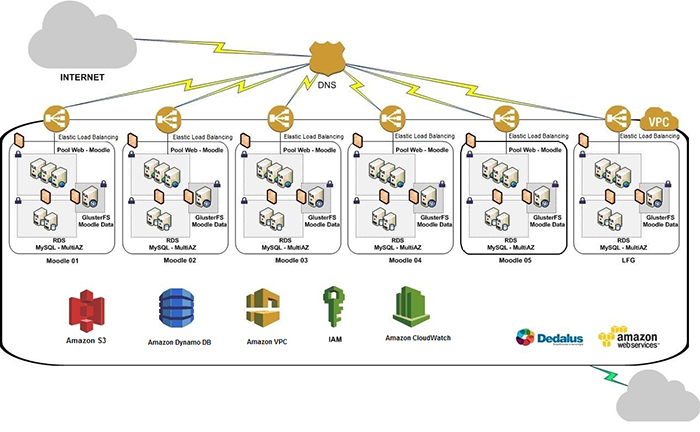
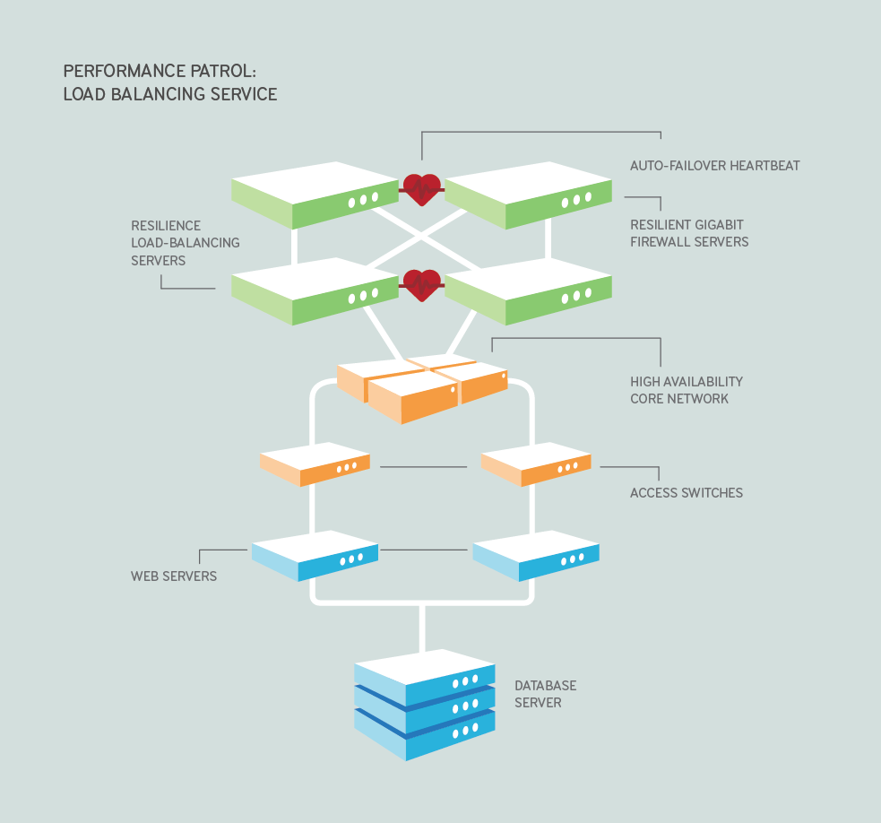

#System Design

##Solution for All:
1. 按照网上的[步骤](http://www.hiredintech.com/app#system-design)走
   1. Constrains and use cases - 分析问题框架
   2. Abstract Design - 设计service/storage layer
   3. Bottlenecks - 根据估算数据分析瓶颈
   4. Scaling Abstract Design - Scale
2. 从base开始, 最后变得复杂, 可以一开始vertical, 后面horizontal
3. 核心是从两个方向走
   * Traffic
     1. More server(应该是这里体现consistent hashing, map reduce可能也是这里)
     2. Load balancer
   * Data
     1. NoSQL vs Relation SQL
     2. 如果小的话就store in memory, 大的话就得考虑sharding(easier for replicate and backup)
     3. 如果读写不均匀的话就分开读写, master/slave replication(reading from slaves and write to master)

-----

##Statistic Numbers
####公司

#####[Facebook](http://newsroom.fb.com/company-info/)
* 1.3 billion active user per month
* 1.07 billion mobile user per month
* 829 million daily active user per day (远大于Monthly因为monthly的active user不能重复计算)

#####[Twitter](https://about.twitter.com/company)
* 271 million monthly active users
* 500 million Tweets are sent per day

#####[Amazon](http://www.statista.com/topics/846/amazon/)
* 237 million active customer accounts worldwide

####程序内
* 一个char是1 byte, 一个int/float/long是4 bytes, 一个double是 8 bytes
* 1 Million = 10^6, 1 Million char = 1MB, 1 Million int = 4MB, 1 Million double = 8MB
* 1 Billion = 10^9, 1 Billion char = 1GB, 1 Billion int = 4GB, 1 Million double = 8GB
* 综上所述，假设8G电脑很普通，一般来说如果不提memory size的话无论什么type都能放下，如果说了memory size就要对比下了
* We choose quicksort over mergesort as mergesort requires O(n) space. Quicksort uses O(logn) space.
* MD5 digest size 128 bits = 16 bytes
* SHA-1 digest size 160 bits = 20 bytes
* Max Email address = 254 char = 254 bytes

| Things| 1 | 1 Thousand(2^10) | 1 Million(2^20) | 1 Billion(2^30) |
| :---: | ---: | ---: | ---: | ---: |
| byte | byte | KB | MB | GB |
| char | 1 byte | 1 KB | 1 MB | 1 GB |
| int/float/long | 4 byte | 4 KB | 4 MB | 4 GB |
| double | 8 byte | 8 KB | 8 MB | 8 GB |
| MD5 | 128 bits = 16 bytes| 16 KB | 16 MB | 16 GB |
| SHA-1 | 160 bits = 20 bytes | 20 KB | 20 MB | 20 GB |
| Email | 254 chars = 254 bytes | 254 KB | 254 MB | 254 GB |
| IP Address(IPv4) | 2**8 * 4 = 4 bytes | 4 KB | 4 MB | 4 GB |
| IP Address(IPv6) | 128 bits = 16 bytes | 16 KB | 16 MB | 16 GB |

####Computer
* SSD 50~200MB/s
* DRAM 2-20GB/s

####Note
1. 所有IP是能放进内存的，因为一共2^32个ip地址

------
##Basic Knowledge

###[Harvard Class](https://www.youtube.com/watch?v=-W9F__D3oY4)
1. 形式: Multi-tier architecture



2. 重要的几个东东西
   1. DNS - 可以通过DNS来进行geo based load balancing, ```nslookup google```
   2. Firewall - 只允许来自80 443 22 VPN端口的访问. 过了下面那层LB，把443转换成80就行了
     * [Principle of Least Privilege](http://en.wikipedia.org/wiki/Principle_of_least_privilege)
   3. Load Balancer
     * 分为软的和硬的
        * Software - Elastic Load Balancing, HAProxy(TCP/HTTP), Linux Virtual Server
        * Hardware - Barracuda, Cisco, Citrix, F5
     * 方法
        * Round robin 平均分配
        * Weighted round robin
        * Least connections
        * Least response time
        * Layer 7 load balancers can further distribute requests based on application specific data such as HTTP headers, cookies, or data within the application message itself, such as the value of a specific parameter.
     * Heart Beat health check
        * Active/Active - 意味着run full capacity, 如果一个跪了，整体的load balancing速度会降低
        * [Active/passive](http://www.loadbalancerblog.com/blog/2013/01/understanding-active-passive-activeactive-load-balancing)
     * ip-hash 根据ip造server
   4. Web Server
     * 可以partition，按照某种方法处理request(例如名字)
   5. 在Web Server和Storage之间还可能要有一层Load Balancer
   6. Switch - 每个server在联入网的时候都是有两个switch，需要调节好防止packet在中间形成loop
   7. Storage
     * NoSQL vs Relational SQL
     * Raid0, Raid1, Raid5, Raid6, Raid10
     * Master/Slave Mode (重点是replica)
        * 一个Master多个Slave, 内容一样，如果Master跪了可以promote一个Slave
        * 分开读写，Master写，Slave读，实时同步(好像有点点SPF)
     * Master/Master Mode
        * 两个Master多个Slave, 就不会跪了

------

###NoSQL vs Relational SQL
* NoSQL
  * MongoDB(Document)
  * Google Big Table (Column)
  * Cassandra (Column)
  * HBase (Column)
  * Amazon DynamoDB(Key-Value Eventually Consistent)
  * Redis(Key-Value RAM)
  * MemcacheDB(Key-Value RAM)
* Eventually Consistent
* Pros:
  * Scalable
  * Flexible
  * It’s Administrator-Friendly
  * It’s Cost-Effective and Open-Source
  * The Cloud’s the Limit
* Cons:
  * A General Lack of Maturity
  * Performance and Scaling > Consistency - Performance and Scaling is good, lack of Consistency

###[Sharding](http://docs.mongodb.org/manual/core/sharding-introduction/)
* Storing data across multiple machines
* Purpose - horizontal scaling
* Advantages
  * Sharding reduces the number of operations each shard handles
  * Sharding reduces the amount of data that each server needs to store.
* 三个重要的structure
  * __Shards__ store the data
  * __Query Routers__ interface with client applications and direct operations to the appropriate shard or shards
  * __Config servers__ store the cluster’s metadata.
* Data Partitioning
  * Range Based Sharding
  * Hash Based Sharding
* Splitting
* Balancing

###[MapReduce](http://michaelnielsen.org/blog/write-your-first-mapreduce-program-in-20-minutes/)
拿这个link的word count作为栗子
* Map is a step to convert each chapter to a dict
  * 实际栗子里是把combine这步放到这里，把多个chapter组成一个intermediate list
  * 所以，输入是chapter，输出是list of words with count 1, a lot duplidates
* Reduce is a step to combine each list and reduce the duplicate data
  输入是个list，通过使用itertool.groupby()和dict来实现去重，把intermediate信息输入进去，最后得到一个新的reduced list
* Steps
  1. Partitioning data
  2. Apply function to the pieces in parallel without communication to each other between the analyzers
  3. Apply another function to combine the results

###[Consistent Hashing](http://blog.csdn.net/sparkliang/article/details/5279393)
* Naive way to do: hash(k) % n
* four important keys
  * Balancing
  * Monotonicity
  * Spread
  * Load
* 解决的问题：N个server， 需要增加或者减少一台，但是又不想re-hash
* Steps:
  1. 环形hash空间
  2. 把数据对象Objecthash到环形空间
  3. 把Server hash到环形空间
  4. Map Object to Server：顺时针顺着object的key走遇到的第一个Server负责该object
  5. 分析
     * 移除Server
       Server B被移除后，只需要从B出发逆时针找第一个Server，在此之间的所有object都要re-map到Server B的下一个Server
     * 添加Server
       同样是从新的server逆时针出发到上一个server之间object归他管了
* 通过virtual node来提高balance
* 正常hash就直接hash ip就行了 hash('192.168.1.1')， 如果是hash virtual node可以 hash('192.168.1.1#1')

###[Storm](https://storm.incubator.apache.org/documentation/Home.html)
Storm is a distributed realtime computation system. Similar to how Hadoop provides a set of general primitives for doing batch processing, Storm provides a set of general primitives for doing realtime computation.

[Another introduction](http://www.slideshare.net/ptgoetz/storm-hadoop-summit2014?next_slideshow=1)

1. __Spout__ is A source of streams in a computation. Spout implementations already exist for most queueing systems. (水龙头， 源源不断的往外送tuple)
2. __Bolt__ processes any number of input streams and produces any number of new output streams. Most of the logic of a computation goes into bolts, such as functions, filters, streaming joins, streaming aggregations, talking to databases, and so on. (Core function of streaming computation)
3. __Topology__ is a network of spouts and bolts, with each edge in the network representing a bolt subscribing to the output stream of some other spout or bolt. A topology is an arbitrarily complex multi-stage stream computation.

* Trident

###[Spark](https://www.youtube.com/watch?v=cs3_3LdCny8)
* Builds on top of HDFS
* Not tied to two-stage Mapreduce
* Proivde in-memory cluster computing
* Use Cases: Machine Learning algorithms and Interactive analytics.

###[Hadoop](http://www-01.ibm.com/software/data/infosphere/hadoop/)
* 最重要的两个是YARN and HDFS
* 其他还有HBase database, the Apache Mahout machine learning system, and the Apache Hive Data Warehouse system

###[Yet Another Resource Negotiator(YARN)](http://www.slideshare.net/hortonworks/apache-hadoop-yarn-understanding-the-data-operating-system-of-hadoop) (Cluster Resource Mangement)

####[Hadoop Distributed File System (HDFS)](http://hortonworks.com/hadoop/hdfs/) (Redundate, Reliable Storage)
* Rack awareness allows consideration of a node’s physical location, when allocating storage and scheduling tasks
* Minimal data motion. MapReduce moves compute processes to the data on HDFS and not the other way around. Processing tasks can occur on the physical node where the data resides. This significantly reduces the network I/O patterns and keeps most of the I/O on the local disk or within the same rack and provides very high aggregate read/write bandwidth.
* Utilities diagnose the health of the files system and can rebalance the data on different nodes
* Rollback allows system operators to bring back the previous version of HDFS after an upgrade, in case of human or system errors
* Standby NameNode provides redundancy and supports high availability
* Highly operable. Hadoop handles different types of cluster that might otherwise require operator intervention. This design allows a single operator to maintain a cluster of 1000s of nodes.

###[ZooKeeper](http://zookeeper.apache.org/doc/trunk/zookeeperOver.html)
A Distributed Coordination Service for Distributed Applications

###[DevOps](http://www.infoq.com/cn/articles/devops-is-not-equal-chef-puppet)

-----

##Topics

###[Tiny URL](http://www.hiredintech.com/app#the-system-design-process)
1. Constrains and Use Cases
   1. Use Cases - What do we use the system for?
      1. Shortening: take a url => return a much shorter url
      2. Redirection: take a short ulr => redirect to the original url
      3. ~~Custom url~~
      4. ~~Analytics~~
      5. ~~Automatic link expiration~~~
      6. ~~Manual link removal~~
      7. ~~UI vs API~~
      8. Highly available
   2. Constrains:
      1. Basic knowledge:
         * 1.3 Billion Facebook active users
         * 650 Million Twitter
         * New Tweets per day 500 Million
      2. 这道题的数据
         1. All shortened URLs per Month: 1.5BN
         2. Sites below the top3: 300M per month
         3. We: 100M per month
         4. 1BN request per month
         5. request by second   400+per second(40 shorten 360 redirects)
         6. Total url 5 years * 12 * 100M: 6Billion url in 5 years
         7. 每个url长度 500bytes: __1 char = 1 byte__ 这个太重要了(ASCII是128=2**7个, 1byte就够了, 但是UTF-8是1~4bytes一个字符)
         8. __url是case sensitive的__
         9. 6 bytes per hash
         10. 注意, 10^3 K->kb, 10^6 M->MB, 10^9 B->GB, 10^12 ->TB
         11. New data written per second 40*(500+6)bytes = 20kb
         12. Data read per second: 360 * 506 bytes = 180k
      3. 重要的几个点
         1. Storage
         2. Data written & Data Read
2. Abstract Design - Finally simple the problem to per second
   1. Application service layer(serves the requests)
      * Shortening Service
      * Redirection Service
   2. Data storage layer(keep track of the hash =>url mapping)
      * Act like a big hash table: stores new mappings and retrieves a value given a key
   3. ```hashed_url = convert_to_base_62(md5(original_url + random_salt))[:6]```
      * Base 62 是一种short ulr的encoding, encode之后只有62种字符0-9 a-z A-Z
3. Understanding Bottlenecks
   * Traffic - not going to be very hard
   * Lots of data - more interesting
4. Scaling Abstract Design
   1. Application Service Layer
      * Start with one machine
      * Measure how far it take us(load tests)
      * Add a load balancer + a cluster of machines over time
        1. to deal with spiky traffice
        2. Also avoid single failure and increase the availability
   2. Data Storage Layer
      1. What's data?
         * Billions of objects
         * Each object is fairly small(<1k)
         * There are no relationship between the objects
         * Reads are 9x more frequent thant writes(360 reads, 40 writes per second)
         * 3TBs of urls, 36GB of hashes
      2. NoSQL vs Relation SQL
         * MySQL:
           * Widely used
           * Mature technology
           * Clear Scaling Paradimgs(sharding, master/slave replication, master/master replication)
           * Used by Facebook, Twitter, Google etc
           * Index lookups are very fast
         * Mappings
           * hash: varchar(6)
           * original_url: varchar(512)
      3. Create a unique index on the hash(36GB+). We want to hold it in memory to speed up lookups.
         1. Vertical Scaling of the MySQL machine (memory is cheap) (vertical for a while)
         2. Partition the data: 5 partitions, 600GB of data, 8GB of indexes (Eventually partiion)
            * We can add more shards in the future. Easier for backup and replicate
            * Default idea of this is: get the first char from the ```hash % num_of_partition```
      4. Master/Slave replication(reading from the slave replicas, writes to the master)(如果有一天read/write不balance了的话) Master/Master

-----

####[Image Hosting Applicaiton](http://www.aosabook.org/en/distsys.html)
* Services
* Dedundancy
* Partitions
* Handling Failure

1. 考虑因素
   * Cost-effective
   * Highliy available
   * Low latency (fast retrieval)
2. 功能
   * Upload image
   * Query image
3. Services
   * Separate read/write (Read usually from cache, Write usually to disk eventually)  
     Write is slower than read
   * 由上面那个导致Apache can maintain 500 connections. Writes can quickly consume all of those，但是read可以asynchronouse and also take advantage of gzip compression or chunked transfer encoding
   * 所以就应该Separate read/write services and scale them independently
   * 解决办法是distribute users across different shards each shard can handle only a set of number of users, 好处是：
     * 系统变的flexible
     * 减小了outage带来的危害
4. Redundancy
   * Data redundancy
   * Service redundancy
     * Remove single point failure by provide backup or spare functionality
     * Create shared-nothing architecture (Each nodes operate independently without knowing other nodes)
5. Partitions
   * Large data - second server to store parts of the data set
   * Computing resource - splitting the operations or load across addtion nodes
   * Partitions or shards - each logical set of functionality is separate
     * geographic boundaries
     * non-paying users vs paying users
   * Data locality (the closer the data to the operation point, the better the performance)
   * Inconsistency
6. Building Blocks
   * Caches
     * Global Caches
        1. Request Node只跟GC联系, 如果data不在GC去问database. (Majority way) (如果cache data file太大, 取就难取)
        2. Request Node先跟GC联系, 如果data不在再自己去问database要
     * Distributed Caches (用consistent hashing)
        * Pros - 可以通过增加Node数量来增加cache大小
        * Cons - Remedying a missing node -> store multiple copies of data -> too complicated -> missing is no big deal
   * Proxies (many proxies are also caches but not all caches act s proxies)
     * Collapsed forwarding - collaps the same or similar requests in to one request and return single result to the requesting client
     * Collapse request for data that is close together
     * Should put caches in front of proxy, because cache runs faster than proxy
   * Index - Trade-offs of increased storage overhead and slower writes (since you must both write the data and update the index) for the benefit of faster reads
     * Index Table - 就像目录一样
     * Many layers of indexes
     * Inverted index - 用来从word反找书页
   * Load Balancer - distribute load across a set of nodes responsible for servicing requests.
     * Sticky Session - die了之后的解决办法 1. browser cache, cookie 2. URL Rewriting??
     * 几种分配方式
        * Round Robin
        * Random
        * Least Connection
        * Least Response Time
        * Layer 7 check header
   * Queues
     * Queues enable clients to work in an asynchronous manner, providing a strategic abstraction of a client's request and its response. On the other hand, in a synchronous system, there is no differentiation between request and reply, and they therefore cannot be managed separately.
     * [RabbitMQ](http://www.rabbitmq.com/getstarted.html), [ActiveMQ](http://activemq.apache.org). 以RabbitMQ为例, 几种比较重要的模型, 都是Producer-Consumer模型
        * P -> Queue -> C : Normal模型, producer-consumer
        * P -> Queue -> CC : Work Queue, 一个Producer对应多个consumer
        * P -> X -> QQ -> CC : Publish/Subscribe
        * [RPC模型](http://www.rabbitmq.com/tutorials/tutorial-six-python.html)


#####Fit to Pattern
1. Constrains and Use Cases
   1. Use Cases
      * Upload image
      * Query image
   2. Constrains
      * Storage scalability
      * Low latency for image downloads/requests
      * High availability
      * Cost-effective

-----

###[News Feed](http://www.quora.com/What-are-best-practices-for-building-something-like-a-News-Feed)
* Load Test: peak/non-peak
* Services
  * User update - Write
  * User query - Read (Use some ranking algorithm)
* Approaches
  * Push - fan-out-on-write
     * Push the metadata to all user's friends when it occur
     * Write O(n), Read O(1)
     * Backlog problem
     * Store a mother copy of metadata
     * A lot of disk seek(我猜是因为需要搜索user's follower??)
  * Pull - fan-out-on-read (这个是facebook的方法, 因为需要dynamic features like ranking or event aggregation)
     * Pull your friends data when you want news
     * Easier to keep things up-to-date
     * May fail to generate a user's feed
     * No inverse celebrity problem(可能会有名人有很多follower,但是大多数user不会follow太多)
     * Must be in memory

-----

###[Facebook Chat](./img/Facebook_Chat.pdf)
* Client Side
   * Regular AJAX for sending messages
   * Regular AJAX for pull list of friends
   * AJAX Long Polling for message
* Server Side
   * Communication between service: Thrift
   * Channel - Erlang - Message queuing and delivery
      * Queue message in each user's channel
      * Deliverer message as long-polling HTTP request
   * Presence - aggregation of online info in memory
   * Chat logger - store conversation at server side
   * Web tier
* 过程
  * Browser -> Web Tier -> Channel -> Browser (发信收信)
  * 1-ajax -> 2-thrift -> 3->long poll
  * Web Tier -> via thrift <- Chat logger
  * Presence和Channel talk(via thrift) 用来获得在线列表

###[Messaging System](http://www.slideshare.net/brizzzdotcom/facebook-messages-hbase)
* Use HBase
* High write throughput
* ```<user_id, word, message_id>```
* Why?
  * Elastic - add new node
  * Automatic Failover
     * Master will detect nodes fail
     * Master fail, stand by will take over
  * Eventually Consistent

-----

###[Type Head Search/Search Suggestion](https://www.facebook.com/video/video.php?v=432864835468)
* Navigational - (用户不感兴趣其他的结果)
* Browser Cache
* Social Graph
* 1st Degree Graph Connection

#####Services
* FoF Friend of Friend
* OoF Object of Friend
* Global (Remove some sensitive stuff)
* Aggregator - Merging, Ranking, Returning

#####Three Way Trade-off
* Pre-compute
  * Trie - Keep users first-degree connection. Waste space.
  * 问题是如何Keep Sync
  * Tiny Bloom Filter
* Memory Consumption
* Cache Bandwidth

-----

###POI
* [GeoHash](http://en.wikipedia.org/wiki/Geohash)
* 一个5位的char -> base32变成 5*5bit(包括奇数位经度偶数位纬度) -> 0表示在low~mid, 1表示mid~high转成纬度

#####Implement second/minute/hour/day counters

#####Photo Storage
* 比较普遍的见上面[Image hosting application](#image-hosting-applicaiton)
* Facebook的是用Haystack

-----
###Others

#####[Facebook](./img/Facebook_Architecture.pdf)
* Web Tier
  * PHP - hiphop
* Storage Tier
  * MySQL
  * HBase
  * Haystack
* Cache Tier
  * Memcached - fast, but do little thing
  * TAO(The associations and object)
     * Objects - Nodes
     * Associations - Edges
* Service Tier
  * Inefficient and messy - access hundreds of machines - nightly cron jobs
  * Build specialized services

#####Note
1. Similar to web server or CDN edge server


###TODO
* [ ] 总结下Twitter Pinterest Facebook题目
* [ ] 精细化数据

